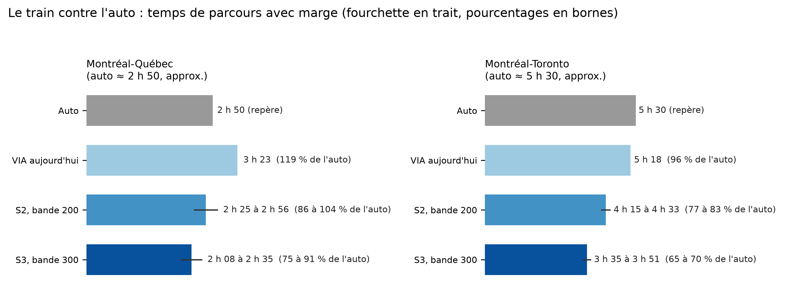
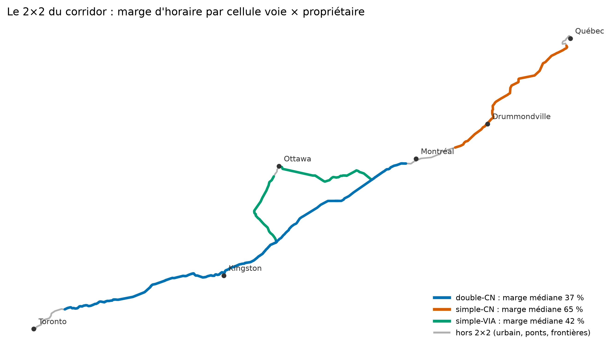

# Synthèse

Cette étude répond à une question simple : combien de temps le train peut-il prendre entre
les grandes villes du corridor, sur la voie qui existe déjà, selon ce qu'on accepte d'y
investir? La réponse est construite en additionnant quatre choses que l'on peut compter :
le temps que les courbes permettent, le temps des zones urbaines (figé à l'horaire
actuel), le temps des arrêts, et une marge d'exploitation que l'étude encadre entre deux
bornes au lieu de la deviner. La figure ci-dessous en donne la lecture d'ensemble, contre
le repère que tout décideur a en tête : l'auto ; la table complète des temps, par tronçon,
scénario et bande de vitesse, est en section 7.

Trois scénarios de matériel et de voie (détail en section 3) : **S1** est la voie et le
train d'aujourd'hui ; **S2** est un train pendulaire exploité selon la méthode que le CN
applique déjà à ce type de train, avec le dévers maximal standard du CN (aucune dérogation
nécessaire) ; **S3** est un pendulaire moderne plus performant, qui sort du précédent
nord-américain et demanderait une approbation par équipement. La « bande » est le plafond
de vitesse qu'on s'autorise à exploiter (200 km/h exige de traiter les passages à niveau et
la signalisation ; 250 et plus exige de les éliminer, voir sections 5 et 6). Les
vitesses de ce document sont en km/h, suivies au besoin de l'équivalent en mi/h,
l'unité d'usage des chemins de fer nord-américains ; les bandes sont nommées par leur
valeur ronde en km/h (200 km/h = 124 mi/h ; 250 = 155 ; 300 = 186 ; 160 = 99).

**La lecture de la figure.** Aujourd'hui, le train fait à peu près jeu égal avec l'auto
sur Montréal-Toronto (539 km : 5 h 18 à l'horaire) et la perd nettement sur
Montréal-Québec (270 km : 3 h 23). Chaque barre de scénario est un temps « avec marge » :
le temps de base (courbes + zones urbaines figées + arrêts) majoré de la marge
d'exploitation, de la borne normative (9 pour cent) à la marge actuelle du tronçon ; les
pourcentages face à l'auto sont donc des bornes, pas des points. Dès S2 à la bande 200,
le train bat l'auto sur Montréal-Toronto (77 à 83 pour cent de son temps) et fait au
moins jeu égal sur Montréal-Québec (86 à 104 pour cent) ; en S3 à la bande 300, il tombe
à 65 à 70 pour cent du temps de l'auto sur Montréal-Toronto et à 75 à 91 pour cent sur
Montréal-Québec.

La solution première est **S2 à la bande
200 km/h (124 mi/h)** : un train pendulaire exploité
exactement selon la méthode que le CN applique déjà, sans dérogation, sans franchir le
mur des passages à niveau ni changer la signalisation au-delà du contrôle en cabine
(sections 5 et 6). Si la marge est gérée de façon excellente (la borne basse normative,
9 pour cent), elle donne 4 h 15 sur Montréal-Toronto, soit 77 pour cent du temps de
l'auto, et 2 h 25 sur Montréal-Québec, soit 86 pour cent. Où le résultat tombe dans la
fourchette dépend surtout du régime de cohabitation, bien plus que du train ou de la
voie : c'est l'objet de la section 4. S3 (le même dévers, une insuffisance portée à
270 mm) et les bandes 250 et 300 sont des références : elles chiffrent ce que
l'approbation d'un matériel plus performant, l'élimination des passages et le contrôle
intégral achèteraient en plus.

La fourchette de marge n'est pas une estimation : sa borne basse est la marge normative
internationale (9 pour cent du temps de parcours aux vitesses de 200 km/h (124 mi/h) et plus
[@uic2000f451 ; @schittenhelm2011]), sa borne haute est la marge que l'horaire actuel de VIA porte
aujourd'hui sur le tronçon concerné (mesurée dans cette étude : de 15 pour cent sur
Montréal-Ottawa à 32 pour cent sur Montréal-Québec). La distance entre les deux bornes
est le coût du régime d'exploitation actuel ; la trancher est l'objet de l'étude de
circulation recommandée en conclusion.

Mise en regard : le projet Alto propose environ 1 000 km de voies neuves dédiées pour
relier Québec à Toronto par un tracé nord à 300 km/h ou plus [@alto2025]. La présente
étude documente ce que le réseau existant du corridor riverain (environ 1 090 km de
voies physiques, parcourues en 1 431 km de trajets) peut donner, ainsi que les cinq obstacles qui les retiennent et le prix réglementaire
de chacun. Les deux exercices sont complémentaires : on ne peut comparer les options
qu'en connaissant les deux.

Le précédent qui valide l'ordre de grandeur est britannique. La West Coast Main Line
(Londres-Manchester-Glasgow), une ligne victorienne partagée avec le fret, a été
modernisée de 1998 à 2008 plutôt que remplacée par une ligne neuve : des trains
pendulaires à 125 mi/h (201 km/h) sur la voie existante et une signalisation relevée,
pour un coût d'environ 8,6 milliards de livres selon l'audit national [@nao2006wcml].
Les gains mesurés sont de la même famille que ceux calculés ici : 36 minutes de moins
sur Londres-Manchester (296 km) et 42 sur Londres-Glasgow (environ 645 km)
[@nao2006wcml], contre 45 à 63 minutes calculées sur Montréal-Toronto en S2 à la
bande 200. Le marché a suivi : sur Londres-Manchester, l'achalandage ferroviaire a crû
de 77 pour cent entre 2009 et 2017 pendant que le trafic aérien du même axe reculait de
27 pour cent [@wcml2026wiki]. La mise en garde symétrique vaut aussi : le budget
britannique a plus que triplé en cours de programme, faute d'une portée verrouillée au
départ [@nao2006wcml] ; c'est précisément le rôle de l'étude de circulation recommandée
en conclusion.

Les cinq constats principaux :

1. **La géométrie n'est pas le problème principal.** Avec un pendulaire moderne (S3),
   il ne reste que 186 km (13 pour cent du réseau parcouru) dont les courbes interdisent
   200 km/h (124 mi/h), et plus aucun kilomètre sous 100 km/h (62 mi/h). Même en restant dans le strict
   précédent CN (S2), le résidu sous 200 km/h est de 267 km.
2. **Les passages à niveau sont l'obstacle réglementaire dominant au-dessus de
   200 km/h** : en scénario S3, 754 des 924 passages du corridor se trouvent sur des segments dont la
   géométrie dépasserait ce seuil (695 en S2, 471 dès S1) ; le précédent américain y exige zéro passage
   [@ecfr213-347].
3. **La signalisation est une ligne de devis, pas un mur** : rien à faire jusqu'à
   160 km/h (99 mi/h), une superposition de contrôle en cabine de 161 à 200 (précédent tarifé au
   Michigan [@fra2024itcs]), un système intégral au-delà (c'est le devis d'Alto).
4. **Le régime de cohabitation pèse plus que le nombre de voies.** Mesuré sur les
   horaires de VIA à géométrie neutralisée : une voie simple coûte environ 5 points de marge
   quand VIA est propriétaire, environ 28 points quand le CN l'est (stable de 3 à 6 et
   de 27 à 33 selon la pénalité d'arrêt testée). Le même instrument
   montre ce que le doublement achète chez le CN : environ 28 points, soit une vingtaine
   de minutes sur Montréal-Québec.
5. **La marge d'horaire est la grandeur que cette étude ne peut pas trancher.** Elle est
   encadrée (7 à 9 pour cent en régime normatif, 37 à 65 pour cent mesurés aujourd'hui
   selon la cellule) ; l'écart entre les deux est précisément ce qu'une étude de
   circulation avec le propriétaire de la voie devra allouer.

# Méthode et périmètre

## Le modèle

Le temps de parcours d'un tronçon se calcule comme on planifie un long trajet en auto :
en additionnant des morceaux que l'on peut vérifier un à un. Quatre morceaux, pour une
bande de vitesse et un scénario de matériel donnés :

1. **les zones urbaines**, où l'étude ne promet aucun gain : leur temps est figé à
   l'horaire actuel ;
2. **l'interurbain**, calculé mètre par mètre le long du tracé : en chaque point, le
   train est borné par la plus basse de deux vitesses, celle que la courbe locale
   permet (selon le scénario) et le plafond qu'on s'autorise (la « bande ») ; entre
   ces bornes, son profil réel d'accélération et de freinage est simulé (voir plus
   bas) ;
3. **les arrêts** : deux minutes d'immobilisation par arrêt intermédiaire, les phases
   d'accélération et de freinage étant déjà dans le profil simulé ;
4. **la marge d'exploitation**, jamais estimée : encadrée entre deux bornes.

En notation compacte :

$$T = \sum \text{blocs urbains figés} + \int \frac{dx}{V(x)} + \text{arrêts} + \text{marge}$$

avec $V(x)$ le profil de vitesse simulé, borné par
$\min(\text{vitesse géométrique du scénario}, \text{bande})$ sur l'interurbain. Le
symbole $\int dx/V(x)$ ne dit rien d'autre que « chaque mètre du tracé est parcouru à
la vitesse que le train y atteint réellement, et on additionne ».

**Le profil d'accélération et de freinage est simulé, à paramètres déclarés.** Le
train de cette étude ne saute pas d'une vitesse à l'autre : sur l'interurbain, son
profil est calculé en deux passes (accélération plafonnée par la motorisation, qui
décroît avec la vitesse ; freinage de service constant), avec arrêt complet à chaque
gare intermédiaire et aux frontières des blocs urbains. Les paramètres de rame sont
des ordres de grandeur déclarés, pas des fiches constructeur : S1 reçoit une rame
tractée comme la flotte actuelle (8 W/kg au rail, 0,5 m/s²) ; S2 et S3 reçoivent la
même rame de référence, dimensionnée pour sa bande (12 W/kg aux bandes 160 et 200,
type pendulaire moderne ; 18 à la bande 250 ; 22 à la bande 300, type rame à grande
vitesse ; 0,6 m/s²). S2 et S3 partagent la même rame parce que ces scénarios se
définissent par l'insuffisance de dévers admise, pas par la motorisation : une rame
commune isole l'effet de la géométrie. Pentes et résistance à l'avancement ne sont
pas modélisées. Contre-vérification : l'ancien forfait de cinq minutes par arrêt sur
intégrale fluide retombe à une à huit minutes près sur les mêmes totaux par tronçon ;
la borne du pilote de 2025 (7,5 à 10 minutes par arrêt évité, effets de sillon
compris) encadre le tout par le haut, l'excédent au-delà de la dynamique pure
relevant du régime de cohabitation, donc de la marge.

**Vitesse géométrique** : le plafond que les courbes permettent. Une courbe de rayon $R$
(en mètres) limite la vitesse à $v = k\sqrt{R}$, où $k$ dépend du dévers (l'inclinaison
de la voie dans la courbe) et de l'insuffisance de dévers admise (l'inclinaison
« manquante » que le train et ses passagers acceptent de subir, ou que la caisse
pendulaire compense). C'est une borne physique, jamais une promesse d'horaire. Avec un
écartement effectif de 1 524 mm, cette formule reproduit exactement la méthode officielle
du CN [@cn2002mr1305].

**Vitesse commerciale** : la vitesse résultante à l'horaire, une fois appliqués les
plafonds réglementaires (passages à niveau, signalisation), les blocs urbains, les arrêts
et la marge. Elle est calculée par l'intégration ci-dessus, jamais par un facteur
multiplicatif.

**Blocs urbains figés.** Aucun gain n'est compté dans les approches urbaines, quel que
soit le scénario : Montréal Central à Dorval (17,8 km), Montréal à Saint-Lambert par le
pont Victoria (6,1 km, tronçon de Québec), Sainte-Foy à Québec avec le pont de Québec
(19,9 km), Guildwood à Toronto Union (20,1 km), chacun figé à la médiane des horaires publiés
actuels (données ouvertes GTFS) [@viarail2026gtfs] ; Ottawa, sans gare d'approche proche, est traité par une
fenêtre de 10 km de part et d'autre \[HYPOTHÈSE, couverte par la sensibilité de ±20 pour
cent sur l'ensemble des blocs urbains\].

**Arrêts.** Deux minutes d'immobilisation par arrêt intermédiaire hors blocs
urbains ; les phases d'accélération et de freinage sont simulées dans le profil
(l'ensemble revient à environ quatre à cinq minutes par arrêt à la bande 200). Repère
mesuré : le pilote de train sans arrêt de septembre 2025 annonçait un gain de 30 à
40 minutes pour quatre arrêts sautés, soit 7,5 à 10 minutes par arrêt en conditions
réelles de cohabitation [@cbc2025pilote] ; l'écart entre ce chiffre et la dynamique
pure est un effet de sillon, qui vit dans la marge.

**Marge.** Jamais estimée : encadrée entre une borne normative et une borne mesurée
(section 4.3).

## Les données, et comment la géométrie a été mesurée

Deux sources publiques se complètent. Les données d'horaires ouvertes de VIA (le format
GTFS, celui qu'utilisent les applications de transport) disent quelles lignes le train
emprunte, dans quel ordre et avec quelles gares [@viarail2026gtfs]. La carte
collaborative OpenStreetMap dit où les rails passent physiquement, à quelques mètres
près [@osm2026geofabrik]. L'étude recolle la première sur la seconde : le tracé
schématique de VIA est verrouillé sur la voie réelle, et l'analyse suit cette voie comme
un train le ferait, sans en changer sauf à un aiguillage. Ce verrouillage est ce qui
évite les « courbes fantômes » qu'un appariement naïf fabrique en sautant entre deux
voies parallèles.

Sur le tracé ainsi reconstruit, un point tous les 10 mètres. Le rayon de courbure en
chaque point est estimé en faisant passer au mieux un cercle à travers les quelque
80 points d'une fenêtre glissante de 900 mètres : moyenner autant de points efface le
bruit de la carte sans aplatir les vraies courbes. L'estimateur a été calibré sur des
cercles synthétiques de rayon connu, puis validé sur des zones-témoins du corridor
(vraies courbes serrées des approches d'Ottawa et de Montréal, longues lignes droites de
la ligne de Kingston), qui doivent ressortir correctement à chaque régénération. Chaque
courbe devient ensuite une vitesse par la formule $v = k\sqrt{R}$ de la section 3, et
chaque segment est classé de façon volontairement conservatrice : sa vitesse est fixée
par sa courbe la plus serrée qui se maintient sur la longueur d'un train (environ
150 mètres), pas par une moyenne ni par un point isolé possiblement bruité. C'est la
logique d'une vraie limite de vitesse ferroviaire. L'ensemble a été validé par quatre
passes de contre-vérification indépendantes lors des phases antérieures du projet.

Le reste des données : nombre de voies par détection géométrique des voies parallèles
dans OpenStreetMap, corroborée par les rapports du Bureau de la sécurité des transports
(l'écart entre un tronçon double détecté et le même tronçon documenté par le BST est de
0,1 km sur 25) ; passages à niveau par l'inventaire officiel ouvert de Transports
Canada [@tc2023inventairepn] ; horaires par le flux GTFS de VIA, saison 2026
[@viarail2026gtfs].

## Hors périmètre, déclaré

La conception par site (clothoïdes, raccordements), les profils de traction constructeur
exacts, les pentes et la résistance à l'avancement (le profil d'accélération et de
freinage est simulé avec des paramètres génériques déclarés en section 2.1), le
cantonnement fin, la simulation de
circulation (c'est l'étude à commander), les ponts, tunnels et l'état detaillé de la
voie, ainsi que les zones urbaines au-delà de leurs blocs figés. Les horaires mesurés
datent de la saison 2026, une période de restrictions exceptionnelles liées aux passages
à niveau (section 6) : les marges mesurées sont donc possiblement gonflées, ce qui est
signalé partout où cela joue.

Règle d'écriture du document : des comptes et des seuils (« ce qui devrait être vrai »),
jamais des estimations d'auteur. On peut contester un coût ; on ne peut pas contester un
compte.

# Le train pendulaire et le dévers

Un train pendulaire incline sa caisse dans les courbes, ce qui permet de les franchir
plus vite sans inconfort pour les passagers. Le Canada en a déjà exploité un : le LRC,
auquel la méthode du CN accorde une insuffisance de dévers de 6 pouces (152 mm), contre
3 pouces pour un train ordinaire [@cn2002mr1305 ; @fra-lrc-152]. C'est un précédent
domestique, pas une hypothèse.

Les trois scénarios :

| | Dévers | Insuffisance | k (v = k·√R) | Statut réglementaire |
|---|---|---|---|---|
| S1 : voie et train actuels | 100 mm (supposé) | 76 mm | 3,83 | régime courant |
| S2 : pendulaire type LRC | 127 mm | 152 mm | 4,82 | 100 % précédent CN |
| S3 : pendulaire moderne | 127 mm | 270 mm | 5,75 | hors précédent NA |

Le dévers de S2 et S3 (127 mm, soit 5 pouces) est le maximum standard du CN pour trafic
mixte [@cn2002mr1305] : il ne demande aucune dérogation et n'exclut pas le fret. S1 porte
un dévers supposé (le réseau réel n'a pas été relevé), signalé comme tel partout.

**Ce que chaque scénario achète**, en kilomètres de tracé dont le plafond géométrique
reste sous la cible (somme des quatre trajets analysés, 1 431 km) :

| Cible | S1 | S2 | S3 |
|---|---|---|---|
| Sous 200 km/h / 124 mi/h (rectification requise pour la grande vitesse) | 620 km | 267 km | 186 km |
| Sous 160 km/h / 99 mi/h | 326 km | 122 km | 59 km |
| Sous 100 km/h / 62 mi/h (sections sévères) | 41 km | 18 km | 0 km |

La lecture décisionnelle : la géométrie du corridor n'a pas besoin d'être reconstruite,
elle a besoin d'un meilleur train. En S3, 87 pour cent du tracé atteint 200 km/h (124 mi/h) ou plus
sans toucher une seule courbe ; le résidu de 186 km est listé section par section dans
les annexes numériques du projet, avec le rayon à ouvrir pour chaque site.

**Ce qu'il faut dire honnêtement de S3.** Aucun matériel n'est exploité en Amérique du
Nord à 270 mm d'insuffisance ; la voie d'approbation existe (l'article 4.3 du règlement
canadien permet d'approuver un équipement désigné au-delà de 3 pouces [@tc2022rrts]),
mais elle reste à parcourir. Une position de repli à 225 mm est calculée en sensibilité
dans les annexes. Par ailleurs, la caisse pendulaire protège le passager, pas le rail :
les efforts en voie croissent avec la vitesse en courbe, ce qui implique un standard
d'entretien renforcé (un point de veto potentiel du propriétaire, et un coût récurrent).
L'histoire du LRC le rappelle : son système d'inclinaison, coûteux en entretien, a été retiré lors de la remise à
neuf de la flotte engagée à partir de 2007-2009, VIA justifiant ce retrait par la
réduction des coûts d'entretien et un allègement de deux tonnes par voiture
[@via2009lrc]. S2 reste, pour cette raison, le scénario pivot de
l'argumentaire : tout y tient dans la méthode que le CN applique déjà.

**Pourquoi 81 kilomètres d'écart ne font que trois à cinq minutes.** La table
ci-dessus et celle de la section 7 semblent se contredire : S3 réduit le résidu sous
200 km/h de 267 à 186 km, un écart de 81 km, mais il ne gagne que 3 minutes sur S2 sur
Montréal-Toronto (5 sur Montréal-Québec). La réconciliation tient à l'endroit où ces
kilomètres se trouvent sur l'échelle des vitesses. Les kilomètres que S3 fait passer
au-dessus de 200 km/h sont précisément ceux où S2 permet déjà 160 à 199 km/h (99 à 124 mi/h) : des
courbes amples, où le train ne perd presque rien. Rouler 81 km à 180 km/h (112 mi/h) plutôt qu'à
200 coûte environ 3 minutes ; c'est tout l'écart. Le temps, lui, se perd dans les
courbes serrées et dans les zones lentes, et là-dessus les deux scénarios font
pratiquement le même travail, puisque tous deux sont plafonnés par la même bande de
200 km/h sur l'essentiel du tracé. Autrement dit, à la bande 200, S3 achète des
kilomètres conformes, pas des minutes. Sa valeur en temps n'apparaît qu'aux bandes
supérieures, où son plafond géométrique cesse d'être bridé par la bande (7 minutes
d'avance sur S2 à la bande 250 sur Montréal-Toronto, 10 à la bande 300) ; à la bande
200, S2 fait déjà l'essentiel du travail.

# Doublement des voies et régime de cohabitation

Ces deux questions se mesurent avec le même instrument, lu dans deux directions. Le
corridor offre une expérience naturelle : des tronçons en voie simple appartenant à VIA
(croisements planifiés entre trains VIA), des tronçons en voie simple appartenant au CN
(croisements subis, le fret étant prioritaire chez lui), et des tronçons en voie double
du CN (croisements éliminés, dépassements subis). En comparant la marge d'horaire de ces
trois familles, à géométrie neutralisée, on lit séparément le prix de la voie manquante
et le prix du régime.

## La mesure

Pour chacune des paires de gares adjacentes du corridor, la marge est l'écart entre le
temps à l'horaire (médiane de tous les sillons, un sillon étant le créneau horaire d'un train donné) et le temps que la géométrie
permet au régime actuel (intégration à vitesse plafonnée à 160 km/h, soit 99 mi/h, en
profil fluide : ce choix est le même pour toutes les cellules et n'affecte pas leur
comparaison), rapporté à ce dernier. Les paires contaminées par un nœud (blocs urbains, ponts Victoria et de Québec,
approches d'Ottawa, chevauchements de frontière de propriétaire) sont exclues, chacune
avec son motif documenté. Résultat, sur le cœur du corridor (classe de voie homogène,
95 à 100 mi/h, soit 153 à 161 km/h, permis sur les lignes du CN et 80 à 95 mi/h, soit 129 à 153 km/h, sur celles de VIA) :

| Cellule | Longueur mesurée | Marge médiane | Dispersion entre sillons | Trafic (trains/jour) |
|---|---|---|---|---|
| Voie double, CN | 515 km (11 paires) | 37 % | 5 % | 40 |
| Voie simple, VIA | 218 km (5 paires) | 42 % | 10 % | 12 à 14 |
| Voie simple, CN | 192 km (2 paires) | 65 % | 21 % | 27 |

Trois lignes, trois faits :

**Ce que le doublement achète, chez le CN** : environ 28 points de marge (65 contre 37),
soit une vingtaine de minutes sur Montréal-Québec. L'échantillon de voie simple CN est
mince (192 km, mais en deux paires seulement, celles du tronçon de Québec) : le chiffre
se publie en fourchette, pas au point. Il est en revanche robuste aux deux objections classiques, et cela se
vérifie dans la table : la classe de voie est la même que sur la ligne double (95 contre
95 à 100 mi/h permis), et la ligne double porte davantage de trafic (40 trains par jour
contre 27) tout en affichant moins de marge. Ni l'état de la voie ni le volume
n'expliquent l'écart ; les croisements l'expliquent.

**Ce que le régime pèse** : sous propriétaire VIA, la voie simple ne coûte qu'environ
5 points de marge par rapport à la voie double du CN ; sous propriétaire CN, elle en
coûte environ 28 (les fourchettes 3 à 6 et 27 à 33 couvrent les pénalités d'arrêt testées). Le rapport est d'environ sept pour un, et il résiste aux tests de
sensibilité (pénalité d'arrêt de 0 à 3 minutes par paire). Une réserve honnête : les
lignes de VIA portent environ deux fois moins de trains que celles du CN ; ce qu'on
mesure est donc l'effet du régime au sens large, densité de fret comprise. C'est
précisément ce que le doublement seul ne change pas.

**La dispersion raconte la même histoire.** Sur voie double, tous les trains d'une même
paire font le même temps (écart interquartile de 5 pour cent). Sur la voie simple du CN,
l'horaire d'une même paire varie de 8 à 16 minutes selon le sillon : les croisements avec
le fret sont écrits dans la grille de VIA elle-même. Le passager de Montréal-Québec paie
jusqu'à 24 minutes selon l'heure de son départ.

## Contre-épreuve : le sud-ouest ontarien

L'étude a étendu la mesure aux lignes Toronto-Windsor et Toronto-Sarnia. Cette région ne
se compare pas au cœur (la voie y est de classe inférieure, avec des vitesses permises de
42 à 70 mi/h (68 à 113 km/h) sur les lignes simples du CN : la marge y mesure d'abord l'état de la voie),
mais son contraste interne vaut la démonstration : le seul segment où le train roule à
vitesse normale (moyenne de 95 km/h ou 59 mi/h, sur une voie entretenue à 100 mi/h ou
161 km/h permis) est le segment
Chatham-Windsor, précisément celui que VIA possède. Les lignes simples voisines du CN,
presque vides (8 trains par jour), roulent à 40-60 km/h (25 à 37 mi/h) de moyenne sur des voies
laissées à 42-70 mi/h. Le propriétaire qui vit du service passager entretient sa voie ;
la conclusion du cœur se réplique dans une seconde région, par un autre mécanisme.

## L'encadrement de la marge

La marge d'horaire est la grandeur que cette étude ne peut pas trancher ; voici
l'intervalle où elle tombe nécessairement, et pourquoi.

**Borne basse, normative.** La fiche UIC 451-1 recommande, pour un train de voyageurs,
un supplément fixe plus un pourcentage selon la vitesse : au total environ 7 pour cent du
temps de parcours à 160 km/h (99 mi/h) et 9 pour cent à 200 (124 mi/h) [@uic2000f451 ; @schittenhelm2011].
Les règles publiées des gestionnaires nationaux se situent au même ordre : SNCF Réseau
impose 4,5 minutes par 100 km sur ligne classique et 5 pour cent sur ligne à grande
vitesse [@sncf2023drr] ; le gestionnaire suédois publie même le différentiel qui nous
intéresse : 3 minutes par 100 km en voie simple contre 2 en voie double, plus 60 secondes
par croisement [@trafikverket2025jnb]. Aucune règle publiée ne dépasse 15 pour cent.

**Borne haute, mesurée.** Le corridor porte aujourd'hui de 37 à 65 pour cent de marge
selon la cellule (table ci-dessus). L'écart entre les deux bornes n'est pas de la
prudence d'horairiste : c'est le prix, en minutes, du régime de cohabitation actuel.

**Le précédent continental.** L'inspecteur général d'Amtrak a documenté le même
phénomène : environ 70 pour cent du temps additionnel des horaires d'Amtrak est
provisionné pour les retards anticipés des chemins de fer hôtes, et le fret cause
59 pour cent des retards des longs parcours [@amtrakoig2019]. La situation du corridor
n'est pas une exception canadienne, c'est la condition générale du train de voyageurs
invité chez un propriétaire de fret.

**Pièces au dossier**, sans récit d'intention : le 11 octobre 2024, le CN a imposé aux
rames neuves de VIA un ralentissement à 72 km/h (45 mi/h) aux passages munis de prédicteurs, les circuits qui déclenchent les barrières à
l'approche d'un train (304 passages visés), déclenchant des retards de 30 à 45 minutes ; VIA a demandé le
contrôle judiciaire en Cour fédérale le 12 novembre 2024 [@via2024requete] ; l'ordre
ministériel de décembre 2024 était une demande d'information au CN, pas un
rétablissement des vitesses, et l'allègement négocié n'est entré en vigueur que le
28 août 2025 [@tc2025gcp]. Le pilote sans arrêt Montréal-Toronto a été suspendu le jour
prévu de son lancement, VIA invoquant des contraintes opérationnelles chez son hôte
[@cbc2025pilote]. La ponctualité du réseau est passée de 71-72 pour cent (2020-2021) à
57-59 (2022-2023), 51 (2024) puis 30 pour cent au premier trimestre 2025
[@via2025rapportannuel ; @via2025t1].

**Sur Montréal-Toronto, déjà doublé, « doubler » n'est pas la demande pertinente.** La
voie double élimine les croisements, pas les dépassements. L'intervention utile y est
l'ajout de liaisons rapides entre les deux voies (un dépassement se règle à basse ou à haute vitesse selon le type d'aiguillage
installé, ce qui change tout son coût en temps [ordres de grandeur 15 vs 45-50 mi/h, soit 24 vs 72-80 km/h,
À VÉRIFIER en étude de circulation]) et les sections de
troisième voie aux points de friction. Le dimensionnement précis relève de l'étude de
circulation.

# Passages à niveau

Un passage à niveau est un croisement rail-route à niveau. Sa tolérance réglementaire
décroît par paliers de vitesse ; le précédent nord-américain le plus structuré est
américain [@ecfr213-347], cité ici comme référence de seuils, non comme droit applicable
au Canada :

- **jusqu'à 153 km/h (95 mi/h)** : régime actuel (le précédent domestique est le Turbo, plafonné
  en service à 153 km/h notamment à cause de ses quelque 300 passages à niveau
  [@bateman2015], alors qu'il détenait le record canadien de 140,6 mi/h (226 km/h), établi en
  conditions d'essai non reproductibles et sans effet sur le temps commercial
  [@canadianrail1976]) ;
- **154 à 177 km/h (96 à 110 mi/h)** : corridor « scellé » : traiter ou fermer chaque passage
  (barrières quatre-quadrants, terre-pleins, détection). Le programme de référence, en
  Caroline du Nord, a été évalué par la FRA : au moins 19 vies sauvées de 1995 à 2004 et
  une réduction projetée d'environ 52 pour cent de la mortalité du corridor
  [@bienaime2009sealed] ;
- **178 à 201 km/h (111 à 125 mi/h)** : système complet d'avertissement et de barrières approuvé et
  fonctionnel (classe 7 américaine) ;
- **au-delà de 201 km/h (125 mi/h) : zéro passage à niveau** (classes 8 et 9 américaines).

**Le compte.** L'inventaire ouvert de Transports Canada [@tc2023inventairepn], joint au
tracé, donne 924 passages physiques sur le corridor (dédoublonnés entre trajets), dont
352 passages publics à protection active : le même ordre de grandeur que les 304 passages
à prédicteurs du dossier judiciaire de VIA [@via2024requete], qui couvre un périmètre
plus étroit (l'écart est expliqué dans les annexes numériques).

**Le compte par bande**, selon la vitesse que la géométrie permettrait en S3 :

| Bande du segment porteur | Passages (corridor dédoublonné) |
|---|---|
| ≤ 153 km/h (95 mi/h) | 20 |
| 154-177 km/h (96-110 mi/h) | 13 |
| 178-201 km/h (111-125 mi/h) | 137 |
| > 201 km/h (> 125 mi/h) | 754 |

La lecture : si l'on veut exploiter la géométrie que le pendulaire libère, 754 passages
tombent dans la bande « zéro passage » du précédent américain. C'est le vrai mur
au-dessus de 200 km/h, très loin devant la signalisation.

**Le tri**, sur données ouvertes (le lecteur applique ses coûts unitaires) : 569 passages
privés ou de ferme, candidats à la fermeture \[HYPOTHÈSE : l'existence d'une alternative
routière à moins de 2 km n'a pas été vérifiée\] ; 233 passages municipaux simples,
traitement standard ; 122 passages urbains, multi-voies ou provinciaux, complexes.

# Signalisation

La signalisation se traite en un escalier de trois marches, chacune étant un compte et
une ligne de devis, pas une carte :

- **Jusqu'à 160 km/h (99 mi/h) : effet nul.** Le corridor s'exploite déjà à 160 km/h sous sa signalisation actuelle (la commande
  centralisée de la circulation, ou CTC), sans qu'aucune règle canadienne n'impose de
  plafond du type « 79 mi/h » (127 km/h) américain.
- **De 161 à 200 km/h (100 à 124 mi/h) : superposition de contrôle en cabine.** C'est la marche du
  scénario retenu (bande 200), elle mérite deux phrases de plus. Au-delà de 160 km/h,
  on considère que le conducteur ne peut plus conduire aux seuls signaux plantés le
  long de la voie : à cette vitesse, l'intervalle entre le moment où un signal devient
  lisible et le moment où il faut avoir réagi devient trop court pour reposer sur
  l'œil humain seul. Un système de contrôle en cabine répond en affichant l'état de la
  voie directement devant le conducteur, en continu, et en freinant automatiquement le
  train si la vitesse permise est dépassée. « Superposition » signifie que ce système
  s'ajoute par-dessus la signalisation existante sans la remplacer : la voie garde ses
  signaux, les trains de fret circulent comme avant, seuls les trains rapides
  embarquent l'équipement. Le précédent est opérationnel et tarifé : la ligne Amtrak
  du Michigan exploite 110 mi/h (177 km/h) avec un tel système incrémental superposé à
  la signalisation existante [@fra2024itcs].
- **Au-delà de 200 km/h (124 mi/h) : contrôle intégral** de type ETCS (le standard européen de
  contrôle des trains). C'est le devis d'Alto [@alto2025], et
  l'argument économique pour ne pas viser cette bande sur la voie partagée.

La signalisation a une seconde fonction, le débit (longueur des cantons, liaisons) : elle
vit dans le paquet capacité de l'étude de circulation, pas ici. Cette étude compte, elle
ne dimensionne pas.

# Résultats intégrés

Deux tables. La première donne les temps de base par tronçon, scénario et bande :
courbes, blocs urbains figés et arrêts, sans marge. La seconde applique la marge en
fourchette : c'est elle qui se compare à l'horaire actuel.

**Temps de base (sans marge).**

| Tronçon | Horaire actuel | S1, plafond 160 | S2, 200 | S3, 200 | S3, 250 | S3, 300 |
|---|---|---|---|---|---|---|
| Montréal-Québec (270 km) | 3 h 23 | 2 h 34 | 2 h 13 | 2 h 08 | 2 h 00 | 1 h 57 |
| Montréal-Ottawa (185 km) | 2 h 02 | 1 h 46 | 1 h 33 | 1 h 30 | 1 h 25 | 1 h 22 |
| Ottawa-Toronto (444 km) | 4 h 35 | 3 h 45 | 3 h 13 | 3 h 10 | 2 h 52 | 2 h 45 |
| Montréal-Toronto (539 km) | 5 h 18 | 4 h 32 | 3 h 54 | 3 h 51 | 3 h 28 | 3 h 18 |

**Temps avec marge (fourchette).** Borne basse : la marge normative (7 pour cent du
temps de base à la bande 160, 9 pour cent aux bandes 200 et plus [@uic2000f451 ;
@schittenhelm2011]). Borne haute : la marge que l'horaire actuel du tronçon porte
aujourd'hui, mesurée dans cette étude (15 pour cent sur Montréal-Ottawa, 17 sur
Montréal-Toronto, 22 sur Ottawa-Toronto, 32 sur Montréal-Québec).
Par construction, la borne haute de la colonne « S1, 160 » retombe sur l'horaire
actuel : c'est un contrôle interne de la méthode, pas une coïncidence.

| Tronçon (horaire actuel) | S1, 160 | S2, 200 | S3, 200 | S3, 250 | S3, 300 |
|---|---|---|---|---|---|
| Montréal-Québec (3 h 23) | 2 h 44 à 3 h 23 | 2 h 25 à 2 h 56 | 2 h 20 à 2 h 49 | 2 h 11 à 2 h 39 | 2 h 08 à 2 h 35 |
| Montréal-Ottawa (2 h 02) | 1 h 54 à 2 h 02 | 1 h 41 à 1 h 47 | 1 h 39 à 1 h 44 | 1 h 32 à 1 h 38 | 1 h 30 à 1 h 35 |
| Ottawa-Toronto (4 h 35) | 4 h 01 à 4 h 35 | 3 h 30 à 3 h 56 | 3 h 27 à 3 h 52 | 3 h 07 à 3 h 30 | 3 h 00 à 3 h 22 |
| Montréal-Toronto (5 h 18) | 4 h 51 à 5 h 18 | 4 h 15 à 4 h 33 | 4 h 12 à 4 h 30 | 3 h 46 à 4 h 02 | 3 h 35 à 3 h 51 |

Sensibilités : blocs urbains ±20 pour cent (déjà dans les fourchettes) ; le bruit sur les
rayons de courbure est absorbé par la publication en classes de vitesse plutôt qu'au
km/h près ; l'immobilisation en gare (2 minutes par arrêt) peut être doublée sans changer
l'ordre des scénarios (chaque minute ajoutée coûte de 3 à 10 minutes par tronçon selon
son nombre d'arrêts) ; la borne du pilote de 2025 (7,5 à 10 minutes par arrêt évité)
inclut des effets de sillon qui relèvent de la marge, pas du temps de base.

Deux garde-fous internes : chaque segment publié vérifie par construction la cohérence
entre sa classe et sa vitesse (zéro violation sur 5 040 contrôles), et les zones-témoins
(courbes réelles d'Ottawa et de Montréal, vitesse de la ligne Kingston) ressortent
correctement à chaque régénération.

# Limites, et l'étude qu'il faut commander

Ce que cette méthode ne voit pas, elle le déclare : elle ne simule pas la circulation
(croisements réels, sillons de fret, robustesse d'horaire), elle ne conçoit aucun site,
elle ne chiffre aucun coût. Ses horaires de référence datent d'une saison de restrictions exceptionnelles ; le
biais a été testé en rejouant la mesure sur les horaires de janvier 2023, antérieurs à
la crise : la hiérarchie entre cellules et les niveaux de marge y sont pratiquement
identiques (voie simple CN à 67 pour cent dès 2023). La structure précède la crise.

C'est précisément pourquoi sa conclusion opérationnelle est une commande d'étude : une
étude de circulation, menée avec le propriétaire de la voie, qui alloue la marge entre
ses causes (fret, état de voie, passages à niveau, terminaux) et dimensionne les
interventions de capacité (liaisons rapides, sections de troisième voie, allongement
d'évitements). Tout ce que la présente étude compte en est l'intrant direct ; ses fourchettes en
bornent d'avance le résultat.

# Références
