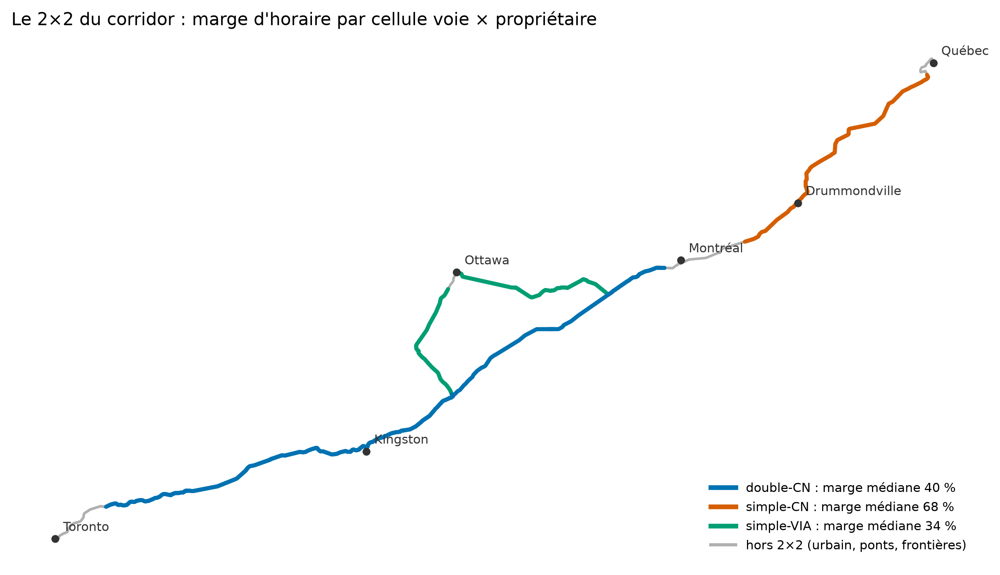

# Synthèse

Cette étude répond à une question simple : combien de temps le train peut-il prendre entre
les grandes villes du corridor, sur la voie qui existe déjà, selon ce qu'on accepte d'y
investir? La réponse est construite en additionnant quatre choses que l'on peut compter :
le temps que les courbes permettent, le temps des zones urbaines (figé à l'horaire
actuel), le temps des arrêts, et une marge d'exploitation que l'étude encadre entre deux
bornes au lieu de la deviner. Les figures ci-dessous en donnent la lecture d'ensemble,
contre le repère que tout décideur a en tête : l'auto ; la table complète des temps, par
tronçon, est en section 7.

Deux scénarios, et seulement deux (détail en section 3) : le **scénario de base** est le
train et l'horaire d'aujourd'hui ; le **scénario recommandé** est un train pendulaire
exploité selon la méthode que le CN applique déjà à ce type de train, avec le dévers
maximal standard du CN (aucune dérogation nécessaire), et plafonné à
**177 km/h (110 mi/h)**. Ce plafond n'est pas choisi par prudence : c'est la limite du
système de signalisation qui le permet, la superposition de contrôle en cabine dont le
précédent américain opère exactement à cette vitesse [@fra2024itcs], et c'est aussi le
seuil au-delà duquel le régime des passages à niveau change de nature (sections 5 et 6).
Les vitesses de ce document sont en km/h, suivies au besoin de l'équivalent en mi/h,
l'unité d'usage des chemins de fer nord-américains (177 km/h = 110 mi/h ;
160 = 99 ; 200 = 124).

**La lecture de la figure.** Aujourd'hui, le train fait à peu près jeu égal avec l'auto
sur Montréal-Toronto (536 km : 5 h 18 à l'horaire) et la perd nettement sur
Montréal-Québec (270 km : 3 h 22). Chaque barre du scénario recommandé est un temps
« avec marge » : le temps de base (courbes + zones urbaines figées + arrêts) majoré de
la marge d'exploitation, de la borne normative (8 pour cent au plafond retenu) à la
marge actuelle du tronçon ; les pourcentages face à l'auto sont donc des bornes, pas des
points. Le scénario recommandé bat l'auto sur Montréal-Toronto (4 h 27 à 4 h 52, soit
81 à 89 pour cent de son temps), sur Montréal-Ottawa (1 h 46 à 1 h 49, soit 76 à
78 pour cent) et sur Ottawa-Toronto (3 h 39 à 4 h 11, soit 84 à 96 pour cent), et fait
au moins jeu égal sur Montréal-Québec (2 h 30 à 3 h 03, soit 88 à 108 pour cent). Bout
en bout, Québec-Toronto par Montréal passe de 8 h 50 à l'horaire actuel à 7 h 07, arrêt
à Montréal compris, si la marge est tenue à la borne normative (figure suivante). La
troisième barre de chaque panneau est le **scénario plafond**[^plafond] : le recommandé,
poussé à sa borne. Il descend à 4 h 03 à 4 h 26 sur Montréal-Toronto (74 à 81 pour cent
de l'auto), 2 h 02 à 2 h 29 sur Montréal-Québec (72 à 88 pour cent), 1 h 26 à 1 h 28
sur Montréal-Ottawa et 3 h 28 à 3 h 58 sur Ottawa-Toronto.

[^plafond]: Le scénario plafond est le scénario recommandé auquel s'ajoutent les deux
sensibilités favorables de la section 7, calculées ensemble par le moteur : les
approches urbaines roulent ce que leur géométrie permet au lieu d'être figées à
l'horaire actuel, et les courbes des sections à doubler sont rectifiées au moment du
doublement. C'est une borne de ce que le corridor peut donner, pas une promesse : les
approches urbaines ont leurs propres contraintes, hors du périmètre de cette étude.

Le scénario recommandé tient en une phrase : **le train pendulaire suffit**. Il atteint
la borne haute des vitesses que les améliorations réalisables du corridor
(superposition de contrôle en cabine, traitement des passages à niveau) permettent
d'exploiter sur une partie suffisante du tracé, tout en restant entièrement dans le
précédent canadien : la méthode que le CN applique déjà aux trains pendulaires, sans
dérogation, sans technologie externe à approuver. Le plafond du scénario n'est pas fixé
par le train, qui pourrait aller plus vite, mais par le système de contrôle disponible
et par le mur réglementaire des passages à niveau au-delà. Ses conditions sont au nombre
de deux, et elles sont affichées sous la figure : la superposition de contrôle en cabine
(section 6), et le corridor scellé, c'est-à-dire le traitement de chacun des 891
passages à niveau de la zone rapide, dont 563 restent à équiper d'un système complet de
feux, cloches et barrières (section 5). Où le résultat tombe dans la fourchette dépend
surtout du régime de cohabitation, bien plus que du train ou de la voie : c'est l'objet
de la section 4.

La fourchette de marge n'est pas une estimation : sa borne basse est la marge normative
internationale, interpolée à 8 pour cent du temps de parcours au plafond retenu
(7 pour cent à 160 km/h, 9 pour cent à 200 [@uic2000f451; @schittenhelm2011]), sa
borne haute est la marge que l'horaire actuel de VIA porte aujourd'hui sur le tronçon
concerné (mesurée dans cette étude : de 11 pour cent sur Montréal-Ottawa à 32 pour cent
sur Montréal-Québec). La distance entre les deux bornes est le coût du régime
d'exploitation actuel ; la trancher est l'objet de l'étude de circulation recommandée
en conclusion.

Mise en regard : le projet Alto propose environ 1 000 km de voies neuves dédiées pour
relier Québec à Toronto par un tracé nord à 300 km/h ou plus [@alto2025]. La présente
étude documente ce que le réseau existant du corridor riverain (environ 1 090 km de
voies physiques, les troncs communs à deux trajets comptés une fois, parcourus en
1 433 km de trajets) peut donner, ainsi que les cinq
obstacles qui les retiennent et le prix réglementaire de chacun. Les deux exercices
sont complémentaires : on ne peut comparer les options qu'en connaissant les deux.

Le précédent qui valide l'ordre de grandeur est britannique. La West Coast Main Line
(Londres-Manchester-Glasgow), une ligne victorienne partagée avec le fret, a été
modernisée de 1998 à 2008 plutôt que remplacée par une ligne neuve : des trains
pendulaires à 125 mi/h (201 km/h) sur la voie existante et une signalisation relevée,
pour un coût d'environ 8,6 milliards de livres selon l'audit national [@nao2006wcml].
Les gains mesurés sont de la même famille que ceux calculés ici : 36 minutes de moins
sur Londres-Manchester (296 km) et 42 sur Londres-Glasgow (environ 645 km)
[@nao2006wcml], contre 26 à 51 minutes calculées sur Montréal-Toronto au scénario
recommandé. Le marché a suivi : sur Londres-Manchester, l'achalandage ferroviaire a crû
de 77 pour cent entre 2009 et 2017 pendant que le trafic aérien du même axe reculait de
27 pour cent [@wcml2026wiki]. La mise en garde symétrique vaut aussi : le budget
britannique a plus que triplé en cours de programme, faute d'une portée verrouillée au
départ [@nao2006wcml] ; c'est précisément le rôle de l'étude de circulation recommandée
en conclusion. Le précédent britannique porte enfin sur une troisième chose, le régime
d'accès à la voie partagée, dont la section 4 tire la leçon.

Les cinq constats principaux :

1. **La géométrie n'est pas le problème principal.** Avec le train pendulaire du
   scénario recommandé, il ne reste que 234 km (16 pour cent du réseau parcouru ;
   environ 265 km si l'on corrige le biais de mesure chiffré en section 7) dont les
   courbes restent sous le plafond de 177 km/h (110 mi/h), et 7 km sous
   100 km/h (62 mi/h). Le train d'aujourd'hui en laisse 494 km.
2. **Les passages à niveau sont la condition dominante du scénario, pas son mur.** Au
   plafond retenu, 891 des 924 passages du corridor se trouvent dans la zone rapide et
   relèvent du régime du corridor scellé : traiter chaque passage (barrières
   quatre-quadrants, terre-pleins, détection) ; 563 d'entre eux restent à équiper d'un
   système complet de feux, cloches et barrières. Le mur, lui, est au-delà : le
   précédent américain exige zéro passage au-dessus de 201 km/h (125 mi/h)
   [@ecfr213-347], et c'est une des raisons pour lesquelles le scénario s'arrête avant.
3. **La signalisation est une ligne de devis, pas un mur** : rien à faire jusqu'à
   160 km/h (99 mi/h), une superposition de contrôle en cabine de 161 à 177, dont le
   précédent américain est tarifé et opère exactement au plafond retenu
   [@fra2024itcs] ; le contrôle intégral n'est requis qu'au-delà de 177 (c'est le devis
   d'Alto, hors du scénario recommandé).
4. **Le régime de cohabitation pèse plus que le nombre de voies.** Mesuré sur les
   horaires de VIA à géométrie neutralisée : une voie simple ne coûte rien quand VIA est propriétaire, et 31 points quand le CN l'est. Sous VIA, elle porte même 3 points de marge de moins que la voie double du CN, et l'écart reste en sa faveur, de 3 à 7 points (3 à 6 minutes sur Montréal-Ottawa et Ottawa-Toronto), quelle que soit la pénalité d'arrêt testée ; sous le CN, le coût de la voie simple tient dans 30 à 33 points sur la même plage, soit de 23 à 26 minutes. Le même instrument montre ce que le doublement procure chez le CN : 31 points, soit 24 minutes sur Montréal-Québec et rien sur Montréal-Toronto, déjà doublé.
5. **La marge d'horaire est la grandeur que cette étude ne peut pas trancher.** Elle est
   encadrée (7 à 9 pour cent en régime normatif, 34 à 68 pour cent mesurés aujourd'hui
   selon la cellule) ; l'écart entre les deux est précisément ce qu'une étude de
   circulation avec le propriétaire de la voie devra allouer.

# Méthode et périmètre

## Le modèle

Le temps de parcours d'un tronçon se calcule comme on planifie un long trajet en auto :
en additionnant des morceaux que l'on peut vérifier un à un. Quatre morceaux, pour un
scénario et un plafond d'exploitation donnés :

1. **les zones urbaines**, où l'étude ne promet aucun gain : leur temps est figé à
   l'horaire actuel ;
2. **l'interurbain**, calculé mètre par mètre le long du tracé : en chaque point, le
   train est borné par la plus basse de deux vitesses, celle que la courbe locale
   permet (selon le scénario) et le plafond qu'on s'autorise (177 km/h pour le
   scénario recommandé) ; entre ces bornes, son profil réel d'accélération et de
   freinage est simulé (voir plus bas) ;
3. **les arrêts** : deux minutes d'immobilisation par arrêt intermédiaire, les phases
   d'accélération et de freinage étant déjà dans le profil simulé ;
4. **la marge d'exploitation**, jamais estimée : encadrée entre deux bornes.

En notation compacte :

$$T = \sum \text{blocs urbains figés} + \int \frac{dx}{V(x)} + \text{arrêts} + \text{marge}$$

avec $V(x)$ le profil de vitesse simulé, borné par
$\min(\text{vitesse géométrique du scénario}, \text{plafond})$ sur l'interurbain. Le
symbole $\int dx/V(x)$ ne dit rien d'autre que « chaque mètre du tracé est parcouru à
la vitesse que le train y atteint réellement, et on additionne ».

**Le profil d'accélération et de freinage est simulé, à paramètres déclarés.** Le
train de cette étude ne saute pas d'une vitesse à l'autre : sur l'interurbain, son
profil est calculé en deux passes (accélération plafonnée par la motorisation, qui
décroît avec la vitesse ; freinage de service constant), avec arrêt complet à chaque
gare intermédiaire et aux frontières des blocs urbains. Les paramètres de rame sont
des ordres de grandeur déclarés, pas des fiches constructeur : le scénario de base
reçoit une rame tractée comme la flotte actuelle (8 W/kg au rail, 0,5 m/s²) ; le
scénario recommandé reçoit une rame pendulaire de référence dimensionnée pour son
plafond (12 W/kg, 0,6 m/s²). Pentes et résistance à l'avancement ne sont pas
modélisées. Contre-vérification : l'ancien forfait de cinq minutes par arrêt sur
intégrale fluide retombe à une à huit minutes près sur les mêmes totaux par tronçon ;
la borne du pilote de 2025 (7,5 à 10 minutes par arrêt évité, effets de sillon
compris) encadre le tout par le haut, l'excédent au-delà de la dynamique pure
relevant du régime de cohabitation, donc de la marge.

**Vitesse géométrique** : le plafond que les courbes permettent. Une courbe de rayon $R$
(en mètres) limite la vitesse à $v = k\sqrt{R}$, où $k$ dépend du dévers (l'inclinaison
de la voie dans la courbe) et de l'insuffisance de dévers admise (l'inclinaison
« manquante » que le train et ses passagers acceptent de subir, ou que la caisse
pendulaire compense). C'est une borne physique, jamais une promesse d'horaire. La
formule utilise un écartement effectif de 1 524 mm (60 pouces, l'entraxe des rails,
à ne pas confondre avec l'écartement nominal de 1 435 mm mesuré entre faces
intérieures) : avec cette valeur, elle reproduit exactement la méthode officielle
du CN [@cn2002mr1305].

**Vitesse commerciale** : la vitesse résultante à l'horaire, une fois appliqués les
plafonds réglementaires (passages à niveau, signalisation), les blocs urbains, les arrêts
et la marge. Elle est calculée par l'intégration ci-dessus, jamais par un facteur
multiplicatif.

**Blocs urbains figés.** Aucun gain n'est compté dans les approches urbaines, quel que
soit le scénario : Montréal Central à Dorval (17,8 km), Montréal à Saint-Lambert par le
pont Victoria (6,1 km, tronçon de Québec), Sainte-Foy à Québec avec le pont de Québec
(19,9 km), Guildwood à Toronto Union (20,1 km), chacun figé à la médiane des horaires publiés
actuels (données ouvertes GTFS) [@viarail2026gtfs] ; Ottawa, sans gare d'approche proche, est traité par une
fenêtre de 10 km de part et d'autre \[HYPOTHÈSE, couverte par la sensibilité de ±20 pour
cent sur l'ensemble des blocs urbains\]. Une sensibilité où ces blocs sont réintégrés
au calcul est chiffrée en section 7.

**Arrêts.** Deux minutes d'immobilisation par arrêt intermédiaire hors blocs
urbains ; les phases d'accélération et de freinage sont simulées dans le profil
(l'ensemble revient à environ quatre à cinq minutes par arrêt au plafond retenu). Repère
mesuré : le pilote de train sans arrêt de septembre 2025 annonçait un gain de 30 à
40 minutes pour quatre arrêts sautés, soit 7,5 à 10 minutes par arrêt en conditions
réelles de cohabitation [@cbc2025pilote] ; l'écart entre ce chiffre et la dynamique
pure est un effet de sillon, qui vit dans la marge.

**Marge.** Jamais estimée : encadrée entre une borne normative et une borne mesurée
(section 4.3).

## Les données, et comment la géométrie a été mesurée

Deux sources publiques se complètent. Les données d'horaires ouvertes de VIA (le format
GTFS, celui qu'utilisent les applications de transport) disent quelles lignes le train
emprunte, dans quel ordre et avec quelles gares [@viarail2026gtfs]. La carte
collaborative OpenStreetMap dit où les rails passent physiquement, à quelques mètres
près [@osm2026geofabrik]. L'étude recolle la première sur la seconde : le tracé
schématique de VIA est verrouillé sur la voie réelle, et l'analyse suit cette voie comme
un train le ferait, sans en changer sauf à un aiguillage. Ce verrouillage est ce qui
évite les « courbes fantômes » qu'un appariement naïf fabrique en sautant entre deux
voies parallèles.

Sur le tracé ainsi reconstruit, un point tous les 10 mètres. Le rayon de courbure en
chaque point est estimé en faisant passer au mieux un cercle à travers les quelque
90 points d'une fenêtre glissante de 900 mètres : moyenner autant de points efface le
bruit de la carte sans aplatir les vraies courbes. L'estimateur a été calibré sur des
cercles synthétiques de rayon connu, puis validé sur des zones-témoins du corridor
(vraies courbes serrées des approches d'Ottawa et de Montréal, longues lignes droites de
la ligne de Kingston), qui doivent ressortir correctement à chaque régénération. Chaque
courbe devient ensuite une vitesse par la formule $v = k\sqrt{R}$ de la section 3, et
chaque segment est classé de façon volontairement conservatrice : sa vitesse est fixée
par sa courbe la plus serrée qui se maintient sur la longueur d'un train (environ
150 mètres), pas par une moyenne ni par un point isolé possiblement bruité. C'est la
logique d'une vraie limite de vitesse ferroviaire. L'ensemble a été validé par quatre
passes de contre-vérification indépendantes lors des phases antérieures du projet.

Le reste des données : nombre de voies par détection géométrique des voies parallèles
dans OpenStreetMap, corroborée par recoupement systématique
(91 pour cent d'accord sur la partie couverte par les documents d'exploitation publics)
et par un contrôle ponctuel contre un rapport du Bureau de la sécurité des transports
(0,1 km d'écart sur un tronçon double de 25 km) ; passages à niveau par l'inventaire officiel ouvert de Transports
Canada [@tc2023inventairepn] ; horaires par le flux GTFS de VIA, saison 2026
[@viarail2026gtfs].

## Hors périmètre, déclaré

La conception par site (clothoïdes, raccordements), les profils de traction constructeur
exacts, les pentes et la résistance à l'avancement (le profil d'accélération et de
freinage est simulé avec des paramètres génériques déclarés en section 2.1), le
cantonnement fin, la simulation de
circulation (c'est l'étude à commander), les ponts, tunnels et l'état détaillé de la
voie, ainsi que les zones urbaines au-delà de leurs blocs figés. Les horaires mesurés
datent de la saison 2026, une période de restrictions exceptionnelles liées aux passages
à niveau (section 5) : les marges mesurées sont donc possiblement gonflées, ce qui est
signalé partout où cela joue.

Règle d'écriture du document : des comptes et des seuils (« ce qui devrait être vrai »),
jamais des estimations d'auteur. On peut contester un coût ; on ne peut pas contester un
compte.

# Le train pendulaire et le dévers

Un train pendulaire incline sa caisse dans les courbes, ce qui permet de les franchir
plus vite sans inconfort pour les passagers. Le Canada en a déjà exploité un : le LRC,
auquel la méthode du CN accorde une insuffisance de dévers de 6 pouces (152 mm), contre
3 pouces pour un train ordinaire [@cn2002mr1305; @fra-lrc-152]. C'est un précédent
domestique, pas une hypothèse.

Les deux scénarios :

| | Dévers | Insuffisance | k (v = k·√R) | Statut réglementaire |
|---|---|---|---|---|
| Scénario de base : voie et train actuels | 100 mm (supposé) | 76 mm | 3,83 | régime courant |
| Scénario recommandé : pendulaire type LRC | 127 mm | 152 mm | 4,82 | 100 % précédent CN |

Le dévers du scénario recommandé (127 mm, soit 5 pouces) est le maximum standard du CN
pour trafic mixte [@cn2002mr1305] : il ne demande aucune dérogation et n'exclut pas le
fret. Le scénario de base porte un dévers supposé (le réseau réel n'a pas été relevé),
signalé comme tel partout.

**Ce que le train pendulaire libère**, en kilomètres de tracé dont le plafond
géométrique reste sous la cible (somme des quatre trajets analysés, 1 433 km) :

| Cible | Scénario de base | Scénario recommandé |
|---|---|---|
| Sous 177 km/h / 110 mi/h (restants sous le plafond retenu) | 494 km | 234 km |
| Sous 160 km/h / 99 mi/h | 358 km | 95 km |
| Sous 100 km/h / 62 mi/h (sections sévères) | 28 km | 7 km |

La lecture décisionnelle : la géométrie du corridor n'a pas besoin d'être reconstruite,
elle a besoin d'un meilleur train. Avec le pendulaire, 84 pour cent du tracé atteint
177 km/h (110 mi/h) ou plus sans toucher une seule courbe ; le résidu de 234 km est
listé section par section dans les annexes numériques du projet, avec le rayon à ouvrir
pour chaque site.

**Pourquoi s'arrêter là.** Le LRC suffit : il atteint la borne haute des vitesses que
les améliorations réalisables du corridor permettent d'exploiter. Au-dessus de
177 km/h (110 mi/h), le plafond n'est plus fixé par le train mais par le système :
la superposition de contrôle en cabine dont le précédent américain est tarifé opère
exactement à cette vitesse [@fra2024itcs], et le régime des passages à niveau se durcit
jusqu'à exiger zéro passage au-delà de 201 km/h [@ecfr213-347]. Un matériel pendulaire
plus performant existe (des insuffisances de dévers de 225 à 270 mm se conçoivent en
référence européenne [@tc2022rrts]), mais il sort du précédent nord-américain, demande
une approbation par équipement, et n'achèterait au plafond retenu que des kilomètres
conformes, pas des minutes : les courbes qu'il libère en plus sont précisément celles
où le LRC permet déjà 160 à 177 km/h. Rester au LRC, c'est rester dans une méthode que
le propriétaire de la voie applique déjà, en opposition à des technologies externes qui
ouvriraient un front d'approbation nouveau. L'histoire du LRC commande une réserve, et
elle est comptée : son système d'inclinaison, coûteux en entretien, a été retiré lors
de la remise à neuf de la flotte engagée à partir de 2007-2009, VIA justifiant ce
retrait par la réduction des coûts d'entretien et un allègement de deux tonnes par
voiture [@via2009lrc]. Le scénario recommandé suppose donc un pendulaire entretenu
comme tel, et la caisse pendulaire protège le passager, pas le rail : les efforts en
voie croissent avec la vitesse en courbe, ce qui implique un standard d'entretien
renforcé (un point de veto potentiel du propriétaire, et un coût récurrent).

# Doublement des voies et régime de cohabitation

Ces deux questions se mesurent avec le même instrument, lu dans deux directions. Le
corridor offre une expérience naturelle : des tronçons en voie simple appartenant à VIA
(croisements planifiés entre trains VIA), des tronçons en voie simple appartenant au CN
(croisements subis, le fret étant prioritaire chez lui), et des tronçons en voie double
du CN (croisements éliminés, dépassements subis). En comparant la marge d'horaire de ces
trois familles, à géométrie neutralisée, on lit séparément le prix de la voie manquante
et le prix du régime.

## La mesure

Pour chacune des paires de gares adjacentes du corridor, la marge est l'écart entre le
temps à l'horaire (médiane de tous les sillons, un sillon étant le créneau horaire d'un train donné) et le temps que la géométrie
permet au régime actuel (intégration à vitesse plafonnée à 160 km/h, soit 99 mi/h, en
profil fluide : ce choix est le même pour toutes les cellules et n'affecte pas leur
comparaison), rapporté à ce dernier. Les paires contaminées par un nœud (blocs urbains, ponts Victoria et de Québec,
approches d'Ottawa, chevauchements de frontière de propriétaire) sont exclues, chacune
avec son motif documenté. Résultat, sur le cœur du corridor (classe de voie homogène,
95 à 100 mi/h, soit 153 à 161 km/h, permis sur les lignes du CN et 80 à 95 mi/h, soit 129 à 153 km/h, sur celles de VIA) :

| Cellule | Longueur mesurée | Marge médiane | Dispersion entre sillons | Trafic (trains/jour) |
|---|---|---|---|---|
| Voie double, CN | 515 km (11 paires) | 37 % | 5 % | 40 |
| Voie simple, VIA | 218 km (5 paires) | 34 % | 10 % | 12 à 14 |
| Voie simple, CN | 192 km (2 paires) | 68 % | 21 % | 27 |

**Ce que vaut un point de marge.** Un point vaut 1 pour cent du temps que la géométrie
permet sur les kilomètres concernés, et ces kilomètres ne sont pas au même endroit selon
la cellule. La voie simple du CN est entièrement sur Montréal-Québec (77 minutes de temps
de base) ; les voies simples de VIA sont sur Montréal-Ottawa et Ottawa-Toronto (92 minutes
ensemble). Montréal-Toronto est en voie double sur toute la longueur retenue : aucun point
de doublement n'y est à gagner, et c'est pourquoi les minutes citées plus bas n'y
apparaissent pas.

Trois lignes, trois faits :

**Ce que le doublement procure, chez le CN** : environ 31 points de marge (68 contre 37), soit 24 minutes sur Montréal-Québec et rien sur Montréal-Toronto, déjà doublé. L'échantillon de voie simple CN est
mince (192 km, mais en deux paires seulement, celles du tronçon de Québec) : le chiffre
se publie en fourchette, pas au point. Il est en revanche robuste aux deux objections classiques, et cela se
vérifie dans la table : la classe de voie est la même que sur la ligne double (95 contre
95 à 100 mi/h permis), et la ligne double porte davantage de trafic (40 trains par jour
contre 27) tout en affichant moins de marge. Ni l'état de la voie ni le volume
n'expliquent l'écart ; les croisements l'expliquent. C'est la part « doublement » de la
figure des gains de la synthèse.

**Ce que le régime pèse** : sous propriétaire VIA, la voie simple ne coûte rien. Elle porte 3 points de marge de MOINS que la voie double du CN, et l'écart reste en sa faveur, de 3 à 7 points (soit de 3 à 6 minutes sur Montréal-Ottawa et Ottawa-Toronto réunis), sur toute la plage de pénalités d'arrêt testée (0 à 3 minutes par paire). Sous propriétaire CN, la même voie simple coûte 31 points, et de 30 à 33 sur la même plage, soit de 23 à 26 minutes sur Montréal-Québec. Le prix de la voie manquante n'est donc pas un prix de voie : il est nul chez l'un et de trente points chez l'autre. Une réserve honnête : les
lignes de VIA portent environ deux fois moins de trains que celles du CN ; ce qu'on
mesure est donc l'effet du régime au sens large, densité de fret comprise. C'est
précisément ce que le doublement seul ne change pas. Seconde réserve : cette lecture est
celle des horaires courants ; sur les horaires de janvier 2023, les mêmes paires VIA
portaient davantage de marge (49 pour cent), sans jamais approcher la voie simple du CN.
Le contraste entre propriétaires est robuste d'une saison à l'autre ; la gratuité exacte
de la voie simple chez VIA ne l'est pas (section 8).

**La dispersion raconte la même histoire.** Sur voie double, tous les trains d'une même
paire font le même temps (écart interquartile de 5 pour cent). Sur la voie simple du CN,
l'horaire d'une même paire varie de 8 à 16 minutes selon le sillon : les croisements avec
le fret sont écrits dans la grille de VIA elle-même. Le passager de Montréal-Québec paie
jusqu'à 24 minutes selon l'heure de son départ.

## Contre-épreuve : le sud-ouest ontarien

L'étude a étendu la mesure aux lignes Toronto-Windsor et Toronto-Sarnia. Cette région ne
se compare pas au cœur (la voie y est de classe inférieure, avec des vitesses permises de
42 à 70 mi/h (68 à 113 km/h) sur les lignes simples du CN : la marge y mesure d'abord l'état de la voie),
mais son contraste interne vaut la démonstration : le seul segment où le train roule à
vitesse normale (moyenne de 95 km/h ou 59 mi/h, sur une voie entretenue à 100 mi/h ou
161 km/h permis) est le segment
Chatham-Windsor, précisément celui que VIA possède. Les lignes simples voisines du CN,
presque vides (8 trains par jour), roulent à 40-60 km/h (25 à 37 mi/h) de moyenne sur des voies
laissées à 42-70 mi/h. Le propriétaire qui vit du service passager entretient sa voie ;
la conclusion du cœur se réplique dans une seconde région, par un autre mécanisme.

## L'encadrement de la marge

La marge d'horaire est la grandeur que cette étude ne peut pas trancher ; voici
l'intervalle où elle tombe nécessairement, et pourquoi.

**Borne basse, normative.** La fiche UIC 451-1 recommande, pour un train de voyageurs,
un supplément fixe plus un pourcentage selon la vitesse : au total environ 7 pour cent du
temps de parcours à 160 km/h (99 mi/h) et 9 pour cent à 200 (124 mi/h) [@uic2000f451; @schittenhelm2011] ;
au plafond retenu de 177 km/h, l'étude interpole à 8 pour cent.
Les règles publiées des gestionnaires nationaux se situent au même ordre : SNCF Réseau
impose 4,5 minutes par 100 km sur ligne classique et 5 pour cent sur ligne à grande
vitesse [@sncf2023drr] ; le gestionnaire suédois publie même le différentiel qui nous
intéresse : 3 minutes par 100 km en voie simple contre 2 en voie double, plus 60 secondes
par croisement [@trafikverket2025jnb]. Aucune règle publiée ne dépasse 15 pour cent.

**Borne haute, mesurée.** Le corridor porte aujourd'hui de 34 à 68 pour cent de marge selon la cellule (table ci-dessus). Ces marges par cellule ne sont pas les marges par
tronçon de la section 7 (11 à 32 pour cent) : ici la référence est le temps que la
géométrie permet en profil fluide, paires contaminées exclues ; là, le temps de base
inclut les blocs urbains figés à l'horaire, qui portent déjà leur propre marge. Le même
mot mesure deux références, et chacune sert son usage. L'écart entre les deux bornes n'est pas de la
prudence d'horairiste : c'est le prix, en minutes, du régime de cohabitation actuel.

**Le précédent continental.** L'inspecteur général d'Amtrak a documenté le même
phénomène : environ 70 pour cent du temps additionnel des horaires d'Amtrak est
provisionné pour les retards anticipés des chemins de fer hôtes, et le fret cause
59 pour cent des retards des longs parcours [@amtrakoig2019]. La situation du corridor
n'est pas une exception canadienne, c'est la condition générale du train de voyageurs
invité chez un propriétaire de fret.

**Pièces au dossier**, sans récit d'intention : le 11 octobre 2024, le CN a imposé aux
rames neuves de VIA un ralentissement à 72 km/h (45 mi/h) aux passages munis de prédicteurs, les circuits qui déclenchent les barrières à
l'approche d'un train (304 passages visés), déclenchant des retards de 30 à 45 minutes ; VIA a demandé le
contrôle judiciaire en Cour fédérale le 12 novembre 2024 [@via2024requete] ; l'ordre
ministériel de décembre 2024 était une demande d'information au CN, pas un
rétablissement des vitesses, et l'allègement négocié n'est entré en vigueur que le
28 août 2025 [@tc2025gcp]. Le pilote sans arrêt Montréal-Toronto a été suspendu le jour
prévu de son lancement, VIA invoquant des contraintes opérationnelles chez son hôte
[@cbc2025pilote]. La ponctualité du réseau est passée de 71-72 pour cent (2020-2021) à
57-59 (2022-2023), 51 (2024) puis 30 pour cent au premier trimestre 2025
[@via2025rapportannuel; @via2025t1].

**Le précédent du régime d'accès, et la leçon de la WCML.** Le précédent de la West
Coast Main Line ne porte pas seulement sur les travaux : il porte tout autant sur le
régime d'accès qui les accompagne. Au Royaume-Uni, l'infrastructure appartient à un
gestionnaire unique et neutre, Network Rail, distinct des exploitants voyageurs et fret
qui y font circuler leurs trains sous contrats d'accès réglementés [@orr2021cadre], et
aucun de ces contrats n'existe sans l'approbation ou l'injonction d'un régulateur
indépendant, l'Office of Rail and Road, faute de quoi il est juridiquement nul
[@orr2021cadre; @railwaysact1993]. La portée réelle de ce pouvoir se mesure sur la
WCML même : en juillet 2025, l'ORR a rejeté trois demandes de sillons au motif que le
tronçon sud, déclaré infrastructure congestionnée, ne pouvait plus les absorber sans
dégrader la performance des circulations voyageurs et fret existantes, tout en
s'assurant que le gestionnaire d'infrastructure traitait les demandeurs publics et
privés de façon équitable et non discriminatoire [@orr2025wcml]. C'est précisément la
fonction dont le corridor aura besoin une fois le doublement réalisé : la capacité
créée ne se répartit de façon crédible que si elle est arbitrée par un tiers
indépendant, et non par le propriétaire de l'une des deux circulations en présence. Le
Canada dispose déjà de l'institution et du pouvoir correspondants : l'Office des
transports du Canada peut accorder des droits de circulation sur le réseau d'une autre
compagnie, en fixer les conditions dans l'intérêt public et en déterminer l'indemnité
[@ltc1996art138; @otc2016circulation].

**Par où doubler : relier les évitements d'abord.** Un corridor à voie unique équipé
d'évitements est déjà partiellement doublé, et la simulation montre que le retard décroît
de façon régulière à chaque tronçon de deuxième voie ajouté lorsque l'on procède en
reliant des paires d'évitements existants : le programme se phase, sans effet de seuil
[@sogin2013doublement]. Ce n'est pas une hypothèse théorique : sur le corridor
Chicago-Detroit, l'étude d'impact fédérale retient précisément de moderniser et de relier
les évitements existants entre Niles et Dowagiac, en notant que cette liaison revient à
doubler la voie sur 16 milles et permet d'ajouter des fréquences à 110 mi/h
[@mdot2014tier1]. La FRA reconnaît de longue date qu'une série d'évitements longs accroît
substantiellement la capacité à un coût très inférieur au doublement continu
[@fra2004ptc]. Le programme de doublement du corridor devrait donc commencer par là :
allonger et relier les évitements en place sur les sections en voie simple, la deuxième
voie continue venant fermer les intervalles restants. L'inventaire fin des évitements
(position, longueur utile) relève de l'étude de circulation : la détection géométrique de
cette étude, calée sur une fenêtre plus large qu'eux, ne les résout pas un à un.

**Sur Montréal-Toronto, déjà doublé, « doubler » n'est pas la demande pertinente.** La
voie double élimine les croisements, pas les dépassements. L'intervention utile y est
l'ajout de liaisons rapides entre les deux voies (un dépassement se règle à basse ou à haute vitesse selon le type d'aiguillage
installé, ce qui change tout son coût en temps : ordres de grandeur 15 contre
45-50 mi/h, soit 24 contre 72-80 km/h, à vérifier en étude de circulation) et les sections de
troisième voie aux points de friction. Le dimensionnement précis relève de l'étude de
circulation.

# Passages à niveau

Un passage à niveau est un croisement rail-route à niveau. Sa tolérance réglementaire
décroît par paliers de vitesse ; le précédent nord-américain le plus structuré est
américain [@ecfr213-347], cité ici comme référence de seuils, non comme droit applicable
au Canada :

- **jusqu'à 153 km/h (95 mi/h)** : régime actuel (le précédent domestique est le Turbo, plafonné
  en service à 153 km/h notamment à cause de ses quelque 300 passages à niveau
  [@bateman2015], alors qu'il détenait le record canadien de 140,6 mi/h (226 km/h), établi en
  conditions d'essai non reproductibles et sans effet sur le temps commercial
  [@canadianrail1976]) ;
- **154 à 177 km/h (96 à 110 mi/h)** : corridor « scellé » : traiter chaque passage
  (barrières quatre-quadrants, terre-pleins, détection). Le programme de référence, en
  Caroline du Nord, a été évalué par la FRA : au moins 19 vies sauvées de 1995 à 2004 et
  une réduction projetée d'environ 52 pour cent de la mortalité du corridor
  [@bienaime2009sealed] ;
- **178 à 201 km/h (111 à 125 mi/h)** : système complet d'avertissement et de barrières approuvé et
  fonctionnel (classe 7 américaine) ;
- **au-delà de 201 km/h (125 mi/h) : zéro passage à niveau** (classes 8 et 9 américaines).

Le scénario recommandé s'arrête volontairement à 177 km/h : les deux dernières marches
de cet escalier décrivent ce que l'étude n'exige pas, et une des raisons de ne pas
viser plus haut sur une voie partagée.

**Le compte.** L'inventaire ouvert de Transports Canada [@tc2023inventairepn], joint au
tracé, donne 924 passages physiques sur le corridor (dédoublonnés entre trajets, chacun
classé à la vitesse maximale des trajets qui l'empruntent), dont
352 passages publics à protection active : le même ordre de grandeur que les 304 passages
à prédicteurs du dossier judiciaire de VIA [@via2024requete], qui couvre un périmètre
plus étroit (l'écart est expliqué dans les annexes numériques).

**Le compte au plafond retenu**, selon la vitesse d'exploitation du scénario recommandé
(la géométrie du pendulaire, plafonnée à 177 km/h) :

| Bande d'exploitation | Passages (corridor dédoublonné) |
|---|---|
| ≤ 153 km/h (95 mi/h) : régime actuel | 33 |
| 154-177 km/h (96-110 mi/h) : corridor scellé | 891 |

La lecture : le corridor scellé est la condition principale du scénario recommandé, et
elle se compte. Sur les 891 passages de la zone rapide, 328 portent déjà un système
complet de feux, cloches et barrières ; **563 restent à équiper**. Les 328 équipés ne
sont pas finis pour autant : leurs barrières sont à deux quadrants (elles ne ferment que
les voies d'entrée), et le corridor scellé leur ajoute les bras de sortie, les
terre-pleins et la détection ; les 563 autres partent de plus loin (475 passages
passifs, 60 avec feux et cloches sans barrières). Le tri
d'intervention, sur données ouvertes (le lecteur applique ses coûts unitaires) : 782
passages standards (municipaux ou privés, deux voies routières ou moins, hors zone
urbaine) et 109 complexes (urbains, multi-voies ou provinciaux). La colonne d'accès
(public ou privé) de chaque passage reste publiée dans les annexes numériques ; l'étude
ne propose la fermeture d'aucun passage.

# Signalisation

La signalisation se traite en un escalier de trois marches, chacune étant un compte et
une ligne de devis, pas une carte :

- **Jusqu'à 160 km/h (99 mi/h) : effet nul.** Le corridor s'exploite déjà à 160 km/h sous sa signalisation actuelle (la commande
  centralisée de la circulation, ou CTC), sans qu'aucune règle canadienne n'impose de
  plafond du type « 79 mi/h » (127 km/h) américain.
- **De 161 à 177 km/h (100 à 110 mi/h) : superposition de contrôle en cabine.** C'est la marche du
  scénario recommandé, elle mérite deux phrases de plus. Au-delà de 160 km/h,
  on considère que le conducteur ne peut plus conduire aux seuls signaux plantés le
  long de la voie : à cette vitesse, l'intervalle entre le moment où un signal devient
  lisible et le moment où il faut avoir réagi devient trop court pour reposer sur
  l'œil humain seul. Un système de contrôle en cabine répond en affichant l'état de la
  voie directement devant le conducteur, en continu, et en freinant automatiquement le
  train si la vitesse permise est dépassée. « Superposition » signifie que ce système
  s'ajoute par-dessus la signalisation existante sans la remplacer : la voie garde ses
  signaux, les trains de fret circulent comme avant, seuls les trains rapides
  embarquent l'équipement. Le précédent est opérationnel et tarifé : la ligne Amtrak
  du Michigan exploite 110 mi/h (177 km/h) avec un tel système incrémental superposé à
  la signalisation existante [@fra2024itcs]. Cette limite de 110 mi/h est celle du
  système lui-même : c'est elle qui fixe le plafond du scénario recommandé.
- **Au-delà de 177 km/h (110 mi/h) : contrôle intégral** de type ETCS (le standard européen de
  contrôle des trains) : le système incrémental s'arrête là, et tout ce qui dépasse
  demande de remplacer la signalisation plutôt que de s'y superposer. C'est le devis
  d'Alto [@alto2025], et l'argument économique pour ne pas viser ces vitesses sur la
  voie partagée : elles sont hors du scénario recommandé.

**Ce que la superposition fait à la capacité : rien en moins, et un levier en plus.** La
superposition retenue ne modifie pas le cantonnement existant : sur la ligne du Michigan,
l'ITCS est explicitement conçu comme une couche de sécurité posée par-dessus la commande
centralisée en place, et c'est ce dispositif qui a porté la vitesse voyageurs de 79 mi/h
en 2000 à 110 mi/h en 2012 sur une ligne partagée avec le fret [@fra2024itcs]. La
capacité existante n'est donc ni retranchée ni réattribuée : la superposition s'ajoute au
système, elle ne le remplace pas, et la position fédérale juge d'ailleurs non démontrés
les gains de débit du contrôle de train pris seul [@fra2004ptc]. Si l'on veut relever le
débit, le levier n'est pas la superposition mais le raccourcissement des cantons qu'elle
peut accompagner : la simulation d'un corridor nord-américain partagé montre qu'à niveau
de service constant, passer d'un cantonnement à trois aspects à quatre aspects puis au
bloc mobile fait passer la capacité de 45 à 50 puis 52 trains par jour, l'essentiel du
gain venant déjà de l'ajout d'aspects [@dick2019blocs]. Ce dimensionnement relève de
l'étude de circulation ; le point à retenir ici est que la marche du scénario recommandé
ne coûte rien à la capacité du propriétaire.

La signalisation a une seconde fonction, le débit (longueur des cantons, liaisons) : elle
vit dans le paquet capacité de l'étude de circulation, pas ici. Cette étude compte, elle
ne dimensionne pas.

# Résultats intégrés

Deux tables. La première donne les temps de base par tronçon : courbes, blocs urbains
figés et arrêts, sans marge. La seconde applique la marge en fourchette : c'est elle
qui se compare à l'horaire actuel.

**Temps de base (sans marge).**

| Tronçon | Horaire actuel | Scénario recommandé, plafond 177 |
|---|---|---|
| Montréal-Québec (270 km) | 3 h 22 | 2 h 18 |
| Montréal-Ottawa (185 km) | 2 h 02 | 1 h 38 |
| Ottawa-Toronto (442 km) | 4 h 35 | 3 h 22 |
| Montréal-Toronto (536 km) | 5 h 18 | 4 h 07 |

**Temps avec marge (fourchette).** Borne basse : la marge normative au plafond retenu
(8 pour cent du temps de base [@uic2000f451; @schittenhelm2011]). Borne haute : la
marge que l'horaire actuel du tronçon porte aujourd'hui, mesurée dans cette étude
(11 pour cent sur Montréal-Ottawa, 18 sur Montréal-Toronto, 24 sur Ottawa-Toronto,
32 sur Montréal-Québec). Contrôle interne de la méthode : nourrie du train, du plafond
et de la marge d'aujourd'hui, elle retombe sur l'horaire actuel, par construction.

| Tronçon (horaire actuel) | Scénario recommandé, plafond 177 |
|---|---|
| Montréal-Québec (3 h 22) | 2 h 30 à 3 h 03 |
| Montréal-Ottawa (2 h 02) | 1 h 46 à 1 h 49 |
| Ottawa-Toronto (4 h 35) | 3 h 39 à 4 h 11 |
| Montréal-Toronto (5 h 18) | 4 h 27 à 4 h 52 |

C'est de ces fourchettes que la figure des gains de la synthèse tire sa décomposition :
le gain de chaque trajet (l'écart entre l'horaire actuel et la borne basse de la
fourchette) est attribué à ses leviers : quatre parts dans la table jointe, que la
figure regroupe en trois tranches (le relèvement du plafond et le train pendulaire y
sont fusionnés). Le trajet Québec-Toronto de la figure est composé de Québec-Montréal
et de Montréal-Toronto, plus dix minutes d'arrêt à Montréal \[HYPOTHÈSE déclarée dans
la table\]. Les parts « relèvement du plafond » et
« train pendulaire » sont l'écart de temps de base recalculé en appliquant chaque
levier séparément, dans les deux ordres possibles, puis en moyennant (l'écart entre
les deux ordres, publié dans `decomposition_gains.csv`, ne dépasse pas 6 minutes) ; la
part « doublement » applique l'écart de marge mesuré entre voie simple et voie double
du CN (section 4) aux seuls kilomètres de voie simple CN du trajet ; la part
« cohabitation » est le résidu, borné à zéro, et c'est une définition honnête : ce que
l'étude ne peut pas allouer autrement, précisément l'objet de l'étude de circulation.

Sensibilités : blocs urbains ±20 pour cent, soit de ±4 à ±8 minutes de temps de base
selon le tronçon ; le biais de la fenêtre de mesure sur les segments courts est mesuré et chiffré ci-dessous ; l'immobilisation en gare (2 minutes par arrêt) peut être doublée sans changer
la conclusion (chaque minute ajoutée coûte de 3 à 10 minutes par tronçon selon
son nombre d'arrêts) ; la borne du pilote de 2025 (7,5 à 10 minutes par arrêt évité)
inclut des effets de sillon qui relèvent de la marge, pas du temps de base.

Deux sensibilités supplémentaires ont été calculées, dans le sens favorable cette
fois. **Blocs urbains réintégrés** : si les approches urbaines cessaient d'être figées
à l'horaire actuel et roulaient ce que leur géométrie permet, le temps de base du
scénario recommandé baisserait encore de 20 minutes sur Montréal-Québec, 15 sur
Montréal-Ottawa, 9 sur Ottawa-Toronto et 22 sur Montréal-Toronto. L'étude ne promet
rien de tel (les approches urbaines ont leurs propres contraintes, hors périmètre),
mais le chiffre borne ce que le statu quo urbain coûte. **Courbes rectifiées avec le
doublement** : reconstruire une plateforme pour y poser une seconde voie est le seul
moment où rouvrir un rayon ne coûte presque rien de plus. Si les courbes situées sur
les sections à doubler (162 km de segments concernés sur les quatre trajets, définis
par un recouvrement d'au moins 70 pour cent avec la voie simple hors gares) étaient rectifiées au plafond
retenu, le temps de base gagnerait encore 4 minutes sur Montréal-Québec et 3 sur
Montréal-Ottawa (moins d'une minute ailleurs) : un gain modeste en minutes, mais
gratuit au moment du chantier, et qui réduit d'autant les kilomètres restants sous
grande vitesse. La combinaison des deux, calculée ensemble par le moteur, est le
**scénario plafond** de la figure de la synthèse : un temps de base de 4 h 03 à 4 h 26
sur Montréal-Toronto, 2 h 02 à 2 h 29 sur Montréal-Québec, 1 h 26 à 1 h 28 sur
Montréal-Ottawa et 3 h 28 à 3 h 58 sur Ottawa-Toronto, marge comprise
(`tbase_par_bande_rectifies_blocs_libres.csv`).

## Le biais de la fenêtre de mesure, et ce qu'il coûte

L'estimateur ajuste un cercle sur une fenêtre glissante de 900 m. Sur une courbe plus
courte que cette fenêtre, il mélange la courbe et ses tangentes d'approche et rend un
rayon plus ample : il annonce une voie plus droite qu'elle n'est. Le biais est à sens
unique, il ne se compense donc pas en agrégeant.

Son ampleur a été mesurée sur le corridor, segment par segment : le corps de chaque
courbe est localisé avec un estimateur fin de 300 m, un cercle unique y est ajusté, et
ce rayon est comparé à celui que le rapport publie. Cet estimateur fin n'est pas
publiable en soi, la flèche d'une courbe ample n'y dépassant pas le bruit de la source ;
il sert de référence locale sur les courbes serrées, où il est légitime.

| Longueur du segment | Segments | Kilomètres | Facteur médian | 9e décile |
|---|---:|---:|---:|---:|
| Moins de 300 m | 155 | 31 km | 1,09 | 1,79 |
| 300 à 450 m | 151 | 56 km | 1,12 | 2,19 |
| 450 à 600 m | 160 | 82 km | 1,13 | 1,84 |
| 600 à 900 m | 158 | 114 km | 1,05 | 1,89 |
| 900 m et plus | 253 | 932 km | référence | référence |

La table ne compte que les segments où la référence fine est mesurable (877 des 1 014 ;
les autres, trop amples pour que la flèche de la courbe dépasse le bruit de la source,
n'ont pas de facteur). Sept cent dix des 1 014 segments du cœur sont plus courts que la fenêtre, soit 305 km
sur 1 433. La médiane du facteur y reste proche de 1, mais le neuvième décile atteint
1,8 à 2,2 : le biais épargne la plupart des segments courts et en frappe une minorité
fortement. Ce sont ces derniers qui déplacent les totaux.

| Restants sous 177 km/h, cœur | Publié | Corrigé |
|---|---:|---:|
| Scénario de base | 494 km | 530 km |
| Scénario recommandé | 234 km | 265 km |

L'effet sur les temps est d'un tout autre ordre : au plafond retenu, le temps de base
du scénario recommandé monte de 3 minutes sur Montréal-Québec, de 2 sur
Ottawa-Toronto et de moins d'une minute sur les deux autres tronçons (toutes
configurations confondues, l'effet va de 0 à 8 minutes, médiane 2).

**La lecture est donc dissymétrique, et c'est le point à retenir.** Ce que cette étude
annonce comme atteignable le reste : les temps de parcours bougent de une à trois
minutes, à l'intérieur des fourchettes déjà publiées. Ce qu'elle annonce comme travaux
restants est en revanche sous-estimé d'environ un huitième (le résidu corrigé du
scénario recommandé est de 13 pour cent plus long que le résidu publié). Un budget de
rectification bâti sur les kilomètres restants de ce rapport doit porter cette réserve.

Les chiffres publiés restent ceux de la chaîne sans correction, pour une raison de
méthode : corriger une partie seulement des segments avec une référence qui n'est pas
valable partout produirait une table mêlant deux mesures. La correction est donnée en
fourchette, son détail segment par segment est joint (`biais_segments_courts.csv`), et
sa levée relève de l'étude à commander, avec une source de géométrie plus fine que
l'inventaire ouvert.

Deux garde-fous internes : chaque segment publié vérifie par construction la cohérence
entre sa classe et sa vitesse (zéro violation sur 3 804 contrôles), et les zones-témoins
(courbes réelles d'Ottawa et de Montréal, vitesse de la ligne Kingston) ressortent
correctement à chaque régénération.

# Limites, et l'étude qu'il faut commander

Ce que cette méthode ne voit pas, elle le déclare : elle ne simule pas la circulation
(croisements réels, sillons de fret, robustesse d'horaire), elle ne conçoit aucun site,
elle ne chiffre aucun coût. Le plafond de 177 km/h est un choix de système (la limite
du contrôle en cabine incrémental disponible), pas une limite de la voie : ce que des
plafonds supérieurs donneraient reste calculé dans les annexes numériques du projet.
Ses horaires de référence datent d'une saison de restrictions exceptionnelles ; le
biais a été testé en rejouant la mesure sur les horaires de janvier 2023, antérieurs à
la crise. Le résultat central y tient : la voie simple du CN portait déjà 67 pour cent
de marge en 2023, contre 36 pour la voie double ; le coût du régime chez le propriétaire
de fret précède la crise. La lecture fine de la voie simple de VIA, elle, dépend de la
saison (49 pour cent de marge en 2023, 34 en 2026) : l'écart entre propriétaires reste
béant dans les deux saisons, mais la valeur « la voie simple ne coûte rien chez VIA »
est celle des horaires courants, et se lit comme telle.

C'est précisément pourquoi sa conclusion opérationnelle est une commande d'étude : une
étude de circulation, menée avec le propriétaire de la voie, qui alloue la marge entre
ses causes (fret, état de voie, passages à niveau, terminaux) et dimensionne les
interventions de capacité (liaisons rapides, sections de troisième voie, allongement
d'évitements). Tout ce que la présente étude compte en est l'intrant direct ; ses fourchettes en
bornent d'avance le résultat.

# Références
