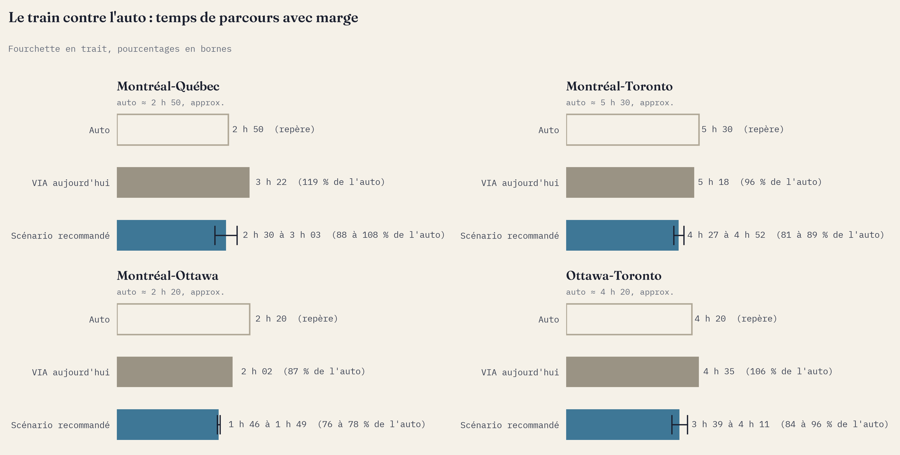

# L’essentiel

Le projet ALTO propose de construire environ 1 000 km de voies neuves pour relier Québec à Toronto à 300 km/h [@alto2025]. Cette étude répond à une question complémentaire : combien de temps le train prendrait-il sur la voie qui existe déjà, si on la modernisait? La réponse tient en trois scénarios, du plus simple au plus complet. Chacun contient le précédent.

- **Scénario 1 : le train pendulaire.** Un train qui s’incline dans les courbes, une signalisation modernisée, des passages à niveau sécurisés et une voie mieux inclinée. Aucune courbe n’est déplacée. Vitesse de pointe : 201 km/h (125 mi/h).
- **Scénario 2 : pendulaire et zones urbaines modernisées.** Le scénario 1, plus des travaux dans les approches des gares de Montréal, Québec, Ottawa et Toronto, pour que le train n’y traîne plus.
- **Scénario 3 : pendulaire, zones urbaines et courbes corrigées au doublement.** Le scénario 2, plus une chose : quand on ajoute une deuxième voie sur les sections qui n’en ont qu’une, on en profite pour adoucir les courbes qui s’y trouvent. C’est le seul moment où le faire coûte peu.

Les temps de parcours, marge d’exploitation de 10 % incluse, et la vitesse moyenne qui en résulte :

  | Trajet | Aujourd’hui | Scénario 1 | Scénario 2 | Scénario 3 | ALTO annoncé |
|---|---|---|---|---|---|
| Montréal-Québec (270 km) | 3 h 22 (80 km/h) | 2 h 35 (104 km/h) | 2 h 16 (119 km/h) | 1 h 56 (140 km/h) | ~1 h 30 |
| Montréal-Ottawa (185 km) | 2 h 02 (91 km/h) | 1 h 50 (101 km/h) | 1 h 34 (118 km/h) | 1 h 23 (134 km/h) | ~1 h |
| Ottawa-Toronto (442 km) | 4 h 35 (96 km/h) | 3 h 43 (119 km/h) | 3 h 34 (124 km/h) | 3 h 29 (127 km/h) | ~2 h |
| Montréal-Toronto (536 km) | 5 h 18 (101 km/h) | 4 h 27 (120 km/h) | 4 h 04 (132 km/h) | 4 h 04 (132 km/h) | 3 h |

Entre parenthèses : la vitesse commerciale moyenne, c’est-à-dire la distance divisée par le temps de parcours complet, arrêts et marge compris. C’est la mesure la plus honnête de ce qu’un voyageur vit. Les temps ALTO viennent du promoteur [@altotrain2026faq] ; le 3 h Montréal-Toronto est un engagement du gouvernement [@pmcanada2025alto]. De bout en bout, Québec-Toronto via Montréal passe de 8 h 50 aujourd’hui à 7 h 12 au scénario 1 et 6 h 10 au scénario 3, arrêt à Montréal compris.

**Ce que la table dit.** Aujourd’hui, le train fait à peu près jeu égal avec l’auto sur Montréal-Toronto et la perd nettement sur Montréal-Québec. Dès le scénario 1, le train bat l’auto sur les quatre trajets. Au scénario 3, il la bat de 20 à 41 %. Il ne rejoint pas ALTO, et ce n’est pas son rôle : la voie existante offre un train compétitif avec la route, pour une fraction de l’effort, pendant qu’ALTO se construit ou à sa place. Les deux lectures sont possibles ; cette étude fournit les chiffres, pas l’arbitrage.

**Cinq constats.**

1. **Les courbes ne sont pas le problème principal.** Avec le train pendulaire, 69 % du tracé permet 201 km/h (125 mi/h) ou plus sans déplacer une seule courbe. Il reste 449 km sous ce plafond, dont 22 km sévères (sous 100 km/h, 62 mi/h). La voie et le train d’aujourd’hui en laissent 771 km. Ces chiffres incluent une correction prudente de la mesure, expliquée à la section sur la méthode.
2. **Première condition : les passages à niveau.** Le corridor en compte 924. Au plafond de 201 km/h, 833 d’entre eux doivent être sécurisés au complet (barrières qui ferment toute la route, terre-pleins, détection d’obstacle), et le dispositif des 672 situés dans la bande la plus rapide doit en plus être approuvé par le régulateur. Sur ces 833, 533 n’ont pas encore de système complet de feux, cloches et barrières.
3. **Deuxième condition : la signalisation.** Chaque palier de vitesse exige son système, et chaque système existe déjà en Amérique du Nord. Le plafond de 201 km/h (125 mi/h) est le sommet de la marche du contrôle de train certifié : Brightline y roule en Floride, et Amtrak roule encore plus vite sur son corridor du Nord-Est. Au-delà de 201, le vrai mur n’est plus la signalisation : c’est l’interdiction de tout passage à niveau.
4. **La voie double vaut d’abord pour la fiabilité.** Sur la voie double, tous les trains d’un même trajet font à peu près le même temps. Sur la voie simple du CN, l’horaire du même trajet varie de 8 à 16 minutes selon le départ. Et le doublement est la condition d’une cohabitation où le passager et le fret gagnent tous les deux, au lieu de se voler des minutes.
5. **La marge d’exploitation retenue est de 10 %.** C’est un peu plus prudent que la moyenne des règles publiées par les gestionnaires de réseau européens, et c’est la valeur du référent britannique. Le corridor porte aujourd’hui de 29 à 60 % de marge selon le tronçon : cet écart est le prix du régime de cohabitation actuel, pas une fatalité technique.

**Le précédent qui valide l’ordre de grandeur** vient du Royaume-Uni. La West Coast Main Line relie Londres à Manchester et Glasgow. C’est une ligne ancienne, partagée avec le fret. Plutôt que de la remplacer, le Royaume-Uni l’a modernisée de 1998 à 2008 : trains pendulaires à 201 km/h sur la voie existante, signalisation relevée [@nao2006wcml]. Les gains sont de la même famille que les nôtres : 36 minutes sur Londres-Manchester, 42 sur Londres-Glasgow [@nao2006wcml], contre 51 à 74 minutes calculées ici sur Montréal-Toronto. Le marché a suivi : sur Londres-Manchester, l’achalandage du train a crû de 77 % pendant que l’avion reculait de 27 % [@wcml2026wiki]. La mise en garde vaut aussi : le budget britannique a plus que triplé en cours de route, faute d’une portée verrouillée au départ [@nao2006wcml]. C’est précisément le rôle de l’étude recommandée en conclusion.

# Trois scénarios, un seul train

Les trois scénarios utilisent le même train et le même plafond de vitesse. Ce qui change, c’est ce qu’on accepte de toucher autour du train.

**Le train : un pendulaire, comme le Canada en a déjà eu.** Un train pendulaire incline sa caisse dans les courbes. Les passagers ne sentent pas la courbe, alors le train peut la franchir plus vite. Le Canada a déjà exploité un tel train : le LRC. La méthode du CN lui accorde encore aujourd’hui une tolérance en courbe double de celle d’un train ordinaire [@cn2002mr1305; @fra-lrc-152]. Les trois scénarios reposent sur ce précédent canadien.

**Le plafond : 201 km/h (125 mi/h), et ce n’est pas un choix arbitraire.** C’est le sommet de la marche du contrôle de train certifié, prouvée en service commercial chez Brightline en Floride [@brightline2023] et dépassée par Amtrak sur le corridor du Nord-Est [@fra2010ptc]. C’est aussi la vitesse de la West Coast Main Line britannique, notre précédent central, en pendulaire [@hoc2010wcml]. Et c’est le seuil au-delà duquel le précédent américain interdit tout passage à niveau [@ecfr213-347] : viser plus haut, c’est changer de projet. La section sur la signalisation détaille l’escalier complet, y compris le palier de 177 km/h (110 mi/h), dont le prix ne tient pas à la signalisation mais aux passages à niveau.

**Scénario 1 : le train pendulaire.** On change le train, la signalisation, les passages à niveau, et on incline la voie au maximum standard du CN dans les courbes. On ne touche à rien d’autre. Les approches urbaines gardent leur temps actuel. Résultat : le train bat déjà l’auto partout.

**Scénario 2 : pendulaire et zones urbaines modernisées.** Le train perd beaucoup de temps dans les approches des gares : Montréal, Québec, Ottawa, Toronto. Le scénario 2 suppose que ces zones urbaines sont modernisées pour que le train y roule ce que la géométrie permet. C’est le levier le plus payant après le train lui-même : de 9 à 23 minutes selon le trajet. C’est aussi le plus incertain, car les approches urbaines ont leurs propres contraintes (ponts, cohabitation dense, terminaux) que cette étude ne résout pas.

**Scénario 3 : les courbes corrigées au moment du doublement.** Une grande partie du corridor n’a qu’une voie. Le programme de doublement (section suivante) reconstruit une plateforme pour y poser la deuxième voie. À ce moment-là, et à ce moment-là seulement, adoucir une courbe coûte peu : la machinerie est sur place et l’emprise est ouverte. Le scénario 3 corrige donc les courbes situées sur les 213 km de segments qui recoupent les sections à doubler. Sur Montréal-Toronto, déjà doublé, ce scénario n’ajoute rien : ses temps sont ceux du scénario 2.

**Pourquoi pas un pendulaire européen plus agressif?** Parce que le LRC suffit. Au-dessus de 201 km/h (125 mi/h), ce n’est plus le train qui bloque, c’est le mur des passages à niveau. Un matériel plus incliné sortirait du précédent nord-américain et ouvrirait un front d’approbation nouveau, pour un gain mince. Réserve : VIA a retiré le mécanisme d’inclinaison du LRC lors de sa remise à neuf, pour économiser l’entretien [@via2009lrc]. Un pendulaire use davantage le rail en courbe : le scénario suppose un entretien à la hauteur, à discuter avec le propriétaire de la voie.

# Ce que les scénarios demandent

## Les passages à niveau

Un passage à niveau est un croisement entre le rail et une route. Plus le train va vite, plus la règle est exigeante. Le barème le plus clair vient des États-Unis [@ecfr213-347], cité ici comme référence en l’absence d’échelle canadienne équivalente :

- **jusqu’à 153 km/h (95 mi/h)** : le régime actuel suffit ;
- **154 à 177 km/h (96 à 110 mi/h)** : « corridor scellé ». Chaque passage est traité : barrières qui ferment les deux sens de la route, terre-pleins pour empêcher le contournement, détection d’obstacle. Le programme de référence, en Caroline du Nord, a sauvé au moins 19 vies de 1995 à 2004 selon l’évaluation fédérale [@bienaime2009sealed] ;
- **178 à 201 km/h (111 à 125 mi/h)** : même famille de traitement, plus une approbation formelle du régulateur américain ;
- **au-delà de 201 km/h : zéro passage à niveau,** public ou privé, sans exception [@ecfr213-347]. C’est le mur qui impose à un TGV comme ALTO une voie neuve et clôturée.

Le compte, sur l’inventaire ouvert de Transports Canada [@tc2023inventairepn] : 924 passages physiques sur le corridor. Au plafond de 201 km/h (125 mi/h) :

  | Bande d’exploitation | Passages (corridor dédoublonné) |
|---|---|
| ≤ 153 km/h (95 mi/h) : régime actuel | 91 |
| 154-177 km/h (96-110 mi/h) : corridor scellé | 161 |
| 178-201 km/h (111-125 mi/h) : corridor scellé, dispositif approuvé | 672 |

Les 833 passages des deux dernières lignes se trouvent dans la partie interurbaine où le train dépasserait 153 km/h (95 mi/h) : ce sont eux qu’il faut sceller. Les 672 de la bande la plus rapide demandent en plus l’approbation formelle de leur dispositif par le régulateur, selon le précédent américain [@ecfr213-347]. Sur les 833, 300 ont déjà un système complet de feux, cloches et barrières ; il faudra tout de même leur ajouter les bras de sortie et les terre-pleins. Les **533 autres partent de plus loin** : 475 n’ont aucune protection automatique. Enfin, 93 des 833 sont en contexte complexe (urbains, routes à plusieurs voies, ou de compétence provinciale) et coûteront plus cher que les autres. Les 91 passages restants du corridor sont sur des sections qui resteront sous 154 km/h. Aucune fermeture de passage n’est proposée : le détail de chaque passage, y compris son statut public ou privé, est publié dans les annexes numériques. Ces comptes sont les mêmes pour les trois scénarios, qui partagent le même plafond.

Le précédent domestique mérite d’être rappelé : le Turbo des années 1970 détenait le record canadien de vitesse (226 km/h en essai) mais a été plafonné en service à 153 km/h, en bonne partie à cause de ses quelque 300 passages à niveau [@bateman2015; @canadianrail1976]. Le corridor bute sur ce mur depuis cinquante ans. Le corridor scellé est la façon d’en sortir.

## La signalisation

La signalisation ferroviaire n’est pas un continuum. C’est un escalier à trois marches, et chaque marche a un prix et un précédent.

**Marche 1 : les signaux au sol.** Le mécanicien lit des signaux plantés le long de la voie et obéit lui-même. Rien à bord ne freine le train à sa place. C’est le régime actuel du corridor (la commande centralisée de la circulation, ou CTC [@cror2025]). Aux États-Unis, ce régime plafonne à 127 km/h : au-delà, la règle exige un équipement à bord [@cfr236-0]. Au Canada, la contrainte publiée est ailleurs : les classes de voie s’arrêtent à 153 km/h pour les voyageurs (161 km/h pour les trains LRC), et rouler plus vite exige un dossier approuvé par le ministre [@tc2022rrts].

**Marche 2 : le contrôle en cabine, et c’est la marche des trois scénarios.** Un calculateur à bord connaît la limite à respecter et freine le train si le mécanicien ne le fait pas. Les signaux au sol restent en place : le fret circule comme avant, seuls les trains rapides embarquent l’équipement. Cette marche est prouvée en Amérique du Nord jusqu’au plafond retenu, et au-delà. Le régulateur américain l’a écrit lui-même : Amtrak exploite en sécurité entre 90 et 150 mi/h (jusqu’à 241 km/h) sur le Northeast Corridor, avec la signalisation de cabine et le système ACSES, un complément qui lit dans des balises posées entre les rails la limite de vitesse de chaque section et la fait respecter à bord [@fra2010ptc; @fra2000acela]. En Floride, Brightline roule à 201 km/h (125 mi/h) en service commercial sous un contrôle de train certifié ordinaire [@brightline2023; @fra2023brightlineptc]. Et la West Coast Main Line britannique roule à 201 km/h avec des trains pendulaires et des signaux au sol, complétés d’une protection ponctuelle [@hoc2010wcml; @orr2024tps]. Le plafond des scénarios n’est pas un chiffre choisi : 201 km/h est le sommet de cette marche, avant le dossier réglementaire renforcé exigé au-delà [@cfr236-1007] et surtout avant le mur des passages à niveau.

**Entre 177 et 201 km/h (110 et 125 mi/h), le prix n’est pas la signalisation : ce sont les passages à niveau.** Le contrôle en cabine est le même aux deux vitesses. L’ITCS de la ligne Amtrak du Michigan, posé par-dessus la signalisation existante, a porté cette ligne partagée avec le fret de 79 mi/h en 2000 à 110 mi/h en 2012 [@fra2024itcs] ; l’I-ETMS de Brightline est certifié à 125 [@fra2023brightlineptc] ; et le dossier renforcé du régulateur ne commence qu’au-delà de 125 [@cfr236-1007]. Ce qui change, c’est le régime des passages. Jusqu’à 110 mi/h, le corridor scellé suffit. De 111 à 125 mi/h, chaque segment qui garde des passages doit recevoir un dispositif de barrières décrit et approuvé par le régulateur fédéral, et le train n’y roule pas si un seul élément est en panne [@ecfr213-347]. Dans ce corridor, 672 passages se trouvent là où le pendulaire roulerait entre 178 et 201 km/h, contre 161 dans la bande scellée. Brightline a tranché exactement ce dilemme : 125 mi/h sur son seul tronçon sans passages, 110 partout ailleurs [@brightline2023]. S’ajoute une classe de voie plus exigeante (classe 7 au lieu de 6 : tolérances et inspections plus serrées, un coût récurrent) [@ecfr213-347]. Ce que les 201 achètent, à géométrie égale : de 2 à 13 minutes par tronçon selon le scénario (13 sur Montréal-Toronto au scénario 3, 6 sur Montréal-Ottawa). L’arbitrage est donc simple à poser : le programme de barrières approuvées sur 672 passages, contre ces minutes. Le train, la géométrie et le corridor scellé servent aux deux paliers ; un programme peut s’arrêter à 177 ou y commencer, puis monter.

**Marche 3 : le contrôle intégral.** Le train reçoit sa permission de rouler par radio, en continu. Les signaux au sol deviennent inutiles [@ec2026etcs; @eu2023ccstsi]. C’est le standard des lignes à grande vitesse neuves, et le devis d’ALTO. Sur une voie partagée avec le fret, ce serait remplacer toute la signalisation et rééquiper tous les trains : l’argument économique joue contre.

**Et la capacité?** La superposition ne retranche rien : elle s’ajoute au système en place. Si l’on veut faire passer plus de trains, le levier est le raccourcissement des cantons (les tronçons qu’un seul train peut occuper) : la simulation d’un corridor nord-américain partagé montre que ce levier ajoute plusieurs trains par jour [@dick2019blocs]. Ce dimensionnement relève de l’étude complète.

## L’inclinaison de la voie

Dans une courbe, la voie est inclinée vers l’intérieur : c’est le dévers. Les scénarios relèvent le dévers au maximum standard du CN pour trafic mixte (127 mm, soit 5 pouces) [@cn2002mr1305]. Aucune dérogation, aucun conflit avec le fret. Les paramètres, en millimètres et en pouces, l’unité de l’industrie :

  | | Dévers | Tolérance du train (insuffisance) | Coefficient k (v = k·√R) |
|---|---|---|---|
| Aujourd’hui : voie et train actuels | 100 mm, 4 po (supposé) | 76 mm (3 po) | 3,83 |
| Scénarios 1 à 3 : pendulaire type LRC | 127 mm (5 po) | 152 mm (6 po) | 4,82 |

Le dévers actuel est une hypothèse, car il n’existe pas de relevé public. Si le dévers réel est plus bas, le train d’aujourd’hui est encore plus lent que calculé, et le gain des scénarios encore plus grand : l’hypothèse joue contre nous, pas pour nous.

**Ce que le train pendulaire libère**, en kilomètres de tracé dont les courbes restent sous la cible (somme des quatre trajets, 1 433 km) :

  | Cible | Voie et train actuels | Train pendulaire |
|---|---|---|
| Sous 201 km/h, 125 mi/h (le plafond retenu) | 771 km | 449 km |
| Sous 177 km/h (110 mi/h) | 511 km | 364 km |
| Sous 160 km/h (99 mi/h) | 451 km | 236 km |
| Sous 100 km/h, 62 mi/h (sections sévères) | 75 km | 22 km |

La lecture est simple : la géométrie du corridor n’a pas besoin d’être reconstruite. Elle a besoin d’un meilleur train.

# Doubler la voie, et vivre ensemble sur le rail

## Ce que la voie double achète vraiment

Une grande partie du corridor n’a qu’une voie. Deux trains qui se croisent doivent s’y attendre l’un l’autre. Le programme proposé est simple : **on double tout ce qui doit l’être, sauf les grands ponts.** Le pont de Québec et le pont Victoria restent tels quels ; ils sont dans les zones urbaines, dont les contraintes sont traitées à part, et leur remplacement est un projet en soi. C’est une limite déclarée du programme, pas un oubli.

La voie double achète deux choses, et la première n’est pas la vitesse.

**D’abord, la fiabilité.** Le corridor offre une expérience naturelle : il y a des tronçons à voie simple de VIA, des tronçons à voie simple du CN, et des tronçons à voie double du CN. On peut comparer, à géométrie neutralisée, la marge que l’horaire porte dans chaque famille :

  | Famille | Longueur mesurée | Marge médiane | Variation entre départs |
|---|---|---|---|
| Voie double, CN | 515 km | 33 % | 5 % |
| Voie simple, VIA | 218 km | 29 % | 10 % |
| Voie simple, CN | 192 km | 60 % | 21 % |

La dernière colonne est la plus parlante. Sur la voie double, tous les trains d’un même trajet font à peu près le même temps. Sur la voie simple du CN, l’horaire du même trajet varie de 8 à 16 minutes selon le départ : les attentes de croisement sont écrites dans la grille horaire elle-même. Le passager de Montréal-Québec paie jusqu’à 24 minutes de plus selon l’heure de son billet. La voie double, c’est d’abord un train qui arrive à l’heure, à la même heure, tous les jours. Une précision de lecture : les pourcentages de cette table comparent les familles de voie entre elles, sur un temps de base fluide, sans arrêts ni approches urbaines. Ils ne sont pas la marge réelle d’un trajet, qui est donnée dans les résultats détaillés.

**Ensuite, la marge.** Chez le CN, passer de la voie simple à la voie double fait tomber la marge de 60 à 33 % : environ 27 points, soit une vingtaine de minutes sur Montréal-Québec. Mais le chiffre le plus instructif de la table est ailleurs : la voie simple de VIA porte MOINS de marge que la voie double du CN. Le prix de la voie manquante n’est donc pas d’abord un prix de béton. C’est un prix de régime : qui possède la voie, et qui passe en premier.

**Ce qui veut dire : le doublement seul ne suffit pas.** Montréal-Toronto est déjà doublé. Son horaire porte pourtant encore 12 % de marge au-dessus du temps de base du train actuel, contre la norme de 10 % retenue pour les scénarios ; Montréal-Québec, sur voie simple, en porte 24 %. Le doublement existant rapproche donc de la norme sans l’atteindre, et il ne règle pas seul la régularité. Trois compléments restent nécessaires : des liaisons rapides entre les deux voies pour dépasser sans ralentir, des sections de troisième voie aux points de friction, et surtout un régime de cohabitation arbitré [@sogin2013doublement; @dick2019blocs; @orr2025wcml]. Le dimensionnement précis relève de l’étude complète.

**En bref : la voie double est plus performante d’abord sur la fiabilité, et elle est la condition d’une meilleure cohabitation.** Aujourd’hui, chaque minute gagnée par le passager sur une voie simple est une minute prise au fret, et inversement : un jeu à somme nulle. Avec la deuxième voie, les deux circulations cessent de se disputer le même créneau. Le fret garde sa fluidité, le passager gagne sa régularité. C’est le seul investissement du dossier qui fait gagner les deux joueurs à la fois.

## Le régime de cohabitation, pièces au dossier

Le corridor appartient surtout au CN, qui vit du fret. VIA y est un invité. Les conséquences sont documentées. Le 11 octobre 2024, le CN a imposé aux rames neuves de VIA un ralentissement à 72 km/h à des centaines de passages à niveau, causant des retards de 30 à 45 minutes ; VIA a saisi la Cour fédérale [@via2024requete], et l’allègement négocié n’est entré en vigueur que dix mois plus tard [@tc2025gcp]. Autre pièce : le projet pilote sans arrêt, un train d’essai qui devait relier Montréal à Toronto directement, sans les arrêts intermédiaires habituels, pour démontrer le temps de parcours possible. Il a été suspendu le jour prévu de son lancement, VIA invoquant des contraintes opérationnelles chez son hôte [@cbc2025pilote]. Pendant ce temps, la ponctualité du réseau est passée de 71 % en 2020 à 30 % au premier trimestre 2025 [@via2025rapportannuel; @via2025t1]. Le phénomène n’est pas canadien : chez Amtrak aussi, environ 70 % du temps tampon des horaires provient des retards anticipés chez les hôtes [@amtrakoig2019].

**Qui répartit la capacité une fois la voie doublée?** Doubler la voie crée de la capacité. Encore faut-il que cette capacité soit répartie par un arbitre neutre, et non par le propriétaire de la voie, qui est aussi l’un des deux joueurs. C’est la leçon du Royaume-Uni. Là-bas, les rails appartiennent à un gestionnaire qui ne fait rouler aucun train, Network Rail. Les compagnies de voyageurs et de fret y achètent leurs passages sous contrat [@orr2021cadre]. Chaque contrat doit être approuvé par un régulateur indépendant [@orr2021cadre; @railwaysact1993]. Ce régulateur a de vrais pouvoirs. En juillet 2025, il a refusé trois demandes de passage sur la West Coast Main Line, parce que la ligne était pleine et que les trains déjà en service en auraient souffert [@orr2025wcml]. Le Canada n’a rien à inventer : l’Office des transports du Canada peut déjà accorder à une compagnie le droit de rouler sur les rails d’une autre, en fixer les conditions et en fixer le prix [@otc2016circulation; @ltc1996art138]. Ce pouvoir n’a simplement jamais servi.

## Par où commencer le doublement

Un corridor à voie unique équipé d’évitements (des tronçons courts de deuxième voie où un train peut en attendre un autre) est déjà partiellement doublé. La simulation montre que chaque tronçon de deuxième voie ajouté réduit le retard, régulièrement, sans effet de seuil, quand on procède en reliant des paires d’évitements existants [@sogin2013doublement]. C’est une pratique établie : sur le corridor Chicago-Detroit, l’étude fédérale retient exactement cette approche [@mdot2014tier1], et le régulateur américain reconnaît de longue date qu’une série d’évitements longs accroît la capacité à un coût bien moindre que le doublement continu [@fra2004ptc]. Le programme devrait donc commencer là : allonger et relier les évitements en place, la deuxième voie continue venant fermer les intervalles restants. L’inventaire fin des évitements relève de l’étude complète.

# Comment nous avons mesuré

Cette section explique d’où viennent les chiffres. Elle se lit en cinq minutes ; le détail complet est dans les annexes numériques et le code versionné.

## Les données

Deux sources publiques se complètent. Les horaires ouverts de VIA (le format GTFS, celui des applications de transport) disent quelles lignes le train emprunte et à quelle heure [@viarail2026gtfs]. La carte collaborative OpenStreetMap dit où les rails passent physiquement, à quelques mètres près [@osm2026geofabrik]. Comme VIA Rail ne fournit pas une géométrie suffisamment détaillée de sa voie, la géométrie du tracé (les courbes) vient de ces données ouvertes : l’étude accroche le tracé de VIA sur la voie réelle d’OpenStreetMap et suit cette voie comme un train le ferait. Les passages à niveau viennent de l’inventaire officiel de Transports Canada [@tc2023inventairepn]. Le nombre de voies est détecté par la géométrie des voies parallèles dans la carte.

## Le modèle de temps

Le temps de parcours d’un trajet est la somme de quatre morceaux :

1. **les zones urbaines** (les approches de Montréal, Québec, Ottawa et Toronto) : figées au temps de l’horaire actuel dans le scénario 1, modernisées dans les scénarios 2 et 3 ;
2. **la zone interurbaine** (tout le reste) : calculée mètre par mètre. En chaque point, le train roule à la plus basse de deux vitesses : celle que la courbe permet et le plafond de 201 km/h (125 mi/h). L’accélération et le freinage sont simulés avec des paramètres de rame déclarés ;
3. **les arrêts** : deux minutes d’immobilisation par gare intermédiaire, en plus du temps de freinage et de relance simulé ;
4. **la marge d’exploitation** : 10 % du temps de base, en un seul point.

Une courbe de rayon R limite la vitesse à v = k·√R. Le coefficient k dépend de l’inclinaison de la voie et de la tolérance du train. Avec l’écartement effectif utilisé, cette formule reproduit exactement la méthode officielle du CN [@cn2002mr1305].

## La marge de 10 %

La marge est le coussin que l’horaire ajoute au temps de roulement pur. L’étude a comparé les règles publiées des gestionnaires de réseau : la norme internationale donne 8 à 9 % à nos vitesses [@uic2000f451; @schittenhelm2011], la France 5 % sur ligne à grande vitesse et 12 % sur ligne classique [@sncf2023drr], la Suède 6 à 9 % selon le nombre de voies [@trafikverket2025jnb], et le référentiel de planification britannique applique 10 % [@rfli2026tpr]. L’étude retient **10 %** : légèrement plus prudent que la médiane, et aligné sur le référent britannique dont ce rapport invoque le précédent. Les valeurs allemande et suisse n’ont pas pu être confirmées en source primaire ; les recherches infructueuses sont documentées au registre des sources. En regard, le corridor porte aujourd’hui de 29 à 60 % de marge selon la famille de voie : l’écart entre cette réalité et la norme est le prix du régime de cohabitation, mesuré à la section précédente.

## La correction des courbes courtes

Pour mesurer une courbe, l’étude fait passer un cercle à travers 900 m de tracé. Sur une courbe plus courte que 900 m, cette fenêtre déborde : elle avale la courbe et les bouts droits qui l’entourent, et la courbe paraît plus douce qu’elle ne l’est. L’erreur va toujours dans le même sens : elle fait paraître la voie plus rapide qu’elle ne l’est.

Un audit de terrain, mené sur un secteur témoin avec la méthode de mesure d’un expert ferroviaire, a chiffré l’erreur : sur des courbes de 300 à 400 m, le rayon publié valait environ le double du rayon réel, ce qui gonfle la vitesse d’environ 30 %. Les chiffres publiés dans ce rapport incluent donc une correction forfaitaire et volontairement prudente : sur tout segment courbe de moins de 900 m, le rayon mesuré est divisé par deux avant de calculer la vitesse. Cette règle touche 414 segments (187 km) du cœur du corridor. Elle ajoute environ 96 km aux kilomètres restants sous le plafond (un quart de plus) et de 4 à 13 minutes aux temps de base selon le tronçon. Elle est prudente par construction : sur une partie des segments corrigés, l’erreur réelle est plus petite que le forfait. La lever demandera une source de géométrie plus fine que la carte ouverte : c’est un des mandats de l’étude à commander.

Deux garde-fous internes complètent la mesure : chaque segment publié vérifie par construction la cohérence entre sa classe et sa vitesse, et des zones-témoins (les vraies courbes serrées d’Ottawa et de Montréal, les longues lignes droites de la ligne Kingston) doivent ressortir correctement à chaque régénération.

## Hors périmètre

La conception par site, les fiches de traction des constructeurs, les pentes, la simulation fine de la circulation, les ponts et tunnels, l’état détaillé de la voie et l’intérieur des zones urbaines sont hors du périmètre. Les horaires mesurés datent de la saison 2026, une période de restrictions exceptionnelles : les marges mesurées sont possiblement gonflées, ce qui est signalé où c’est pertinent.

# Résultats détaillés

**Temps de base (sans marge) et temps publiés (avec marge de 10 %),** par tronçon :

  | Tronçon | Horaire actuel | Scénario 1 (base) | Scénario 1 (publié) | Scénario 2 (publié) | Scénario 3 (publié) | ALTO annoncé |
|---|---|---|---|---|---|---|
| Montréal-Québec | 3 h 22 | 2 h 21 | 2 h 35 | 2 h 16 | 1 h 56 | ~1 h 30 |
| Montréal-Ottawa | 2 h 02 | 1 h 40 | 1 h 50 | 1 h 34 | 1 h 23 | ~1 h |
| Ottawa-Toronto | 4 h 35 | 3 h 23 | 3 h 43 | 3 h 34 | 3 h 29 | ~2 h |
| Montréal-Toronto | 5 h 18 | 4 h 03 | 4 h 27 | 4 h 04 | 4 h 04 | 3 h |

Le trajet Québec-Toronto des figures additionne Québec-Montréal et Montréal-Toronto, plus dix minutes d’arrêt à Montréal (hypothèse déclarée). La méthode d’attribution des tranches de la figure des gains est dans l’annexe numérique (`decomposition_gains.csv`).

**La marge réelle de l’horaire actuel** est l’écart entre l’horaire et le temps de base du train d’aujourd’hui (`temps_scenario_1.csv`). Elle vaut 24 % sur Montréal-Québec, 16 % sur Ottawa-Toronto, 12 % sur Montréal-Toronto et 7 % sur Montréal-Ottawa. D’où une particularité de la figure des gains : Montréal-Ottawa n’a aucune tranche « doublement ». Ce tronçon roule sur la voie de VIA à partir de Coteau, sans fret prioritaire, et son horaire est déjà sous la norme de 10 %. Il n’y a aucun coussin à récupérer ; la norme absorbe même 3,6 minutes du gain pendulaire. Tout son gain vient de la géométrie.

**Les kilomètres restants sous le plafond** sont détaillés dans le sous-livrable joint (`sections_restantes_201kmh_pendulaire.pdf`) : 449 km en 169 sections. Onze sites courts (6,7 km au total) restent sous 100 km/h (62 mi/h) même avec le pendulaire : ce sont les seuls candidats à une rectification de tracé, et la plupart sont des courbes d’approche de gare.

**Sensibilités.** La délimitation des zones urbaines varie de ±20 % : effet de ±4 à ±8 minutes sur les temps de base. La rame actuelle de VIA (une locomotive Charger et cinq voitures Venture) porte 8,4 W de puissance nominale par kilogramme de rame à vide ; le modèle retient 8 [@viarail2024corridor; @siemens2024chargerwsdot; @wikipedia2026charger; @wikipedia2026venture]. Le train pendulaire de référence retient 12 W/kg, une valeur encadrée par les pendulaires en service : 10,9 pour l’ICE T allemand [@db2019icet411; @austriaforum2026icet], 11,1 pour le Pendolino de la West Coast Main Line, notre analogue le plus proche [@wikipedia2026class390], et 13,1 pour l’ETR 610 [@alstom2005pendolino; @wikipedia2026newpendolino]. Deux réserves : la masse des voitures Venture vient d’une source secondaire (corroborée à 1 % près par la fiche officielle de la locomotive), et la puissance nominale n’est pas celle disponible au rail : un train moins puissant ajouterait 3 à 5 minutes par tronçon. Les conventions de calcul sont au registre des sources.

# Et si on enlevait tous les passages à niveau?

Le plafond de 201 km/h (125 mi/h) tient à une seule chose : les passages à niveau. Supposons qu’on les enlève tous. Les 924 croisements du corridor sont dénivelés ou fermés, sans exception. Le mur tombe. Le train peut alors monter à la marche de signalisation suivante, déjà prouvée en Amérique du Nord : 241 km/h (150 mi/h), la vitesse du corridor du Nord-Est d’Amtrak [@fra2010ptc; @fra2000acela]. Combien de temps ce chantier achète-t-il?

La réponse, sur le scénario 3 (marge de 10 % incluse) :

  | Trajet | Scénario 3 (plafond 201 km/h) | Zéro passage à niveau (plafond 241 km/h) | Gain | ALTO annoncé |
|---|---|---|---|---|
| Montréal-Québec | 1 h 56 | 1 h 52 | 4 min | ~1 h 30 |
| Montréal-Ottawa | 1 h 23 | 1 h 21 | 2 min | ~1 h |
| Ottawa-Toronto | 3 h 29 | 3 h 21 | 8 min | ~2 h |
| Montréal-Toronto | 4 h 04 | 3 h 52 | 12 min | 3 h |

Sur le scénario 1, les gains sont du même ordre : de 1 à 12 minutes selon le trajet. De bout en bout, Québec-Toronto gagnerait 16 minutes.

**Pourquoi si peu?** Parce qu’au-dessus de 201 km/h, ce ne sont plus les passages qui retiennent le train : ce sont les courbes. Le tracé n’offre qu’un nombre limité de sections assez droites pour porter 241 km/h, et le train n’y reste jamais longtemps. Le mur des passages à niveau et le mur de la géométrie sont presque au même endroit.

**La lecture d’investissement est donc simple.** Comme levier de temps, déniveler les 924 passages ne se justifie pas : des centaines d’ouvrages pour gagner 2 à 12 minutes, là où le corridor scellé (le traitement des passages en place) fait partie du scénario de base et coûte une fraction de ce prix. Les dénivellations gardent leurs autres mérites, la sécurité d’abord, et quelques-unes se justifieront site par site. Mais quiconque veut des minutes au-delà du scénario 3 doit toucher au tracé lui-même, et c’est un autre projet : celui d’ALTO. Cette page borne l’écart entre les deux mondes.

# Limites, et l’étude qu’il faut commander

Cette étude ne simule pas la circulation réelle (croisements, sillons de fret, robustesse d’horaire). Elle ne conçoit aucun site et ne chiffre aucun coût. Le plafond de 201 km/h (125 mi/h) est un choix de système, pas une limite physique : c’est le sommet de la marche du contrôle de train certifié, et le seuil au-delà duquel le précédent américain interdit tout passage à niveau ; viser plus haut serait changer de projet. Les horaires de référence datent d’une saison de restrictions exceptionnelles ; la mesure a été rejouée sur les horaires de janvier 2023, antérieurs à la crise, et le résultat central tient : la voie simple du CN portait déjà bien plus de marge que sa voie double. La lecture fine de la voie simple de VIA, elle, varie selon la saison : le constat « la voie simple de VIA porte moins de marge que la voie double du CN » vaut pour les horaires courants, pas pour toutes les saisons.

L’étape suivante est une étude de circulation menée avec le propriétaire de la voie. Elle devra répartir la marge entre ses causes (fret, état de voie, passages à niveau, terminaux), dimensionner les interventions de capacité (liaisons rapides, troisième voie, évitements), lever la correction des courbes courtes avec une géométrie fine, et établir la feuille de route concrète de l’alternative à ALTO.

# Note de l’auteur

Consulting assisté par intelligence artificielle. Dans un marché du consulting auprès
des organisations publiques fortement bouleversé par l’intelligence artificielle, les
méthodes de travail permettant de maximalement mettre à profit les nouvelles
technologies sont appelées à changer rapidement. Conséquemment, il m’apparaît essentiel
d’expliciter davantage ma relation de travail avec l’IA, surtout considérant les
différences énormes entre les IA conversationnelles offertes gratuitement et les
modèles et harnais avancés utilisés ici. Ce rapport et ses analyses ont été produits à
l’aide d’agents de codage, soit les IA les plus performantes disponibles ayant les
capacités d’interagir en direct avec l’ordinateur, de créer des fichiers divers et de
les manipuler librement. Concrètement, le travail technique est dirigé, supervisé et
coréalisé par l’humain à toutes les étapes tandis que le rapport est rédigé par l’IA
sous direction humaine étroite et ensuite, révisé ligne par ligne. Cette approche
novatrice permet d’accélérer substantiellement la génération de connaissances utiles
pour les organisations publiques tout en assurant la fiabilité du contenu. Chaque
processus ayant produit ce rapport étant une ligne de code documentée, ce
fonctionnement permet un audit plus aisé du pipeline d’analyse ainsi que la
standardisation des méthodes de production du savoir. L’appareil complet est au
dossier : le dépôt de code versionné, le pipeline documenté étape par étape, le
registre des sources, et le visualiseur joint, dont les vérifications recalculent les
chiffres clés du rapport dans le navigateur du lecteur.

# Références
