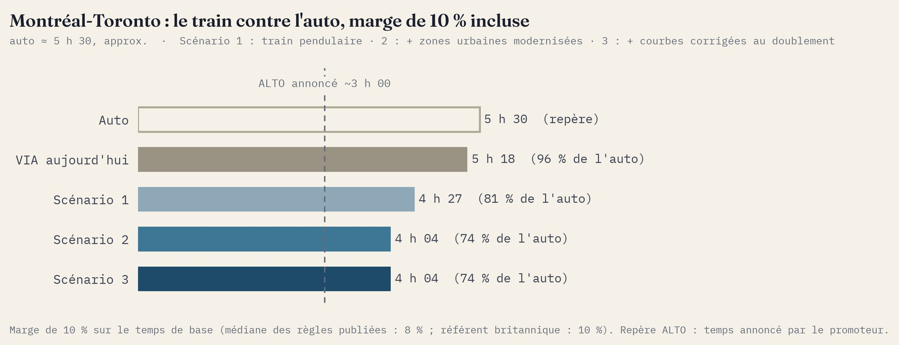
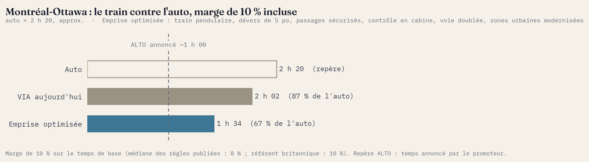
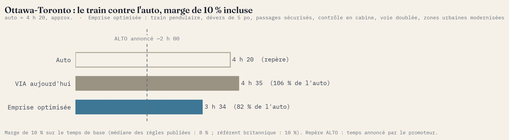

# L'essentiel

Le projet ALTO propose de construire environ 1 000 km de voies neuves pour relier Québec à Toronto à 300 km/h [@alto2025]. Cette étude répond à une question complémentaire : combien de temps le train prendrait-il sur l'emprise qui existe déjà, si on la modernisait?

Une fois l'emprise optimisée, le train Montréal-Toronto via Kingston passerait de 5 h 18 aujourd'hui à 4 h 04, soit 1 h 14 de moins. Plus d'une heure serait aussi retirée du trajet Montréal-Québec, qui passerait de 3 h 22 à 2 h 16. Le temps de parcours Montréal-Ottawa, lui, serait réduit de 28 minutes.

Sans offrir une vitesse équivalente à la prévision d'ALTO, l'amélioration de l'emprise existante offre un train compétitif, pour une fraction de l'effort, du temps et du coût. Cet investissement aurait aussi l'avantage d'améliorer la sécurité des opérations des trains de marchandises et de réduire les nuisances pour les populations avoisinantes du chemin de fer, notamment par la sécurisation ou l'élimination des croisements routiers.

**Temps de parcours et vitesse moyenne commerciale.**

  | Trajet | Auto (repère) | Voie actuelle | Emprise optimisée | ALTO annoncé |
|---|---|---|---|---|
| Montréal-Québec (270 km) | ~2 h 50 | 3 h 22 (80 km/h) | 2 h 16 (119 km/h) | ~1 h 30 |
| Montréal-Ottawa (185 km) | ~2 h 20 | 2 h 02 (91 km/h) | 1 h 34 (118 km/h) | ~1 h |
| Ottawa-Toronto (442 km) | ~4 h 20 | 4 h 35 (96 km/h) | 3 h 34 (124 km/h) | ~2 h |
| Montréal-Toronto (536 km) | ~5 h 30 | 5 h 18 (101 km/h) | 4 h 04 (132 km/h) | 3 h |

Entre parenthèses : la vitesse commerciale moyenne, c'est-à-dire la distance divisée par le temps de parcours complet, arrêts et marge compris. Le temps en auto est une estimation à partir de la cartographie routière grand public, approximative. Les temps du projet ALTO viennent du promoteur [@altotrain2026faq] ; le 3 h Montréal-Toronto est d'ailleurs un engagement du gouvernement [@pmcanada2025alto]. De bout en bout, Québec-Toronto via Montréal passerait de 8 h 50 aujourd'hui à 6 h 30, avec dix minutes d'arrêt à Montréal, contre environ 4 h 30 pour le projet ALTO.

Aujourd'hui, le train fait à peu près jeu égal avec l'auto sur Montréal-Toronto et la perd nettement sur Montréal-Québec. Sur l'emprise optimisée, le train prend de 67 à 82 % du temps de l'auto selon le trajet : il devient très compétitif.

**Gain d'achalandage.** Cette optimisation pourrait permettre un gain d'achalandage très important, même si la vitesse n'est pas celle d'un TGV. Selon l'étude EcoTrain commandée par les gouvernements du Québec, de l'Ontario et du Canada, l'option à 200 km/h récupère 92 % de l'achalandage prévu pour l'option à 300 km/h, d'après les prévisions de son tableau 5-7 (10,2 contre 11,1 millions de voyageurs en 2031) [@ecotrain2011, p. 54].

**Les actions pour réduire le temps de trajet.** La réduction du temps de parcours est réalisable grâce aux cinq actions suivantes.

1. **Doublement des voies.** La voie est simple sur 31 % du trajet. Un doublement permettrait une cohabitation où le passager et le fret gagnent tous les deux, au lieu de se voler des minutes.
2. **Une signalisation modernisée.** Grâce à l'installation d'un système de contrôle de train en cabine comme celui déjà utilisé aux États-Unis, la distance nécessaire entre les trains sera de beaucoup réduite, ce qui favorisera la cohabitation. Ce système autorise une vitesse maximale de 201 km/h (125 mi/h) quand la voie le permet.
3. **Arbitrage de l'Office des transports du Canada.** Nous proposons de donner une orientation claire en faveur du service aux passagers, par règlement ou par projet de loi, dans le but de permettre à l'Office des transports du Canada d'exercer ses pouvoirs d'accorder à une compagnie le droit de rouler sur les rails d'une autre, d'en fixer les conditions et d'en fixer le prix [@otc2016circulation; @ltc1996art138], même lorsqu'ils s'appliquent aux contrats de cohabitation existants.
4. **Passages à niveau éliminés ou sécurisés.** Le corridor en compte 924. Il faudra en sécuriser 533 qui n'ont pas de barrières complètes. Un programme distinct de ponts d'étagement, présenté à part, éliminerait le tiers des croisements, en priorité parmi les 102 situés en zone urbaine.
5. **Train pendulaire et voies plus inclinées dans les courbes.** Un train pendulaire incline sa caisse dans les courbes. De plus, on incline la voie au maximum standard du CN (dévers de 127 mm, soit 5 po) dans les courbes. Cela permet de faire en sorte que les passagers ne sentent pas la courbe et donc, que le train puisse la franchir plus vite.

Les actions 1 à 3 réduisent la marge d'exploitation, soit l'écart entre le temps de parcours réel et la possibilité théorique fondée sur la géométrie de la voie. Les actions 4 et 5 accroissent cette possibilité théorique : le train pendulaire prend les courbes plus vite, et les passages sécurisés, avec le contrôle en cabine, autorisent 201 km/h. L'analyse des données et les conseils de notre expert ferroviaire [@dusablon2026] nous permettent de retenir une marge d'exploitation de 10 %, alignée sur la West Coast Main Line britannique, qui relie Londres à Manchester et Glasgow avec des trains pendulaires à 201 km/h sur des voies partagées avec les trains de marchandises. Nous estimons l'ordre de grandeur du coût de ces cinq actions à environ 4,5 G$ CA (section 9). Un programme distinct d'élimination du tiers des croisements par des ponts d'étagement, qui n'est pas nécessaire aux temps calculés ici, s'y ajouterait pour environ 8 G$ CA.

Comme le montre la table qui suit, les actions proposées auront un impact significatif. Les postes se lisent sur le trajet complet Québec-Toronto ; la section 10 donne le détail en minutes, trajet par trajet.

  | Facteur de réduction du temps de parcours | Part du gain |
|---|---|
| Cohabitation : doublement des voies, arbitrage, capacité libérée par la signalisation | 41 % |
| Changement de classe de vitesse : passages à niveau sécurisés et contrôle en cabine | 32 % |
| Train pendulaire et dévers | 21 % |
| Zones urbaines modernisées | 6 % |

![Facteurs de réduction des temps de parcours, trajet par trajet. La barre pleine, incluant les parties colorées, est l'horaire actuel. Le segment sans couleur est le temps de l'emprise optimisée. Quatre facteurs se partagent le gain : la cohabitation, qui réunit le régime de circulation avec le fret et le doublement des voies ; le train pendulaire et les zones urbaines, comptés sous la classe de voie actuelle (153 km/h, 95 mi/h) ; et le changement de classe, soit ce que ces facteurs rapportent en plus une fois le plafond porté à 201 km/h grâce aux passages à niveau sécurisés et à la signalisation.](livrables/figure_gains.png)

# Comment nous avons mesuré

## La méthode

Pour réaliser ce rapport, nous avons combiné l'expertise d'un expert ferroviaire avec une analyse assistée par agents de codage (IA) des données publiques disponibles, provenant notamment des images satellites. Cette analyse a été réalisée par Vincent Duguay, étudiant à la maîtrise recherche à l'ENAP.

Notre expert ferroviaire, Pierre DuSablon, a une longue expérience dans le domaine ferroviaire et a notamment été responsable des opérations du CN sur la section Montréal-Québec. Il a utilisé les diagrammes de la voie entre Québec et Montréal pour évaluer l'impact de certaines actions visant à réduire les temps de parcours. Son avis, reproduit intégralement en annexe, vient valider les hypothèses de l'analyse de Vincent Duguay [@dusablon2026].

**Analyse assistée par agents de codage (IA) des données satellites.** Comme VIA Rail ne fournit pas une géométrie suffisamment détaillée de sa voie, la géométrie du tracé vient des données ouvertes OpenStreetMap, appariées aux horaires de VIA. Ces deux sources publiques se complètent. Les horaires ouverts de VIA (le format GTFS, celui des applications de transport) disent quelles lignes le train emprunte et à quelle heure [@viarail2026gtfs]. La carte collaborative OpenStreetMap dit où les rails passent physiquement, à quelques mètres près [@osm2026geofabrik]. L'étude accroche le tracé de VIA sur la voie réelle d'OpenStreetMap et suit cette voie comme un train le ferait. Les passages à niveau viennent de l'inventaire officiel de Transports Canada [@tc2023inventairepn]. Le nombre de voies, lui, est détecté par la géométrie des voies parallèles dans la carte. La page de crédits décrit la méthode de travail avec les agents de codage.

## Le modèle de temps

Le temps de parcours d'un trajet est la somme de quatre morceaux :

1. **les zones urbaines** (les approches de Montréal, Québec, Ottawa et Toronto) : intégrées sous le même calcul de vitesse que l'interurbain, en tenant compte toutefois des limitations particulières des approches de Montréal et de Québec ;
2. **la zone interurbaine** (tout le reste) : en chaque point, le train roule à la plus basse de deux vitesses : celle que la courbe permet, et le plafond de 201 km/h (125 mi/h) établi. L'accélération et le freinage sont simulés avec des paramètres de puissance et de masse de rame référencés [@siemens2024chargerwsdot; @db2019icet411; @wikipedia2026class390] ;
3. **les arrêts** : deux minutes d'immobilisation par gare intermédiaire, en plus du temps de freinage et de relance ;
4. **la marge d'exploitation** : 10 % du temps de base, fondée sur les normes internationales [@uic2000f451; @rfli2026tpr] et sur ce qui est déjà possible sur certains segments (Montréal-Ottawa, sur la voie simple détenue par VIA, opère avec 7 % de marge seulement).

Une courbe de rayon R limite la vitesse selon la formule v = k·√R. Le coefficient k dépend de l'inclinaison de la voie et de la tolérance du train. Avec l'écartement effectif utilisé, cette formule reproduit exactement la méthode officielle du CN [@cn2002mr1305].

**Matériel roulant.** L'hypothèse est qu'une rame actuelle de VIA (une locomotive Charger et cinq voitures Venture) porte 8,4 W de puissance nominale par kilogramme de rame à vide ; le modèle arrondit à 8 [@viarail2024corridor; @siemens2024chargerwsdot; @wikipedia2026charger; @wikipedia2026venture]. Le train pendulaire de référence retient 12 W/kg, une valeur encadrée par les pendulaires en service : 10,9 pour l'ICE T allemand [@db2019icet411; @austriaforum2026icet], 11,1 pour le Pendolino de la West Coast Main Line, notre analogue le plus proche [@wikipedia2026class390], et 13,1 pour l'ETR 610 [@alstom2005pendolino; @wikipedia2026newpendolino]. Deux réserves : la masse des voitures Venture vient d'une source secondaire (corroborée à 1 % près par la fiche officielle de la locomotive), et la puissance nominale n'est pas celle disponible au rail : un train moins puissant ajouterait 3 à 5 minutes par tronçon.

## La marge d'exploitation de 10 %

La marge est le coussin que l'horaire ajoute au temps de roulement pur. Les actions identifiées permettront de la réduire. L'étude a comparé les règles publiées des gestionnaires de réseau : la norme internationale donne 8 à 9 % aux vitesses analysées [@uic2000f451; @schittenhelm2011], la France 5 % sur ligne à grande vitesse et 12 % sur ligne classique [@sncf2023drr], la Suède 6 à 9 % selon le nombre de voies [@trafikverket2025jnb], le référentiel de planification britannique applique 10 % [@rfli2026tpr] et surtout, Montréal-Ottawa, sur la voie simple détenue par VIA, opère avec 7 % de marge seulement.

L'analyse des données et les conseils de notre expert ferroviaire [@dusablon2026] nous permettent de retenir une borne conservatrice de 10 % : légèrement plus prudent que la médiane, et aligné sur le référent britannique.

Le précédent qui valide l'ordre de grandeur vient du Royaume-Uni. La West Coast Main Line relie Londres à Manchester et Glasgow. C'est une ligne ancienne, partagée avec le fret. Plutôt que de la remplacer, le Royaume-Uni l'a modernisée de 1998 à 2008 : trains pendulaires à 201 km/h sur la voie existante (le même plafond que celui retenu ici), avec signalisation relevée [@nao2006wcml]. Les gains sont de la même famille que les nôtres : 36 minutes sur Londres-Manchester (environ 300 km), 42 sur Londres-Glasgow (environ 650 km) [@nao2006wcml], contre 74 minutes calculées ici sur Montréal-Toronto (536 km). Le marché a suivi : sur Londres-Manchester, l'achalandage du train a crû de 77 % pendant que l'avion reculait de 27 % [@wcml2026wiki]. La mise en garde vaut aussi : le budget britannique a plus que triplé en cours de route, faute d'une portée verrouillée au départ [@nao2006wcml]. C'est précisément le rôle de l'étude qui devrait suivre.

## La correction des mesures des courbes courtes

Les chiffres présentés ici incluent une correction prudente des courbes courtes : sur tout segment courbe de moins de 900 m, le rayon est divisé par deux, une règle calée sur un audit de terrain.

Pour mesurer une courbe, le code fait passer un cercle à travers 900 m de tracé. Sur une courbe plus courte que 900 m, cette fenêtre déborde de chaque côté : elle avale la courbe et les bouts droits qui l'entourent, et la courbe paraît plus douce qu'elle ne l'est. L'erreur va toujours dans le même sens : elle fait paraître la voie plus rapide qu'elle ne l'est. Malheureusement, l'imprécision de la carte publique nous empêche d'utiliser la même méthode que le CN, soit la flèche mesurée sur une corde de 62 pieds.

Pour y remédier, une vérification sur le terrain menée sur un secteur témoin avec notre expert ferroviaire (Pierre DuSablon, communication personnelle, août 2026) a permis de chiffrer l'erreur en comparant la mesure officielle avec le résultat du code : sur des courbes de 300 à 400 m, le rayon publié valait, dans le pire cas, environ le double du rayon réel ; cet écart gonfle donc la vitesse possible d'environ 30 % sur les courbes courtes. Les chiffres publiés dans ce rapport incluent donc une correction volontairement prudente : sur tout segment courbe de moins de 900 m, le rayon mesuré est divisé par deux avant de calculer la vitesse, alignant leur vitesse sur le plus grand écart entre la mesure de l'expert et celle du code. Cette règle touche 414 segments (187 km), ajoute environ 96 km aux kilomètres restants sous le plafond (un quart de plus) et de 4 à 13 minutes aux temps (avant marge) selon le tronçon. Lever cette incertitude serait relativement simple avec un accès à une carte plus précise, ce qui n'a pas été possible dans le cadre de cette étude basée sur des données ouvertes.

## Hors périmètre

La conception par site, les fiches de traction des constructeurs, les pentes, la simulation fine de la circulation, les ponts et tunnels, l'état détaillé de la voie et l'intérieur des zones urbaines sont hors du périmètre de cette étude. Les horaires mesurés datent de la saison 2026, une période de restrictions exceptionnelles : les marges mesurées sont possiblement gonflées, ce qui est signalé où c'est pertinent.

# Doubler la voie

Une partie du corridor n'a qu'une seule voie, alors que l'emprise pourrait permettre d'en bâtir une deuxième. Le programme proposé est simple : on double tout ce qui n'est pas déjà doublé, sauf les ouvrages majeurs comme les grands ponts. Le pont de Québec et le pont Victoria restent tels quels, par exemple : leur remplacement est un projet en soi. C'est une limite déclarée de l'analyse.

En comparant les horaires de VIA sur les tronçons à voie simple de VIA, à voie simple du CN et à voie double du CN, on remarque que la variation entre les temps de trajet des différents départs est quatre fois plus faible sur la voie double du CN que sur sa voie simple. La raison est simple : VIA doit se garder une marge plus grande à certains moments de la journée à cause des activités des trains de marchandises. La marge médiane est un exercice comparatif entre familles de voie ; ses pourcentages ne sont pas directement transposables aux temps de trajet réels.

  | Famille | Longueur mesurée | Marge médiane | Variation entre départs |
|---|---|---|---|
| Voie double, CN | 515 km | 33 % | 5 % |
| Voie simple, VIA | 218 km | 29 % | 10 % |
| Voie simple, CN | 192 km | 60 % | 21 % |

Sur la voie double, tous les trains d'un même trajet font à peu près le même temps. Sur la voie simple du CN, l'horaire du même trajet varie de 8 à 16 minutes selon le départ : les attentes de croisement sont écrites dans la grille horaire elle-même. Le chiffre le plus instructif est ailleurs : sur une voie simple, l'horaire porte deux fois moins de marge chez VIA (29 %) que chez le CN (60 %). Le prix de la voie manquante reflète donc d'abord le prix du régime de cohabitation avec le fret : qui possède la voie et qui passe en premier.

Nous calculons maintenant la marge réelle de chaque trajet, c'est-à-dire l'écart entre l'horaire d'aujourd'hui et le temps de base du train actuel, calculé avec les mêmes arrêts et les mêmes approches urbaines :

  | Trajet | Horaire actuel | Temps de base, train actuel | Marge réelle |
|---|---|---|---|
| Montréal-Québec | 3 h 22 | 2 h 46 | 22 % (37 min) |
| Montréal-Ottawa | 2 h 02 | 1 h 54 | 7 % (8 min) |
| Ottawa-Toronto | 4 h 35 | 3 h 57 | 16 % (38 min) |
| Montréal-Toronto | 5 h 18 | 4 h 43 | 12 % (35 min) |

Montréal-Toronto est déjà doublé. Son horaire porte pourtant encore 12 % de marge, contre la norme de 10 % et contre les 7 % de la voie simple de VIA entre Montréal et Ottawa. Le doublement existant rapproche donc de l'optimum sans l'atteindre. Un corridor à voie unique équipé d'évitements (des tronçons courts de deuxième voie où un train peut être mis en attente) est déjà, dans les faits, partiellement doublé. Une simulation montre que chaque tronçon de deuxième voie ajouté réduit le retard quand on procède en reliant des paires d'évitements existants [@sogin2013doublement]. C'est une pratique établie, notamment sur le corridor Chicago-Detroit, où l'étude fédérale retient exactement cette approche [@mdot2014tier1]. Notre expert ferroviaire arrive à la même conclusion pour Charny-Sainte-Rosalie, à partir du diagramme de voie du CN : relier les 18 évitements existants, soit environ 92 milles (148 km) de voie à construire, dont une pourrait être réservée en priorité à VIA [@dusablon2026]. Il est important aussi de prévoir des liaisons rapides entre les deux voies pour dépasser sans ralentir, des sections de troisième voie aux points de friction, et surtout un régime de cohabitation arbitré, qui pourrait être établi en donnant le rôle d'arbitre à l'Office des transports du Canada [@dick2019blocs; @orr2025wcml; @sogin2013doublement].

**En bref : la voie double est plus performante sur la fiabilité et elle est la condition d'une meilleure cohabitation.** Aujourd'hui, chaque minute gagnée par le passager sur une voie simple est une minute prise au fret, et inversement : un jeu à somme nulle. Avec la deuxième voie, les deux circulations cessent de se disputer le même créneau.

# La signalisation

La signalisation permet de réduire l'espace-temps entre deux trains. La signalisation ferroviaire fonctionne essentiellement selon un escalier à trois marches. Nous proposons ici d'exiger la marche 2, soit le contrôle en cabine (le PTC nord-américain).

**Marche 1 : les signaux au sol.** Le mécanicien lit des signaux plantés le long de la voie et obéit lui-même. Rien à bord ne freine le train à sa place. C'est le régime actuel du corridor (la commande centralisée de la circulation, ou CCC [@cror2025]). Aux États-Unis, ce régime plafonne à 127 km/h : au-delà, la règle exige un équipement à bord [@cfr236-0]. Au Canada, la contrainte publiée est ailleurs : les classes de voie s'arrêtent à 153 km/h pour les voyageurs (161 km/h pour les trains LRC), et rouler plus vite exige un dossier approuvé par le ministre [@tc2022rrts].

**Marche 2 : le contrôle en cabine PTC.** Un calculateur à bord connaît la limite à respecter et freine le train si le mécanicien ne le fait pas. Les signaux au sol restent en place : le fret circule comme avant et seuls les trains rapides embarquent le nouvel équipement. Ce système est prouvé en Amérique du Nord jusqu'au plafond retenu de 201 km/h, et au-delà (241 km/h) lorsque les passages à niveau sont retirés (section 7). Le régulateur américain l'a écrit lui-même : Amtrak exploite en sécurité entre 90 et 150 mi/h (jusqu'à 241 km/h) sur le Northeast Corridor, avec la signalisation de cabine et le système ACSES, un complément qui lit la limite de vitesse de chaque section dans des balises posées entre les rails et la fait respecter automatiquement [@fra2010ptc; @fra2000acela]. En Floride, Brightline roule à 201 km/h (125 mi/h) en service commercial sous l'I-ETMS, la variante de contrôle en cabine la plus répandue chez les chemins de fer nord-américains [@brightline2023; @fra2023brightlineptc]. Finalement, la West Coast Main Line britannique (elle aussi en cohabitation avec le fret) roule à 201 km/h avec des trains pendulaires et des signaux au sol, complétés d'une protection ponctuelle [@hoc2010wcml; @orr2024tps], soit une protection inférieure au contrôle en cabine proposé ici.

**Marche 3 : le contrôle intégral.** Le train reçoit sa permission de rouler par radio, en continu. Les signaux au sol deviennent inutiles [@ec2026etcs; @eu2023ccstsi]. C'est le standard des lignes à grande vitesse neuves, et ce que prévoit un projet comme ALTO. Sur une voie partagée, cela demanderait de remplacer toute la signalisation et de rééquiper tous les trains, passagers et fret.

**Deux rôles, deux postes.** La signalisation joue dans deux des facteurs de gain de ce rapport, et il faut les distinguer pour ne rien compter deux fois. Le premier rôle est la vitesse : le contrôle en cabine est la condition, avec les passages à niveau sécurisés, du passage de la classe actuelle (153 km/h) à 201 km/h. C'est ce que le rapport mesure sous « changement de classe ». Le deuxième rôle est la capacité : le contrôle en cabine, installé avec des cantons plus courts (les tronçons qu'un seul train peut occuper), rapproche les trains et libère de la place pour la cohabitation avec le fret. La simulation d'un corridor nord-américain partagé montre que ce levier ajoute plusieurs trains par jour [@dick2019blocs]. Cet effet n'est pas mesuré à part : il fait partie de ce que le poste « cohabitation » peut rendre, avec le doublement et l'arbitrage.

# L'arbitrage de l'Office des transports du Canada

Le corridor appartient surtout au CN, qui y fait circuler du fret ; VIA et ses passagers y sont présents comme invités. Les conséquences de ce déséquilibre sont multiples et nous proposons d'en survoler quelques-unes, pour illustrer l'impact au-delà des temps de parcours.

Le 11 octobre 2024, le CN a imposé aux rames neuves de VIA un ralentissement à 72 km/h à des centaines de passages à niveau, causant des retards de 30 à 45 minutes. VIA a dû saisir la Cour fédérale [@via2024requete] et l'allègement négocié n'est entré en vigueur que dix mois plus tard [@tc2025gcp], au détriment évident des passagers. Autre instance : VIA devait lancer en 2025 un projet pilote de train direct, qui reliait Montréal à Toronto sans les arrêts intermédiaires habituels, pour démontrer le temps de parcours possible. Il a été suspendu le jour prévu de son lancement, VIA invoquant des contraintes opérationnelles chez le CN [@cbc2025pilote]. Pendant ce temps, la ponctualité du réseau est passée de 71 % en 2020 à 30 % au premier trimestre 2025 [@via2025rapportannuel; @via2025t1]. Le phénomène n'est pas unique au contexte canadien : chez Amtrak aussi, environ 70 % du temps tampon des horaires provient des retards anticipés chez les chemins de fer hôtes [@amtrakoig2019].

**Qui répartit la capacité une fois la voie doublée?** Doubler la voie crée de la capacité additionnelle. Encore faut-il que cette capacité soit répartie par un arbitre neutre, et non par le propriétaire de la voie. C'est la leçon du Royaume-Uni : là-bas, les rails appartiennent à un gestionnaire indépendant, Network Rail. Les compagnies de voyageurs et de fret y achètent leurs passages sous contrat [@orr2021cadre] et chaque contrat doit être approuvé par un régulateur indépendant [@orr2021cadre; @railwaysact1993]. Ce régulateur a de vrais pouvoirs et les utilise notamment pour protéger les services de trains de passagers. En juillet 2025, il a refusé trois demandes de passage sur la West Coast Main Line, parce que la ligne était pleine et que les trains déjà en service en auraient souffert [@orr2025wcml]. Le Canada a peu de choses à modifier pour calquer ce régime : l'Office des transports du Canada peut déjà accorder à une compagnie le droit de rouler sur les rails d'une autre, en fixer les conditions et en fixer le prix [@otc2016circulation; @ltc1996art138]. Ce pouvoir n'a simplement jamais servi, notamment parce qu'il ne s'applique pas aux contrats de cohabitation existants (le modèle VIA-CN du corridor) et qu'une orientation claire en faveur du service aux passagers n'a jamais été édictée. Ces deux enjeux peuvent aisément être corrigés, par règlement ou par projet de loi.

# Les passages à niveau

Un passage à niveau est un croisement entre le rail et une route. Plus le train va vite, plus la règle est exigeante. Sur l'inventaire ouvert de Transports Canada [@tc2023inventairepn], on dénombre 924 passages physiques sur le corridor. Le tableau qui suit les répartit selon la vitesse que la géométrie permet au train pendulaire, au plafond de 201 km/h (125 mi/h) :

  | Bande d'exploitation | Passages (corridor dédoublonné) |
|---|---|
| ≤ 153 km/h (95 mi/h) : régime actuel | 91 |
| 154-177 km/h (96-110 mi/h) : corridor scellé | 161 |
| 178-201 km/h (111-125 mi/h) : corridor scellé, dispositif approuvé | 672 |

Les 833 passages des deux dernières lignes se trouvent là où le train peut physiquement dépasser 153 km/h : ce sont eux qu'il faut sceller. Parmi eux, 300 ont déjà un système complet de feux, cloches et barrières ; il faudra y ajouter les bras de sortie, les terre-pleins et la détection d'obstacle. Les 533 autres partent de plus loin : 475 n'ont aucune protection automatique, et 58 ont des feux et des cloches sans barrières. Enfin, 77 des 833 sont en zone urbaine et coûteront plus cher que les autres. Les 91 passages de la première ligne sont dans des sections où les courbes plafonnent de toute façon le train sous 153 km/h ; le régime actuel y suffit. L'inventaire complet, passage par passage, est dans l'annexe numérique.

Par type d'accès, le corridor compte 355 passages publics et 569 passages privés ou de ferme :

  | | Passages actuels | Sans barrières complètes | Ponts d'étagement proposés (un tiers) |
|---|---|---|---|
| Passages publics | 355 | 12 | 118 |
| Passages privés ou de ferme | 569 | 563 | 190 |
| Total | 924 | 575 | 308 |

Il faudra équiper ou éliminer les 533 passages sans barrières complètes situés dans les sections rapides. Dans le but de renforcer encore plus la sécurité et d'améliorer la vitesse, nous proposons de construire 118 ponts d'étagement pour éliminer le tiers des croisements routiers publics, et 190 passages dénivelés pour remplacer le tiers des 569 traverses privées et de ferme. Notre expert ferroviaire recommande de regrouper certains accès agricoles en passages à usage commun, aménagés à des endroits stratégiques, ce qui réduirait le nombre d'ouvrages [@dusablon2026]. L'élimination de croisements aura aussi l'avantage d'éliminer les sifflements de train, qui dérangent les citoyens de façon importante.

Le précédent domestique mérite d'être rappelé : le train Turbo des années 1970 détenait le record canadien de vitesse (226 km/h en essai) mais a été plafonné en service à 153 km/h, en bonne partie à cause de ses quelque 300 passages à niveau [@bateman2015; @canadianrail1976]. Le corridor bute sur ce mur depuis cinquante ans : un corridor scellé est la façon la plus économe de permettre une vitesse plus haute sans tout reconstruire.

Comme le montre le barème suivant, il est possible d'atteindre 201 km/h en zone interurbaine, pour autant qu'il y ait des barrières automatiques à tous les croisements routiers. Voici le barème des États-Unis [@ecfr213-347], cité ici comme référence en l'absence d'échelle canadienne équivalente :

- **jusqu'à 153 km/h (95 mi/h)** : le régime actuel suffit ;
- **154 à 177 km/h (96 à 110 mi/h)** : « corridor scellé ». Chaque passage est traité : barrières qui ferment les deux sens de la route (entrées et sorties), terre-pleins pour empêcher le contournement, détection d'obstacle. Cette modernisation est aussi soutenue par un argument de sécurité : le programme de référence, en Caroline du Nord, a sauvé au moins 19 vies de 1995 à 2004 selon l'évaluation fédérale [@bienaime2009sealed] ;
- **178 à 201 km/h (111 à 125 mi/h)** : même traitement que le niveau précédent, mais avec une approbation de chaque passage par les autorités compétentes ;
- **au-delà de 201 km/h : zéro passage à niveau,** public ou privé, sans exception [@ecfr213-347]. C'est le mur qui impose à un TGV comme ALTO une voie neuve et clôturée.

Même si nous proposons de nous en tenir à une vitesse maximale d'exploitation de 201 km/h, nous notons que la vitesse maximale du corridor du Nord-Est d'Amtrak est de 241 km/h (150 mi/h) [@fra2000acela; @fra2010ptc]. Ce train dépasse les 201 km/h parce qu'il n'y a pas de croisements routiers. La section suivante mesure ce que ce chantier rapporterait ici.

# Et si on enlevait tous les passages à niveau?

Le plafond de 201 km/h (125 mi/h) n'est requis que pour une raison : les passages à niveau. Supposons donc qu'on les enlève partout où ils bloquent, pour tester si le choix de vitesse plafond limite indûment la performance. La règle n'interdit les passages que sur les segments roulés à plus de 201 km/h : 627 des 924 passages du corridor se trouvent là où le tracé le permet [@ecfr213-347]. Ces 627 passages seraient dénivelés ou fermés, soit deux fois plus que ce que nous proposons ; les 297 autres garderaient des barrières, puisque le train ne peut pas dépasser 201 km/h dans ces sections à cause de la géométrie de la voie. Le mur tombe et le train peut alors monter à la marche de vitesse suivante, déjà prouvée en Amérique du Nord : 241 km/h (150 mi/h), la vitesse maximale du corridor du Nord-Est d'Amtrak [@fra2010ptc; @fra2000acela]. Combien de temps ce chantier achète-t-il?

  | Trajet | Emprise optimisée (201 km/h) | Sans passage à niveau (241 km/h) | Gain | ALTO annoncé |
|---|---|---|---|---|
| Montréal-Québec | 2 h 16 | 2 h 13 | 3 min | ~1 h 30 |
| Montréal-Ottawa | 1 h 34 | 1 h 33 | 1 min | ~1 h |
| Ottawa-Toronto | 3 h 34 | 3 h 26 | 7 min | ~2 h |
| Montréal-Toronto | 4 h 04 | 3 h 52 | 12 min | 3 h |

De bout en bout, Québec-Toronto pourrait y gagner 15 minutes.

**Pourquoi si peu?** Parce qu'au-dessus de 201 km/h, ce ne sont plus les passages qui retiennent le train : ce sont les courbes. Le tracé n'offre qu'un nombre limité de sections assez droites pour porter 241 km/h, et le train n'y reste jamais longtemps.

**La lecture d'investissement est donc simple.** Comme levier de temps, retirer ces 627 passages ne se justifie pas : des centaines d'ouvrages pour gagner 1 à 12 minutes, alors que le traitement des passages en place coûte une fraction de ce prix. Les retraits gardent leurs autres mérites, notamment la sécurité et la fin des sifflements, et c'est à ce titre que le programme de ponts d'étagement de la section précédente se justifie. Mais quiconque veut des minutes au-delà de l'emprise optimisée doit toucher au tracé lui-même, et c'est un autre projet : celui d'ALTO. Cette page établit l'écart entre les deux mondes.

# Le train pendulaire et le dévers

Un train pendulaire incline sa caisse dans les courbes. De plus, on incline la voie au maximum standard du CN dans les courbes : c'est ce qu'on appelle le dévers (127 mm, 5 po) [@cn2002mr1305]. Les passagers ne sentent pas la courbe, alors le train peut la franchir plus vite. Cette modification ne requiert aucune dérogation et ne nuit pas aux trains de marchandises. Le Canada a déjà exploité un tel train : le LRC. La méthode du CN lui accorde encore aujourd'hui une tolérance en courbe double de celle d'un train ordinaire [@cn2002mr1305; @fra-lrc-152]. Notre expert ferroviaire confirme que le matériel pendulaire de type LRC et le relèvement du dévers, courbe par courbe, sont les deux leviers à étudier en priorité sur Québec-Montréal [@dusablon2026].

Avec le train pendulaire, 69 % du tracé permet notre limite opérationnelle de 201 km/h (125 mi/h) sans déplacer une seule courbe. Il reste 449 km sous ce plafond, dont 22 km sévères (sous 100 km/h, 62 mi/h). La voie et le train d'aujourd'hui en laissent 771 km, soit presque le double. En kilomètres de tracé dont les courbes permettent moins que chaque seuil de vitesse (sur les quatre trajets, soit un total de 1 433 km) :

  | Cible | Voie et train actuels | Train pendulaire |
|---|---|---|
| Sous 201 km/h, 125 mi/h (plafond retenu) | 771 km | 449 km (−42 %) |
| Sous 177 km/h (110 mi/h) | 511 km | 364 km (−29 %) |
| Sous 160 km/h (99 mi/h) | 451 km | 236 km (−48 %) |
| Sous 100 km/h, 62 mi/h (sections sévères) | 75 km | 22 km (−71 %) |

La géométrie du corridor n'a donc pas besoin d'être reconstruite pour améliorer la performance. Elle a surtout besoin d'un meilleur train. Les paramètres sont les suivants :

  | | Dévers | Tolérance du train (insuffisance) | Coefficient k (vitesse = k·√rayon) |
|---|---|---|---|
| Aujourd'hui : voie et train actuels | 100 mm, 4 po (supposé) | 76 mm (3 po) | 3,83 |
| Emprise optimisée : pendulaire type LRC | 127 mm (5 po) | 152 mm (6 po) | 4,82 |

Le dévers actuel est une hypothèse, car aucun relevé public n'est disponible. Il est probablement plus bas que 100 mm : un dévers élevé use davantage la voie au passage des trains lents, et les gains de vitesse comptent peu pour les trains de marchandises que fait circuler le propriétaire de la voie, le CN. Dans ce cas, le train d'aujourd'hui est encore plus limité par les courbes que nos calculs ne l'indiquent. Les temps de l'emprise optimisée n'en seraient pas changés, puisqu'ils sont calculés avec le dévers relevé à 127 mm (5 po). Ce qui changerait, c'est la répartition des gains : une part plus grande serait attribuée au train pendulaire, et donc aux courbes, alors qu'une part plus petite proviendrait de la marge excessive de l'horaire actuel et des autres facteurs mesurés.

**Pourquoi pas un pendulaire européen plus agressif?** Parce qu'un matériel plus incliné sortirait du précédent nord-américain et ouvrirait un front d'approbation nouveau, pour un gain de temps mince. Une réserve à garder en tête : VIA a retiré le mécanisme d'inclinaison du LRC lors de sa remise à neuf, pour économiser l'entretien [@via2009lrc]. Un pendulaire use davantage le rail en courbe qu'un train régulier : l'analyse suppose un entretien et des inspections à la hauteur, ce qui impose nécessairement des coûts supplémentaires et une entente avec le propriétaire de la voie.

# Estimation des coûts

Nous estimons ici l'ordre de grandeur du coût des actions proposées, sur les 991 km des trois liaisons Québec-Montréal, Montréal-Ottawa et Montréal-Toronto. Ce sont des coûts unitaires de planification, pas des devis : ils situent le projet, ils ne l'engagent pas. Chaque coût unitaire est rattaché à un précédent public ; quand il n'en existe pas, c'est dit.

**Voie.** Le renouvellement de la voie courante (rails, traverses, ballast), hors ouvrages d'art, est évalué à 500 000 $ CA par kilomètre. Le premier tronçon de la réhabilitation du chemin de fer de la Gaspésie, 126 km pour 54,5 M$, revient à environ 430 000 $ par kilomètre [@mtmd2026gaspesie]. Comme le projet prévoit le remplacement d'une voie et l'ajout d'une deuxième dans l'emprise existante, nous prévoyons 991 km × 500 000 $ × 2 voies, soit environ 1 G$ CA. C'est une borne basse : dès qu'il faut reconstruire des ponts, le coût au kilomètre est multiplié, comme sur le Québec Central entre Lévis et Thetford Mines, où la reconstruction de 17 ponts porte le projet à près de 7 M$ par kilomètre [@mtmd2026quebeccentral].

**Signalisation.** Amtrak installe le contrôle en cabine et renouvelle toute la signalisation du Downeaster, entre Brunswick (Maine) et Haverhill (Massachusetts), pour 51 M$ US sur un peu plus de 160 km [@schreiber2024downeaster; @amtrak2024ptc]. Cela revient à environ 0,45 M$ CA par kilomètre, signalisation complète comprise, soit environ 0,5 G$ CA pour les 991 km.

**Trains.** Nous estimons le coût d'une flotte neuve à partir de la commande d'Amtrak de 28 rames pendulaires Avelia Liberty pour le corridor Boston-New York-Washington : 2 G$ US pour les rames seules, soit environ 2,7 G$ CA [@levy2016amtrak; @amtrak2016alstom]. L'investissement annoncé de 2,45 G$ US comprenait aussi des ateliers et des travaux de voie.

**Passages à niveau.** Tel qu'indiqué à la section 6, nous proposons d'installer des barrières aux 533 croisements des sections rapides qui n'en sont pas équipés. Transports Canada rapporte un coût de 300 000 $ à 600 000 $, voire davantage, pour un système complet de feux, cloches et barrières [@canada2021passagesniveau] ; à 600 000 $ l'unité, nous obtenons un budget de 0,3 G$ CA. De plus, nous proposons de construire 118 ponts d'étagement pour éliminer le tiers des croisements routiers publics. Le coût d'un tel ouvrage varie beaucoup : environ 7 M$ pour la réfection d'un pont existant à Trois-Rivières [@constas2022etagement], mais de 60 à 100 M$ pour éliminer le passage à niveau du CN sur l'autoroute 20 à Saint-Hyacinthe, selon les estimations successives du ministère [@lorry2018sthyacinthe]. Nous retenons 50 M$ comme valeur moyenne de planification, soit 5,9 G$ CA. Nous proposons également 190 passages dénivelés pour remplacer le tiers des 569 traverses privées et de ferme, à 12 M$ chacun, soit 2,3 G$ CA ; aucun précédent public ne chiffre ce type d'ouvrage, et ce coût unitaire est une hypothèse de travail.

Ces ouvrages forment un programme à part. Ils ne sont pas nécessaires aux temps de parcours présentés ici : les barrières complètes suffisent au plafond de 201 km/h. Ils s'inscrivent plutôt dans une volonté de sécurité et de meilleure cohabitation avec les riverains de la ligne, et ils peuvent se décider site par site, au rythme des budgets. Les deux tableaux qui suivent les présentent donc séparément.

**Les cinq actions nécessaires aux temps de parcours calculés :**

  | Composante du projet (991 km de voies) | Coût estimé (G$ CA) |
|---|---|
| Rénovation de la voie et doublement, hors ouvrages d'art | 1,0 |
| Système de contrôle en cabine et signalisation | 0,5 |
| Trains pendulaires | 2,7 |
| Sécurisation de 533 croisements routiers | 0,3 |
| Total des cinq actions | 4,5 |

**Le programme d'élimination des croisements, en plus :**

  | Programme de ponts d'étagement | Coût estimé (G$ CA) |
|---|---|
| 118 ponts d'étagement, le tiers des croisements publics | 5,9 |
| 190 passages dénivelés, le tiers des croisements privés et de ferme | 2,3 |
| Total du programme | 8,2 |

Les deux ensemble représentent environ 12,7 G$ CA.

# Impacts des actions sur les temps de parcours

En appliquant la méthode de la section 2, nous obtenons les réductions de temps suivantes sur chacun des trajets actuels. Les actions 1 à 3 sont regroupées, puisqu'elles agissent toutes sur le même facteur : la cohabitation. Le gain relié à la cohabitation est proportionnellement très élevé entre Montréal et Québec, puisque la voie y est simple sur une grande partie du trajet. À l'opposé, comme la voie entre Montréal et Ottawa est déjà en bonne partie contrôlée par VIA, le potentiel de gain relié à une meilleure cohabitation y est plus faible.

  | Facteur (minutes gagnées, marge de 10 % incluse) | Montréal-Québec | Montréal-Ottawa | Montréal-Toronto | Québec-Toronto, bout en bout | Part du gain |
|---|---|---|---|---|---|
| Cohabitation : doublement, arbitrage, capacité de la signalisation | 38 | 9 | 20 | 58 | 41 % |
| Changement de classe : passages à niveau sécurisés et contrôle en cabine | 12 | 6 | 34 | 46 | 32 % |
| Train pendulaire et dévers | 13 | 11 | 16 | 29 | 21 % |
| Zones urbaines modernisées | 4 | 2 | 4 | 8 | 6 % |
| Total du temps économisé | 67 | 28 | 74 | 141 | 100 % |
| Temps du trajet actuel | 3 h 22 | 2 h 02 | 5 h 18 | 8 h 50 | |
| Temps sur l'emprise optimisée | 2 h 16 | 1 h 34 | 4 h 04 | 6 h 30 | |

Les tranches sont des attributions qui somment au gain, pas des mesures indépendantes. La signalisation apparaît dans deux postes : comme condition du changement de classe, où son effet sur la vitesse est mesuré, et comme levier de capacité dans la cohabitation, où son effet n'est pas isolé de celui du doublement et de l'arbitrage. Le pendulaire et les zones urbaines sont comptés sous la classe actuelle (153 km/h) ; le changement de classe est ce que l'interurbain rapporte en plus une fois le plafond porté à 201 km/h. Les temps de base sans marge et la méthode d'attribution sont dans l'annexe numérique (`temps_scenario_2.csv`, `decomposition_gains.csv`).

**Montréal-Québec, sous-section par sous-section.** Le trajet Montréal-Québec est celui où le gain est le plus grand. Le tableau qui suit le découpe aux gares de Saint-Hilaire, de Saint-Hyacinthe et de Drummondville. Chaque ligne va du départ d'une gare à l'arrivée à la suivante ; le total ajoute les deux minutes d'arrêt à Saint-Hyacinthe et à Drummondville.

  | Sous-section | Distance | Aujourd'hui | Emprise optimisée |
|---|---|---|---|
| Montréal à Saint-Hilaire | 35 km | 51 min (train de banlieue) | 19 min |
| Saint-Hilaire à Saint-Hyacinthe | 19 km | aucun train direct | 10 min |
| Saint-Hyacinthe à Drummondville | 47 km | 30 min | 20 min |
| Drummondville à Québec | 170 km | 2 h 08 | 1 h 23 |
| Montréal à Québec, arrêts compris | 270 km | 3 h 22 | 2 h 16 |

VIA ne s'arrête pas à Saint-Hilaire. Le temps d'aujourd'hui sur cette ligne est celui du train de banlieue exo, qui roule sur la même voie du CN jusqu'à son terminus de Mont-Saint-Hilaire avec cinq arrêts intermédiaires [@exo2026gtfs] ; le temps de l'emprise optimisée est un temps de passage, sans arrêt à Saint-Hilaire, qui comprend l'arrêt à Saint-Lambert. Pour le voyageur de VIA, Montréal-Saint-Hyacinthe passerait de 40 à 29 minutes. Le gros du gain se trouve entre Drummondville et Québec, sur la subdivision Drummondville, là où la voie est simple et la marge de l'horaire la plus forte. Le détail est dans l'annexe numérique (`sous_sections_montreal_quebec.csv`).

**Sensibilités.** La délimitation des zones urbaines varie de ±20 % : effet de ±5 à ±9 minutes sur les temps avant marge. Un train moins puissant que l'hypothèse de 12 W/kg ajouterait 3 à 5 minutes par tronçon. Une géométrie fine, qui lèverait la correction des courbes courtes, rendrait de 4 à 13 minutes par tronçon.

# Limites, et l'étude qu'il faut commander

Cette étude ne simule pas la circulation réelle (croisements, sillons de fret, robustesse d'horaire). Elle ne conçoit aucun site précis et ne chiffre les coûts qu'en ordre de grandeur. Les horaires de référence datent d'une saison de restrictions exceptionnelles, mais la mesure a été rejouée sur les horaires de janvier 2023, antérieurs à la crise de la fiabilité, et les deux résultats centraux tiennent là aussi : la voie simple du CN porte bien plus de marge que sa voie double, et la voie simple de VIA bien moins que celle du CN. Les niveaux bougent d'une saison à l'autre ; l'ordre des familles, non.

L'étape suivante est une étude de circulation menée avec le propriétaire de la voie. Elle devra répartir la marge entre ses causes (fret, état de voie, passages à niveau, terminaux), dimensionner les interventions de capacité (liaisons rapides, troisième voie, évitements), lever la correction des courbes courtes avec une géométrie fine, et établir la feuille de route concrète de l'alternative à ALTO. Notre expert ferroviaire recommande, dans le même sens, une étude technique de chaque courbe qui compare le degré de courbure, l'élévation disponible, le matériel roulant et la vitesse maximale admissible [@dusablon2026].

# Annexe : avis de l'expert ferroviaire {-}

> **Étude sur l'augmentation des vitesses et le doublement des voies entre Québec-Montréal et Montréal-Toronto**, par Pierre DuSablon, consultant en ingénierie de voies, avis daté du 4 septembre 2026 [@dusablon2026]. Pierre DuSablon a une longue expérience dans le domaine ferroviaire ; il a notamment été responsable des opérations du CN sur la section Montréal-Québec. Le texte qui suit est reproduit tel que remis par son auteur, à l'exception de coquilles de forme. Les comptes et les avis sont les siens : ils ont servi à valider les hypothèses du rapport, et ils ne remplacent pas les chiffres du rapport, qui viennent de l'analyse décrite à la section 2.

### 1. Objet de l'étude {-}

Cette étude porte sur les possibilités d'augmenter les vitesses commerciales ferroviaires sur le tronçon Montréal-Québec, notamment en doublant la section de voie entre Québec et St-Hyacinthe.

L'analyse s'appuie notamment sur un diagramme de voie du CN afin d'identifier les principaux obstacles à l'augmentation de la vitesse et au doublement des voies : passages à niveau, ponts, viaducs, courbes, élévations et voies d'évitement.

### 2. Gare du Palais à Charny {-}

**Subdivision Bridge, 15,9 milles.** Entre la gare du Palais, à Québec, et Charny, la subdivision Bridge s'étend sur environ 15,9 milles. La voie est double sur environ 5 milles à partir de la gare du Palais. Une voie est également déjà dédiée à VIA Rail.

Principales infrastructures :

- environ 16 passages à niveau publics ;
- environ 20 viaducs ;
- 4 ponts, dont le pont de Québec et le pont de la Chaudière, qui est actuellement à voie simple.

Possibilités d'augmentation de la vitesse. L'augmentation importante de la vitesse est difficile à réaliser sur une grande partie de cette subdivision en raison de la présence de courbes à degré élevé et de la géographie accidentée en milieu urbain. Toutefois, entre la gare du Palais et le mille 10,9, où la voie est déjà double sur environ 5 milles, certains gains de temps pourraient être réalisés en éliminant des passages à niveau. Trois de ces passages sont piétonniers et deux autres sont associés à l'avenue Plante et au boulevard Père-Lelièvre. L'élimination de ces obstacles pourrait permettre un gain estimé à 3 à 4 minutes.

Au-delà du mille 10,9, le doublement de la voie sur environ 10,9 milles apparaît beaucoup plus difficile en raison du caractère urbain du secteur, de la géographie et du degré élevé de certaines courbes.

### 3. Charny à Sainte-Rosalie {-}

**Subdivision Drummondville, 116,3 milles.** La subdivision Drummondville s'étend sur environ 116,3 milles entre Charny et la région de Sainte-Rosalie. La voie est principalement simple entre Charny et Sainte-Rosalie.

Principales infrastructures. On retrouve approximativement :

- 56 passages à niveau publics ;
- 19 viaducs ;
- 28 ponts ;
- 18 voies d'évitement ;
- environ 240 passages à niveau de ferme ou privés, selon les recherches effectuées.

Il faut toutefois noter que certains viaducs et ponts ne permettent pas nécessairement l'ajout d'une deuxième voie sans travaux majeurs.

Possibilité de doubler la voie. Une solution intéressante consisterait à relier les voies d'évitement existantes afin de créer une deuxième voie sur une grande partie du parcours. Selon cette approche, environ 91,9 milles de voie devraient être construits afin de relier les voies d'évitement existantes. La première section, entre Charny et Drummondville, devrait être reliée du côté droit de la voie, tandis que la section entre Drummondville et Sainte-Rosalie pourrait être reliée du côté gauche. Une des deux voies pourrait éventuellement être réservée prioritairement à VIA Rail.

Il demeure important de conserver des voies d'évitement suffisamment longues et réparties de part et d'autre du parcours afin de permettre les rencontres entre les trains ainsi que le stationnement de wagons défectueux.

### 4. Augmentation de la vitesse dans les courbes {-}

Le degré des courbes constitue l'un des principaux obstacles à l'augmentation de la vitesse sur cette portion du réseau. Une étude détaillée devrait être réalisée afin d'établir la relation entre :

- le degré des courbes ;
- l'élévation de la voie ;
- le type de matériel roulant ;
- les vitesses maximales admissibles.

L'utilisation de matériel roulant pendulaire, notamment de type LRC, pourrait permettre d'augmenter la vitesse dans certaines courbes. Les possibilités d'augmenter l'élévation de la voie devraient également être étudiées en fonction du degré de chaque courbe.

Selon l'analyse proposée, une fois certaines limites de courbure respectées, des alignements pourraient éventuellement permettre des vitesses allant jusqu'à 125 mi/h (201 km/h). Une étude technique précise « degré versus élévation » serait donc nécessaire afin de déterminer les vitesses maximales réellement atteignables. Même sans modifier le tracé des courbes, certaines modifications de l'élévation pourraient permettre d'augmenter la vitesse et de réduire le temps de parcours de plusieurs minutes.

### 5. Passages à niveau, subdivision Drummondville {-}

L'augmentation de la vitesse nécessiterait également une réduction du nombre de passages à niveau. Il serait particulièrement pertinent d'éliminer plusieurs passages à niveau situés en milieu rural. Certains passages à niveau urbains, notamment à Drummondville, pourraient toutefois être maintenus lorsque l'arrêt du train demeure nécessaire pour l'embarquement des passagers. Des systèmes de protection plus performants devraient également être étudiés, notamment des dispositifs qui sont des barrières impénétrables de protection utilisés ailleurs en Amérique du Nord et en Europe.

Passages à niveau de ferme et privés. Les passages à niveau de ferme et privés représentent une problématique particulière lorsque les vitesses dépassent 100 mi/h. Une solution pourrait consister à regrouper certains accès en créant des passages à usage commun, aménagés à des endroits stratégiques. Selon les coûts et les contraintes du terrain, ces passages pourraient être :

- souterrains ;
- aménagés par un chemin d'exploitation commun ;
- ou protégés par des systèmes d'avertissement et des barrières.

### 6. Sainte-Rosalie à Montréal {-}

**Subdivision St-Hyacinthe, environ 35,55 milles.** Entre Sainte-Rosalie et le pont Victoria à Montréal, la subdivision St-Hyacinthe possède déjà une voie double sur environ 35,55 milles. On compte environ 20 passages à niveau publics, et plusieurs viaducs et ponts. Le décompte précis des viaducs et des ponts n'a pas été effectué puisque la voie est déjà double sur cette section.

Pont Victoria à gare Centrale. La section comprise entre le pont Victoria et la gare Centrale demeure difficile à améliorer afin d'augmenter significativement la vitesse. La possibilité d'augmenter la vitesse sur cette subdivision repose principalement sur l'analyse des courbes, de leur degré et de leur élévation.

Comme pour la subdivision Drummondville, l'élimination de certains passages à niveau, particulièrement en milieu rural, pourrait contribuer à réduire les contraintes imposées aux trains. Les passages à niveau situés dans les secteurs urbains, notamment à Saint-Hyacinthe, pourraient toutefois être conservés lorsque les arrêts pour les passagers sont nécessaires. Les passages à niveau privés et agricoles demeurent également un enjeu important lorsque les vitesses dépassent 100 mi/h.

### 7. Québec à Montréal : bilan sommaire {-}

Entre Québec et Montréal, la distance totale considérée est d'environ 167 milles. Le parcours comprend approximativement :

  | Infrastructure | Nombre approximatif |
|---|---|
| Passages à niveau | 92 |
| Ponts | 32 |
| Viaducs | 39* |

\* Les données concernant les viaducs et certains ouvrages ne couvrent pas nécessairement la subdivision St-Hyacinthe, où la voie est déjà double.

### 8. Constats et recommandations {-}

L'analyse démontre que l'augmentation de la vitesse entre Québec et Montréal dépend en grande partie du doublement des voies. Les principaux facteurs à considérer sont :

1. le degré des courbes et leur élévation ;
2. l'élimination ou la sécurisation des passages à niveau ;
3. le raccordement des voies d'évitement existantes ;
4. l'ajout de sections de deuxième voie ;
5. la capacité des ponts et viaducs à recevoir une deuxième voie ;
6. l'utilisation de matériel roulant adapté aux parcours comportant des courbes, notamment du matériel pendulaire ;
7. la répartition stratégique des voies d'évitement pour faciliter les rencontres entre trains ;
8. l'amélioration des infrastructures entre le pont Victoria et la gare Centrale de Montréal.

Une première priorité pourrait être d'intervenir sur les secteurs où les infrastructures existantes permettent les gains les plus importants, notamment en reliant les voies d'évitement et en améliorant les caractéristiques de la voie.

### 9. Conclusion {-}

Le corridor Québec-Montréal possède un potentiel important d'amélioration des temps de parcours, mais plusieurs contraintes techniques limitent actuellement l'augmentation des vitesses.

Le doublement de la voie entre Québec et St-Hyacinthe apparaît nécessairement réalisable sur l'ensemble du parcours. Une approche progressive, combinant le raccordement des voies d'évitement, l'ajout de sections de deuxième voie, l'amélioration de l'élévation dans les courbes et la réduction du nombre de passages à niveau, pourrait toutefois permettre des gains de temps appréciables.

Une étude technique détaillée devrait être réalisée pour chaque courbe afin de comparer précisément le degré de courbure, l'élévation disponible, le matériel roulant et la vitesse maximale admissible.

Il faut également souligner qu'au Canada, le réseau ferroviaire est encore loin d'exploiter tout le potentiel associé à une infrastructure répondant aux exigences d'une voie de classe 6 ou 7, car seule la classe 5 est permise au Canada, permettant notamment des vitesses pouvant atteindre environ 100 mi/h pour les trains de voyageurs, selon les conditions et normes applicables. Pour les trains de marchandises, les vitesses demeurent nécessairement plus faibles.

En résumé, l'amélioration du corridor Québec-Montréal devrait privilégier une combinaison de travaux ciblés sur la voie, dont le doublement systématique de l'ensemble du parcours, l'élimination des principaux obstacles, l'amélioration des courbes et l'augmentation stratégique de la capacité.

Bien que je ne possède pas les diagrammes des voies sur les trajets de Montréal-Toronto et de Montréal-Ottawa, je déduis de mon analyse détaillée de la section Montréal-Québec qu'il est raisonnable d'affirmer que les mêmes stratégies utilisées entre Québec et Montréal peuvent y être mises en œuvre. Il faut toutefois noter qu'à l'exception de la section Westmount-gare Centrale, le reste des zones urbaines de ces deux corridors est plus rectiligne que dans les zones urbaines de la section Montréal-Québec. Cette réalité va permettre d'améliorer la vitesse dans ces zones urbaines par l'élimination de passages à niveau.

*Pierre DuSablon, consultant en ingénierie de voies*

# Crédits {-}

**Direction du mandat.** François Rebello, pour Vision Transport.

**Analyse, modélisation et rédaction.** Vincent Duguay, candidat à la maîtrise recherche à l'École nationale d'administration publique (ENAP).

**Avis d'expert.** Pierre DuSablon, consultant en ingénierie de voies, ancien responsable des opérations du CN sur la section Montréal-Québec. Son avis du 4 septembre 2026 est reproduit intégralement en annexe, et son audit de terrain des courbes courtes, en août 2026, fonde la correction de la section 2. Les avis exprimés dans l'annexe sont les siens.

**Données.** Horaires ouverts de VIA Rail (GTFS) ; carte collaborative OpenStreetMap, extraits Québec et Ontario de Geofabrik ; inventaire des passages à niveau de Transports Canada ; méthode de calcul des vitesses en courbe du CN (circulaire MR 1305-0), fournie par un collaborateur du CN.

**Méthode de travail.** Dans un marché du conseil auprès des organisations publiques fortement bouleversé par l'intelligence artificielle, il nous apparaît essentiel d'expliciter la relation de travail avec l'IA, surtout considérant les différences énormes entre les IA conversationnelles offertes gratuitement et les modèles et harnais avancés utilisés ici. Ce rapport et ses analyses ont été produits à l'aide d'agents de codage, soit les IA les plus performantes disponibles ayant les capacités d'interagir en direct avec l'ordinateur, de créer des fichiers divers et de les manipuler librement. Concrètement, le travail technique est dirigé, supervisé et coréalisé par l'humain à toutes les étapes, tandis que le rapport est rédigé par l'IA sous direction humaine étroite, puis révisé ligne par ligne. Chaque processus ayant produit ce rapport étant une ligne de code documentée, ce fonctionnement permet un audit plus aisé du pipeline d'analyse ainsi que la standardisation des méthodes de production du savoir. L'appareil complet est au dossier : le dépôt de code versionné, le pipeline documenté étape par étape, le registre des sources, et le visualiseur joint, dont les vérifications recalculent les chiffres clés du rapport dans le navigateur du lecteur.

# Références
