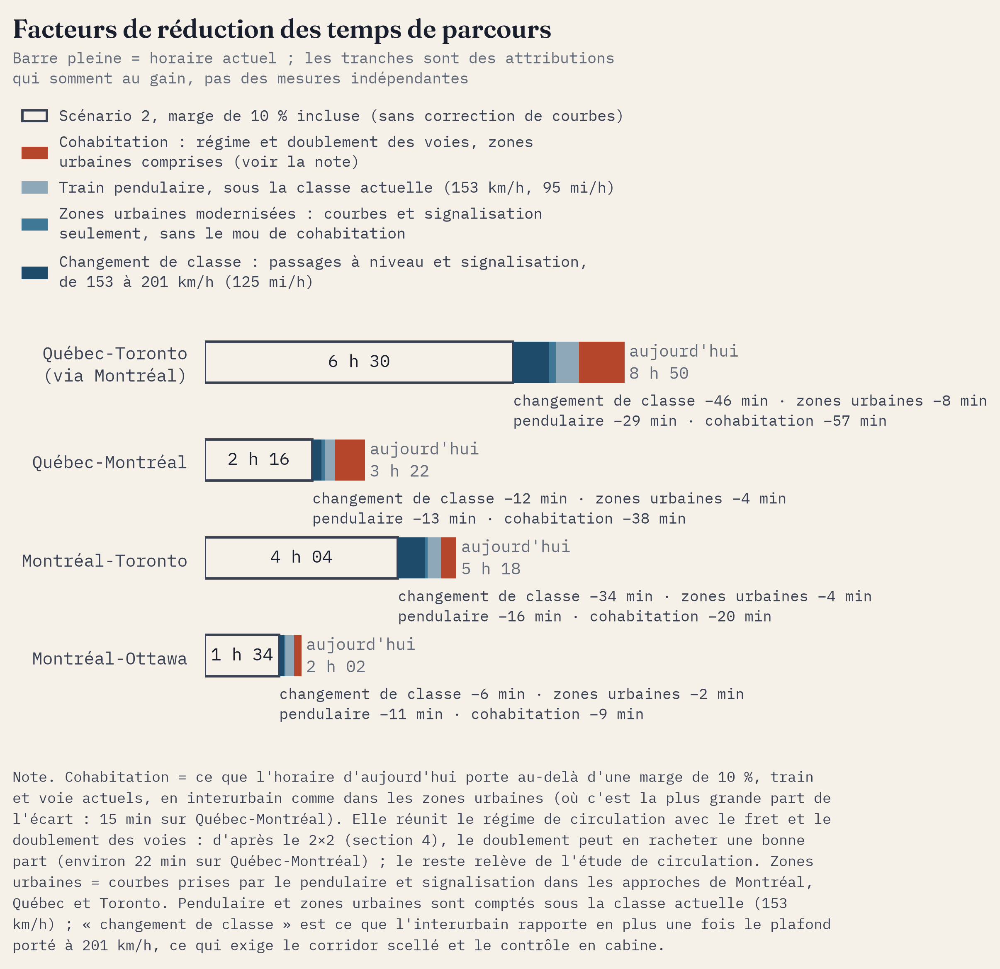

# Synthèse

Cette étude fait la lumière sur un contrefactuel au projet ALTO (TGV) : combien de temps le train peut-il prendre entre les grandes villes du corridor, sur la voie qui existe déjà, si un projet de modernisation optimal était mis en œuvre? La réponse est construite en additionnant les quatre variables déterminantes : le temps que permettent les courbes, le temps passé dans les zones urbaines (figé à l’horaire actuel), le temps des arrêts, et une marge d’exploitation que l’étude encadre entre la recommandation de l’Union internationale des chemins de fer [@uic2000f451] et la réalité du réseau tel qu’opéré actuellement. Les figures ci-dessous en donnent la lecture d’ensemble contre le repère le plus important pour le choix modal : le temps en auto (la table complète des temps, par tronçon, est à la section 7).

Deux scénarios sont comparés : le **scénario de base** est le train et l’horaire d’aujourd’hui, tandis que le **scénario recommandé** est un train pendulaire exploité selon la méthode que le CN applique déjà à ce type de train (LRC), avec le dévers maximal standard du CN (5 pouces) et un plafond d’exploitation de **177 km/h (110 mi/h)**. Cette limite correspond au plafond relevé que permet la modernisation de la signalisation vers la superposition de contrôle en cabine, calquée sur le modèle michiganais d’Amtrak [@fra2024itcs], et c’est aussi le seuil au-delà duquel le régime des passages à niveau change de nature (voir sections 5 et 6). Les vitesses de ce document sont en km/h, suivies au besoin de l’équivalent en mi/h, l’unité d’usage des chemins de fer nord-américains (177 km/h = 110 mi/h).

**Lecture de la figure.** Aujourd’hui, le train fait à peu près jeu égal avec l’auto sur Montréal-Toronto (536 km \| 5 h 18) et la perd nettement sur Montréal-Québec (270 km \| 3 h 22). Chaque barre du scénario recommandé est un temps « avec marge » : le temps de base (courbes + zones urbaines figées + arrêts) majoré de la marge d’exploitation, allant de la borne normative (8 %) à la marge actuelle du tronçon. Le scénario recommandé bat l’auto sur Montréal-Toronto (4 h 27 à 4 h 52, soit 81 à 89 % de l’auto), sur Montréal-Ottawa (1 h 46 à 1 h 49, soit 76 à 78 % de l’auto) et sur Ottawa-Toronto (3 h 39 à 4 h 11, soit 84 à 96 % de l’auto), et fait au moins jeu égal sur Montréal-Québec (2 h 30 à 3 h 03, soit 88 à 108 % de l’auto). De bout en bout, Québec-Toronto via Montréal passe de 8 h 50 à l’horaire actuel à 7 h 07, incluant arrêt à Montréal, si la marge est tenue à la borne basse (figure suivante). La troisième barre de chaque panneau est ce que nous appelons le **scénario plafond**[^1] : le recommandé, poussé à sa meilleure performance en modernisant les zones urbaines et en corrigeant certaines courbes contraignantes sur les segments doublés seulement. Il descend entre 4 h 03 à 4 h 26 sur Montréal-Toronto (74 à 81 % de l’auto), 2 h 02 à 2 h 29 sur Montréal-Québec (72 à 88 % de l’auto), 1 h 26 à 1 h 28 sur Montréal-Ottawa et 3 h 28 à 3 h 58 sur Ottawa-Toronto. À noter que puisque le doublement ne corrigerait les courbes concernées que dans un seul sens et que les zones urbaines sont limitées par des contraintes complexes, non-adressables par cette étude, ces estimations doivent être maniées avec prudence.

La manchette du scénario recommandé : **le train pendulaire et la modernisation proposée changent la donne**. Le train atteint la borne haute des vitesses que les améliorations réalisables du corridor (superposition de contrôle en cabine, traitement des passages à niveau) permettent d’exploiter sur une partie suffisante du tracé, tout en restant entièrement dans le précédent canadien, soit les trains LRC. Le plafond du scénario n’est pas fixé par le train, qui pourrait théoriquement aller plus vite, mais bien par le meilleur système de contrôle disponible dans les conditions (<177 km/h) et par le mur réglementaire des passages à niveau (<201 km/h). Ses conditions sont affichées sous la figure : la superposition de contrôle en cabine (section 6), et le corridor scellé, c’est-à-dire le traitement de chacun des 891 passages à niveau de la zone, dont 563 restent à équiper d’un système complet de feux, cloches et barrières (section 5). Où le résultat tombe dans la fourchette dépend du régime de cohabitation bien plus que du train ou de la voie : le sujet est traité en section 4.

La fourchette de marge est basée sur deux données solides : sa borne basse est la marge normative internationale, interpolée à 8 % du temps de parcours au plafond retenu (7 % à 160 km/h, 9 % à 200 km/h [@schittenhelm2011; @uic2000f451]), tandis que sa borne haute est la marge que l’horaire actuel de VIA porte aujourd’hui sur le tronçon concerné (de 11 % sur Montréal-Ottawa à 32 % sur Montréal-Québec). La distance entre les deux bornes constitue le coût du régime d’exploitation actuel ; pour établir ce qui est réellement possible dans cette fourchette, une étude plus approfondie est nécessaire (voir section 8).

Mise en regard : le projet Alto propose environ 1 000 km de voies neuves dédiées pour relier Québec à Toronto par un tracé nord à 300 km/h ou plus [@alto2025]. La présente étude documente ce que le réseau existant du corridor riverain (environ 1 090 km de voies physiques, les troncs communs à deux trajets comptés une fois, parcourus en 1 433 km de trajets) peut donner, ainsi que les cinq obstacles qui les retiennent et le prix réglementaire de ceux-ci.

Le précédent qui valide l’ordre de grandeur nous vient du Royaume-Uni. La West Coast Main Line (Londres-Manchester-Glasgow), une ligne victorienne partagée avec le fret, a été modernisée de 1998 à 2008 au lieu d’être remplacée par une ligne neuve : des trains pendulaires à 125 mi/h (201 km/h) sur la voie existante et une signalisation relevée, pour un coût d’environ 8,6 milliards de livres selon l’audit national [@nao2006wcml]. Les gains mesurés sont de la même famille que ceux calculés ici : 36 minutes de moins sur Londres-Manchester (296 km) et 42 sur Londres-Glasgow (environ 645 km) [@nao2006wcml], contre 26 à 51 minutes calculées sur Montréal-Toronto au scénario recommandé (536 km). La comparaison comporte un biais conservateur qu’il faut nommer : 38 % des gains du scénario recommandé sur le trajet Québec-Toronto dépendent du régime de cohabitation, un problème que les Britanniques avaient réglé avant la modernisation, par un régime d’arbitrage indépendant en place depuis 1993 [@railwaysact1993; @orr2021cadre]. Nous tirons des leçons de ce précédent à la section 4. Le marché a récompensé cette compétitivité : sur Londres-Manchester, l’achalandage ferroviaire a crû de 77 % entre 2009 et 2017 pendant que le trafic aérien du même axe reculait de 27 % [@wcml2026wiki]. La mise en garde symétrique vaut aussi : le budget britannique a plus que triplé en cours de programme, faute d’une portée verrouillée au départ [@nao2006wcml] ; c’est précisément le rôle de l’étude recommandée en conclusion.

Cinq constats principaux se dégagent :

1.  **La géométrie n’est pas le problème principal.** Avec le train pendulaire du scénario recommandé, il ne reste que 234 km (16 % du réseau parcouru, et environ 265 km si l’on corrige le biais de mesure chiffré en section 7) dont les courbes restent sous le plafond de 177 km/h (110 mi/h), et 7 km sous 100 km/h (62 mi/h). Le train d’aujourd’hui en laisse 494 km.
2.  **Les passages à niveau sont une des deux conditions pour matérialiser le potentiel du train pendulaire.** Au plafond retenu, 891 des 924 passages du corridor se trouvent dans la zone rapide et relèvent du régime du corridor scellé. Il faut traiter chaque passage (barrières quatre-quadrants, terre-pleins, détection) ; 563 d’entre eux restent à équiper d’un système complet de feux, cloches et barrières. Cependant, un mur n’est pas franchi par le scénario recommandé : le précédent américain exige zéro passage au-dessus de 201 km/h (125 mi/h) [@ecfr213-347], et la proposition y préfère une modernisation, plus accessible.
3.  **La signalisation est la deuxième condition de succès**: les normes indiquent que rien n’est à faire jusqu’à 160 km/h (99 mi/h), tandis qu’une superposition de contrôle en cabine est nécessaire de 161 à 177 km/h. Le contrôle intégral, lui, n’est requis qu’au-delà de 177 (similaire au devis Alto).
4.  **Le régime de cohabitation pèse plus que le nombre de voies.** Mesuré sur les horaires de VIA à géométrie neutralisée, une voie simple ne coûte rien quand VIA est propriétaire, et 31 points de marge quand le CN l’est. Sous VIA, elle porte même 3 points de marge de moins que la voie double du CN, et l’écart reste en sa faveur quelle que soit la pénalité d’arrêt testée. Sous le CN, le coût de la voie simple tient dans 30 à 33 points sur la même plage, soit de 23 à 26 minutes sur Montréal-Québec. Le même instrument montre ce que le doublement procure chez le CN, passant d’une voie simple à double sous leur propriété : 31 points, soit 24 minutes sur Montréal-Québec et rien sur Montréal-Toronto (déjà doublé).
5.  **La marge d’horaire est une fourchette que cette étude ne peut pas trancher.** Celle-ci est encadrée (7 à 9 % selon les meilleures pratiques, 34 à 68 % mesurés aujourd’hui selon le régime et le doublement) mais l’écart entre les deux est précisément ce qu’une étude plus complète en partenariat avec le propriétaire de la voie devra investiguer.

# Méthode et périmètre

## Le modèle

Le temps de parcours d’un tronçon se calcule en additionnant quatre morceaux vérifiés :

1.  **les zones urbaines**, où aucun gain n’est promis : leur temps est figé à l’horaire actuel, à part dans le *scénario plafond* ;
2.  **l’interurbain**, calculé mètre par mètre le long du tracé. En chaque point, le train est borné par la plus basse de deux vitesses : celle que la courbe locale permet (selon le scénario) et le plafond permis (177 km/h pour le scénario recommandé). Entre ces bornes, le profil réel d’accélération et de freinage est simulé (voir plus bas) ;
3.  **les arrêts** : deux minutes d’immobilisation par arrêt intermédiaire (les phases d’accélération et de freinage sont dans le profil simulé) ;
4.  **la marge d’exploitation**, encadrée entre les deux bornes.

En notation compacte :

$$T = \sum\text{blocs urbains figés} + \int\frac{dx}{V(x)} + \text{arrêts} + \text{marge}$$

avec $V(x)$ le profil de vitesse simulé, borné par $min(\text{vitesse géométrique du scénario},\text{plafond})$ sur l’interurbain. Le symbole $\int dx/V(x)$ veut simplement dire « chaque mètre du tracé est parcouru à la vitesse que le train y atteint réellement, et on additionne ».

**Le profil d’accélération et de freinage est simulé, à paramètres déclarés.** L’accélération plafonnée par la motorisation, qui décroît avec la vitesse, avec arrêt complet à chaque gare intermédiaire et aux frontières des blocs urbains. Les paramètres de rame sont des ordres de grandeur : le scénario de base reçoit une rame tractée comme la flotte actuelle (8 W/kg au rail, 0,5 m/s²) alors que le scénario recommandé reçoit une rame pendulaire de référence (12 W/kg, 0,6 m/s²). Ces paramètres sont des hypothèses de modélisation déclarées, pas des fiches constructeur ; les sensibilités de la section 7 encadrent leur effet.

**Vitesse géométrique**. Le plafond que les courbes permettent. Une courbe de rayon $R$ (en mètres) limite la vitesse à $v = k\sqrt{R}$, où $k$ dépend du dévers (l’inclinaison de la voie dans la courbe) et de l’insuffisance de dévers admise (l’inclinaison « manquante » que le train et ses passagers acceptent de subir, ou que la caisse pendulaire compense). La formule utilise un écartement effectif de 1 524 mm (60 pouces, l’entraxe des rails) et avec cette valeur, elle reproduit exactement la méthode officielle du CN [@cn2002mr1305].

**Vitesse commerciale**. La vitesse résultante à l’horaire, une fois appliqués les plafonds réglementaires (passages à niveau, signalisation), les blocs urbains, les arrêts et la marge.

**Blocs urbains figés.** Aucun gain n’est compté dans les approches urbaines : Montréal Central à Dorval (17,8 km), Montréal à Saint-Lambert par le pont Victoria (6,1 km, tronçon de Québec), Sainte-Foy à Québec incluant le pont de Québec (19,9 km), Guildwood à Toronto Union (20,1 km) sont chacun figé à la médiane des horaires publiés actuels [@viarail2026gtfs]. Ottawa, sans gare d’approche proche, est traité par une fenêtre de 10 km de part et d’autre (hypothèse). Une sensibilité où ces blocs sont réintégrés au calcul est chiffrée en section 7.

**Arrêts.** Deux minutes d’immobilisation par arrêt intermédiaire hors blocs urbains. Avec les phases d’accélération et de freinage, l’ensemble revient à environ quatre à cinq minutes par arrêt. Repère : le projet pilote de train sans arrêt de septembre 2025 annonçait un gain de 30 à 40 minutes pour quatre arrêts sautés, soit 7,5 à 10 minutes par arrêt en conditions réelles de cohabitation [@cbc2025pilote] ; l’écart entre ce repère et notre dynamique pure tient aux effets de sillon (l’attente derrière les autres trains), qui vivent dans la marge, pas dans le temps de base.

**Marge.** Encadrée entre une borne normative et une borne mesurée (section 4.3).

## Les données, et comment la géométrie a été mesurée

Deux sources publiques se complètent. Les données d’horaires ouvertes de VIA (le format GTFS, celui qu’utilisent les applications de transport) disent quelles lignes le train emprunte, dans quel ordre et avec quelles gares [@viarail2026gtfs]. La carte collaborative OpenStreetMap dit où les rails passent physiquement, à quelques mètres près [@osm2026geofabrik]. L’étude recolle la première sur la seconde : le tracé schématique de VIA est verrouillé sur la voie réelle, et l’analyse suit cette voie comme un train le ferait.

Sur le tracé ainsi reconstruit, le rayon de courbure en chaque point est estimé en faisant passer au mieux un cercle à travers les quelque 90 points d’une fenêtre glissante de 900 mètres (un point tous les 10 mètres) : moyenner autant de points efface une part importante du bruit de la carte sans aplatir les vraies courbes. L’estimateur a été calibré sur des cercles synthétiques de rayon connu, puis validé sur des zones-témoins du corridor (vraies courbes serrées des approches d’Ottawa et de Montréal, longues lignes droites de la ligne de Kingston), qui doivent ressortir correctement à chaque régénération. Chaque courbe devient ensuite une vitesse par la formule $v = k\sqrt{R}$ de la section 3, et chaque segment est classé de façon volontairement conservatrice : sa vitesse est fixée par sa courbe la plus serrée qui se maintient sur la longueur d’un train (environ 150 mètres).

Le reste des données : nombre de voies par détection géométrique des voies parallèles dans OpenStreetMap (recoupements de vérification dans les annexes numériques) ; passages à niveau par l’inventaire officiel ouvert de Transports Canada [@tc2023inventairepn] ; horaires par le flux GTFS de VIA, saison 2026 [@viarail2026gtfs].

## Hors périmètre

La conception par site (spirales, raccordements), les profils de traction constructeur exacts, les pentes et la résistance à l’avancement (le profil d’accélération et de freinage est simulé avec des paramètres génériques déclarés en section 2.1), le cantonnement fin, la simulation de circulation, les ponts, tunnels et l’état détaillé de la voie, ainsi que les zones urbaines au-delà de leurs blocs figés sont tous hors du périmètre de ce document. Les horaires mesurés datent de la saison 2026, une période de restrictions exceptionnelles liées aux passages à niveau (voir section 5) : les marges mesurées sont donc possiblement gonflées, ce qui est signalé là où c’est pertinent.

# Le train pendulaire et le dévers

Un train pendulaire incline sa caisse dans les courbes, ce qui permet de les franchir plus vite sans inconfort pour les passagers. Le Canada en a déjà exploité un : le LRC, auquel la méthode du CN accorde une insuffisance de dévers de 6 pouces (152 mm), contre 3 pouces pour un train ordinaire [@cn2002mr1305; @fra-lrc-152]. Il y a donc un précédent domestique de cette technologie.

Les deux scénarios :

  | | Dévers | Insuffisance | k (v = k·√R) | Statut réglementaire |
|---|---|---|---|---|
| Scénario de base : voie et train actuels | 100 mm (supposé) | 76 mm | 3,83 | régime courant |
| Scénario recommandé : pendulaire type LRC | 127 mm | 152 mm | 4,82 | 100 % précédent CN |

Le dévers du scénario recommandé (127 mm, soit 5 pouces) est le maximum standard du CN pour trafic mixte [@cn2002mr1305]. Il ne demande aucune dérogation et n’exclut pas le fret. Le scénario de base porte un dévers supposé, vu l’absence de données publiques disponibles. Cette hypothèse joue dans un sens connu : si le dévers effectif est plus bas, le temps que la géométrie permet est surestimé, et les marges mesurées à la section 4 sont d’autant gonflées. Le gain total du scénario recommandé n’en dépend pas : sa voie est ré-inclinée à 127 mm quel que soit le dévers de départ, si bien qu’une marge qui serait en réalité du dévers manquant est incluse dans les résultats présentés.

**Ce que le train pendulaire libère**, en kilomètres de tracé dont le plafond géométrique reste sous la cible (somme des quatre trajets analysés, 1 433 km) :

  | Cible | Scénario de base | Scénario recommandé |
|---|---|---|
| Sous 177 km/h / 110 mi/h (restants sous le plafond retenu) | 494 km | 234 km |
| Sous 160 km/h / 99 mi/h | 358 km | 95 km |
| Sous 100 km/h / 62 mi/h (sections sévères) | 28 km | 7 km |

Lecture décisionnelle : la géométrie du corridor n’a pas besoin d’être reconstruite, elle a besoin d’un meilleur train. Avec la technologie pendulaire, 84 % du tracé atteint 177 km/h (110 mi/h) ou plus sans toucher une seule courbe.

**Pourquoi ne pas importer des trains pendulaires européens, avec une insuffisance de dévers supérieure?** Parce que le LRC suffit : il atteint la borne haute des vitesses que les améliorations réalisables du corridor permettent d’exploiter. Au-dessus de 177 km/h (110 mi/h), le plafond n’est plus fixé par le train mais bien par le système : la superposition de contrôle en cabine du précédent américain opère exactement jusqu’à cette vitesse [@fra2024itcs] et le régime des passages à niveau se durcit jusqu’à exiger zéro passage au-delà de 201 km/h [@ecfr213-347]. Certes, un matériel pendulaire plus performant existe (des insuffisances de dévers de 225 à 270 mm se conçoivent en référence européenne [@tc2022rrts]), mais il sort du précédent nord-américain, demande une approbation par équipement, et n’entraînerait pas des économies de temps substantielles : les courbes qu’il libère en plus sont précisément celles où le LRC permet déjà la haute vitesse (160 à 177 km/h). Rester avec le LRC, c’est rester dans une méthode que les utilisateurs de la voie appliquent déjà, en opposition à des technologies externes qui ouvriraient un front d’approbation nouveau. L’histoire du LRC commande cependant une réserve : son système d’inclinaison, coûteux en entretien, a été retiré lors de la remise à neuf de la flotte engagée à partir de 2007-2009. VIA a justifié ce retrait par la réduction des coûts d’entretien et un allègement du poids des voitures [@via2009lrc]. Le scénario recommandé suppose donc un pendulaire entretenu comme tel, et la caisse pendulaire protège le passager, mais abime le rail : les efforts en voie croissent avec la vitesse en courbe, ce qui implique un standard d’entretien renforcé (un point de veto potentiel du CN, et un coût récurrent à prévoir).

# Doublement des voies et régime de cohabitation

Le corridor offre une expérience naturelle pour élucider le poids respectif de la contrainte de voie simple et de la cohabitation avec le CN : il existe des tronçons en voie simple appartenant à VIA (croisements planifiés entre trains VIA), des tronçons en voie simple appartenant au CN (croisements subis, le fret étant prioritaire chez lui), et des tronçons en voie double du CN (croisements éliminés, lenteur du fret et voies d’évitement trop courtes subis). En comparant la marge d’horaire de ces trois familles, à géométrie neutralisée, on peut constater séparément le prix de la voie manquante et le prix du régime de droits de passage.

## La mesure

La marge est composée de l’écart entre le temps à l’horaire (médiane de tous les sillons, un sillon étant le créneau horaire d’un train donné) et le temps que la géométrie permet au régime actuel (intégration à vitesse plafonnée à 160 km/h (99 mi/h) en profil fluide). La marge est rapportée en pourcentage du temps que la géométrie permet. Les inter-gares qui sont contaminés par un nœud (blocs urbains, ponts Victoria et de Québec, approches d’Ottawa, chevauchements de frontière de propriétaire) sont exclus. Résultats :

  | Cellule | Longueur mesurée | Marge médiane | Dispersion entre sillons | Trafic (trains/jour) |
|---|---|---|---|---|
| Voie double, CN | 515 km (11 paires) | 37 % | 5 % | 40 |
| Voie simple, VIA | 218 km (5 paires) | 34 % | 10 % | 12 à 14 |
| Voie simple, CN | 192 km (2 paires) | 68 % | 21 % | 27 |

**Ce que le doublement procure, chez le CN** : environ 31 points de marge (68 % sur la voie simple CN contre 37 % sur la voie double CN), soit 24 minutes sur Montréal-Québec et rien sur Montréal-Toronto, qui est déjà doublé.

**Ce que le régime pèse** : sous propriétaire VIA, en 2026, la voie simple ne coûte rien, portant même 3 points de marge de moins que la voie double du CN. Le prix de la voie manquante n’est donc pas un prix de voie : l’effet est nul entre une voie simple possédée par VIA et une voie double possédée par le CN. Une réserve honnête : les lignes de VIA portent environ deux fois moins de trains que celles du CN. Ce qu’on mesure est donc l’effet du régime au sens large, densité de fret comprise. Cette équivalence de marge ne tranche pas le choix d’intervention sur Québec-Montréal : à marge égale, la voie double élimine les croisements et libère les fréquences, ce qu’une voie simple neuve (même possédée par VIA) ne fait pas. Aussi, la voie double du CN porte encore 37 % de marge, contre une borne normative internationale de 8 % : c’est cet écart qu’un régime d’accès arbitré par un tiers indépendant, sur le modèle de la WCML, viendrait fermer. Doubler la ligne existante sous un tel régime a donc le potentiel de cumuler les deux gains, mais l’étude de circulation devra le confirmer. Sur Montréal-Ottawa, la figure des gains reflète cette incertitude : la part du doublement y est nulle sur les horaires courants, mais atteindrait jusqu’à 12 points de marge sur ceux de 2023. Comme l’horaire actuel du tronçon ne porte que 3 points au-dessus de la borne normative, le résidu de 3 minutes y est affiché sans être départagé entre doublement et cohabitation (tranche hachurée). Seconde réserve : cette lecture est celle des horaires courants alors que sur les horaires de janvier 2023, les mêmes paires VIA portaient davantage de marge (49 %) que la voie double du CN.

**La dispersion (variabilité des temps de trajet) raconte la même histoire.** Sur voie double, tous les trains d’une même paire font à peu près le même temps (écart interquartile de 5 %). Sur la voie simple du CN, l’horaire d’une même paire varie de 8 à 16 minutes selon le sillon : les croisements avec le fret sont écrits dans la grille de VIA elle-même. Le passager de Montréal-Québec paie jusqu’à 24 minutes selon l’heure de son départ. La voie simple possédée par VIA, malgré une marge compétitive avec la voie double du CN, affiche elle aussi une variation plus élevée (10 %).

## Contre-épreuve : le sud-ouest ontarien

L’étude a étendu la mesure aux lignes Toronto-Windsor et Toronto-Sarnia. Cette région ne se compare pas au cœur (la voie y est de classe inférieure, avec des vitesses permises de 42 à 70 mi/h (68 à 113 km/h) sur les lignes simples du CN), mais son contraste interne vaut la démonstration : le seul segment où le train roule à vitesse normale (≃95 km/h) est le segment Chatham-Windsor, précisément celui que VIA possède. Les lignes simples voisines du CN, presque vides (8 trains par jour), roulent à 25 à 37 mi/h de moyenne sur des voies laissées à 42-70 mi/h. Le propriétaire qui vit du service passager entretient sa voie : la conclusion du cœur se réplique dans une seconde région, par un autre mécanisme.

## L’encadrement de la marge

La marge d’horaire est la grandeur que cette étude ne peut pas trancher définitivement. Voici donc l’intervalle où elle tombe, et pourquoi.

**Borne basse, normative.** La fiche UIC 451-1 recommande, pour un train de voyageurs, un supplément fixe plus un pourcentage selon la vitesse : au total environ 7 % du temps de parcours à 160 km/h (99 mi/h) et 9 % à 200 (124 mi/h) [@schittenhelm2011; @uic2000f451]. Au plafond retenu de 177 km/h, l’étude interpole à 8 %. Les règles publiées des gestionnaires nationaux se situent également dans ces environs : SNCF Réseau impose 4,5 minutes par 100 km sur ligne classique et 5 % sur ligne à grande vitesse [@sncf2023drr] ; le gestionnaire suédois publie même le différentiel qui nous intéresse : 3 minutes par 100 km en voie simple contre 2 en voie double, plus 60 secondes par croisement [@trafikverket2025jnb]. Aucune règle publiée ne dépasse 15 %.

**Borne haute, mesurée.** Le corridor porte aujourd’hui de 34 à 68 % de marge selon l’expérience naturelle mesurée (table ci-dessus). Ce ne sont pas les marges par tronçon de la section 7 qui elles, incluent les blocs urbains figés pour calculer un temps de trajet de bout en bout. L’écart entre les deux bornes, celle normative et celle constatée, est le prix du régime de cohabitation actuel.

**Le précédent continental.** L’inspecteur général d’Amtrak a documenté le même phénomène : environ 70 % du temps additionnel des horaires d’Amtrak est provisionné pour les retards anticipés des chemins de fer hôtes, et le fret cause 59 % des retards des longs parcours [@amtrakoig2019]. La situation du corridor n’est pas une exception canadienne, c’est la condition générale du train de voyageurs invité chez un propriétaire de fret.

**Pièces au dossier**. Le 11 octobre 2024, le CN a imposé aux rames neuves de VIA un ralentissement à 72 km/h (45 mi/h) aux passages munis de prédicteurs, les circuits qui déclenchent les barrières à l’approche d’un train (304 passages visés), provoquant des retards de 30 à 45 minutes. VIA a demandé le contrôle judiciaire en Cour fédérale le 12 novembre 2024 [@via2024requete] pour trancher le litige. Un allègement a ensuite été négocié, mais n’est entré en vigueur que le 28 août 2025 [@tc2025gcp]. Autre instance du même conflit : le projet pilote sans arrêt Montréal-Toronto a été suspendu le jour prévu de son lancement, VIA invoquant des contraintes opérationnelles chez son hôte [@cbc2025pilote]. La ponctualité du réseau est passée de 71-72 % (2020-2021) à 57-59 % (2022-2023), 51 % (2024) puis 30 % au premier trimestre 2025 [@via2025rapportannuel; @via2025t1].

**Le précédent du régime d’accès, et la leçon de la WCML.** Le précédent de la West Coast Main Line porte sur les travaux de modernisation, certes, mais aussi sur le régime d’accès qui les accompagne. Au Royaume-Uni, l’infrastructure appartient à un gestionnaire unique et neutre, Network Rail, distinct des exploitants voyageurs et fret qui y font circuler leurs trains sous contrats d’accès réglementés [@orr2021cadre], et aucun de ces contrats n’existe sans l’approbation ou l’injonction d’un régulateur indépendant, l’Office of Rail and Road [@orr2021cadre; @railwaysact1993]. La portée réelle de ce pouvoir se mesure sur la WCML même où, en juillet 2025, l’ORR a rejeté trois demandes de sillons au motif que le tronçon sud ne pouvait plus les absorber sans dégrader la performance des circulations voyageurs et fret existantes, tout en s’assurant que le gestionnaire d’infrastructure traitait les demandeurs publics et privés de façon équitable et non discriminatoire [@orr2025wcml]. C’est précisément la fonction dont le corridor aura besoin une fois le doublement réalisé : la capacité créée ne se répartit de façon crédible que si elle est arbitrée par un tiers indépendant ou une entente équitable, et non par le propriétaire de l’une des deux circulations en présence. Le Canada dispose déjà de l’institution et du pouvoir correspondants : l’Office des transports du Canada peut accorder des droits de circulation sur le réseau d’une autre compagnie, en fixer les conditions dans l’intérêt public et en déterminer l’indemnité [@otc2016circulation; @ltc1996art138].

**Pour doubler, relier les évitements d’abord.** Un corridor à voie unique équipé d’évitements est déjà partiellement doublé, et la simulation montre que le retard décroît de façon régulière à chaque tronçon de deuxième voie ajouté lorsque l’on procède en reliant des paires d’évitements existants. Le programme se phase, progressivement, sans effet de seuil [@sogin2013doublement]. Cette approche est courante : par exemple, sur le corridor Chicago-Detroit, l’étude d’impact fédérale retient précisément de moderniser et de relier les évitements existants entre Niles et Dowagiac en notant que cette liaison revient à doubler la voie sur 16 milles et permet d’ajouter des fréquences à 110 mi/h [@mdot2014tier1]. La FRA reconnaît de longue date qu’une série d’évitements longs accroît substantiellement la capacité à un coût très inférieur au doublement continu [@fra2004ptc]. Le programme de doublement du corridor devrait donc commencer par là : allonger et relier les évitements en place sur les sections en voie simple, la deuxième voie continue venant fermer les intervalles restants. L’inventaire fin des évitements (position, longueur utile) relève de l’étude complète ; la détection géométrique de cette étude, calée sur une fenêtre plus large que le standard (limite des données ouvertes), ne les résout pas un à un.

**Sur Montréal-Toronto, déjà doublé, la demande pertinente est ailleurs.** La voie double élimine les croisements, pas la lenteur du fret et les voies d’évitement trop courtes. L’intervention utile y est l’ajout de liaisons rapides entre les deux voies (un dépassement se règle à basse ou à haute vitesse selon le type d’aiguillage installé), les sections de troisième voie aux points de friction et bien sûr, un meilleur arrangement de cohabitation. Le dimensionnement précis de ces éléments relève de l’étude complète.

# Passages à niveau

Un passage à niveau est un croisement rail-route à niveau. Sa tolérance réglementaire décroît par paliers de vitesse ; le précédent nord-américain le plus structuré à cet égard est américain [@ecfr213-347], cité ici comme référence de seuils par absence d’échelle canadienne aussi claire :

- **jusqu’à 153 km/h (95 mi/h)** : régime actuel (le précédent domestique est le Turbo, plafonné en service à 153 km/h notamment à cause de ses quelque 300 passages à niveau [@bateman2015], alors qu’il détenait le record canadien de 140,6 mi/h (226 km/h), établi en conditions d’essai non reproductibles [@canadianrail1976]) ;
- **154 à 177 km/h (96 à 110 mi/h)** : corridor « scellé » : traiter chaque passage (barrières quatre-quadrants, terre-pleins, détection). Le programme de référence, en Caroline du Nord, a été évalué par la FRA quant aux impacts de sécurité : au moins 19 vies sauvées de 1995 à 2004 et une réduction projetée d’environ 52 % de la mortalité du corridor [@bienaime2009sealed] ;
- **178 à 201 km/h (111 à 125 mi/h)** : système complet d’avertissement et de barrières approuvé et fonctionnel (classe 7 américaine) ;
- **au-delà de 201 km/h (125 mi/h) : zéro passage à niveau** (classes 8 et 9 américaines).

Le scénario recommandé s’arrête volontairement à 177 km/h : les deux dernières marches de cet escalier décrivent un autre niveau d’ambition infrastructurelle (et financière).

**Le compte.** L’inventaire ouvert de Transports Canada [@tc2023inventairepn], joint au tracé, donne 924 passages physiques sur le corridor (dédoublonnés entre trajets, chacun classé à la vitesse maximale des trajets qui l’empruntent), dont 352 passages publics à protection active. Ce nombre est du même ordre de grandeur que les 304 passages à prédicteurs du dossier judiciaire de VIA [@via2024requete], qui couvre un périmètre plus étroit que cette étude.

**Le compte au plafond retenu**, selon la vitesse d’exploitation du scénario recommandé (177 km/h) :

  | Bande d’exploitation | Passages (corridor dédoublonné) |
|---|---|
| ≤ 153 km/h (95 mi/h) : régime actuel | 33 |
| 154-177 km/h (96-110 mi/h) : corridor scellé | 891 |

Le corridor scellé est la condition principale du scénario recommandé. Sur les 891 passages de la zone rapide, 328 portent déjà un système complet de feux, cloches et barrières tandis que **563 restent à équiper**. Les 328 équipés ne sont pas finis pour autant : leurs barrières sont à deux quadrants (elles ne ferment que les voies d’entrée), et le corridor scellé leur ajoutera les bras de sortie, les terre-pleins et la détection. Les 563 autres partent de plus loin (475 passages passifs, 60 avec feux et cloches sans barrières). Le tri d’intervention, sur données ouvertes : 782 passages standards (municipaux ou privés, deux voies routières ou moins, hors zone urbaine) et 109 complexes (urbains, multi-voies ou provinciaux). La colonne d’accès (public ou privé) de chaque passage est publiée dans les annexes numériques.

# Signalisation

La signalisation se traite en un escalier de trois marches, chacune débloquant une classe de vitesse :

- **Jusqu’à 160 km/h (99 mi/h) : effet nul.** Le corridor s’exploite déjà à 160 km/h sous sa signalisation actuelle (la commande centralisée de la circulation, ou CTC).
- **De 161 à 177 km/h (100 à 110 mi/h) : superposition de contrôle en cabine.** C’est la marche du scénario recommandé. Au-delà de 160 km/h, il est considéré que le conducteur ne peut plus conduire seulement grâce aux signaux plantés le long de la voie : à cette vitesse, l’intervalle entre le moment où un signal devient lisible et le moment où il faut avoir réagi devient trop court pour reposer sur l’œil humain seul. Un système de contrôle en cabine répond en affichant l’état de la voie directement devant le conducteur, en continu, et en freinant automatiquement le train si la vitesse permise est dépassée. « Superposition » signifie que ce système s’ajoute par-dessus la signalisation existante : la voie garde ses signaux, les trains de fret circulent comme avant, seuls les trains rapides embarquent l’équipement. Le précédent est opérationnel sur la ligne Amtrak du Michigan, qui exploite 110 mi/h (177 km/h) avec un tel système incrémental superposé, appelé ITCS et à ne pas confondre avec ETCS [@fra2024itcs]. Cette limite de 110 mi/h est celle déterminée pour le système par les États-Unis et conséquemment, c’est elle qui fixe le plafond du scénario recommandé.
- **Au-delà de 177 km/h (110 mi/h) : contrôle intégral** de type ETCS (le standard européen de contrôle des trains). Le système incrémental s’arrête là, et tout ce qui dépasse 177 km/h semble demander de remplacer la signalisation et de tenter d’y adapter l’ensemble du fret plutôt que de s’y superposer. C’est le devis d’Alto [@alto2025], et l’argument économique pour ne pas viser ces vitesses sur la voie partagée.

**Ce que la superposition fait à la capacité : rien en moins, et un levier en plus.** La superposition retenue l’est davantage pour ce qu’elle permet au niveau des vitesses : sur la ligne du Michigan, par exemple, l’ITCS est explicitement conçu comme une couche de sécurité posée par-dessus la commande centralisée en place, et c’est ce dispositif qui a porté la vitesse voyageurs de 79 mi/h en 2000 à 110 mi/h en 2012 sur une ligne partagée avec le fret [@fra2024itcs]. La capacité existante n’est donc ni retranchée ni réattribuée : la superposition s’ajoute au système, elle ne le remplace pas, et la position fédérale juge d’ailleurs non démontrés les gains de débit du système de contrôle de train [@fra2004ptc]. Si l’on veut relever le débit, le levier n’est pas la superposition mais le raccourcissement des cantons qu’elle peut accompagner : la simulation d’un corridor nord-américain partagé montre qu’à niveau de service constant, passer d’un cantonnement à trois aspects à quatre aspects puis au bloc mobile fait passer la capacité de 45 à 50 puis 52 trains par jour, l’essentiel du gain venant déjà de l’ajout d’aspects [@dick2019blocs]. Ce dimensionnement relève de l’étude complète.

# Résultats intégrés

Les résultats globaux tiennent en deux tableaux. Le premier donne les temps de base par tronçon : temps interurbains considérant les courbes, blocs urbains figés et arrêts, sans marge. Le second applique la marge en fourchette : **c’est lui qui peut être comparé à l’horaire actuel.**

**Temps de base (sans marge).**

  | Tronçon | Horaire actuel (référence, non comparable) | Scénario recommandé, plafond 177 |
|---|---|---|
| Montréal-Québec (270 km) | 3 h 22 | 2 h 18 |
| Montréal-Ottawa (185 km) | 2 h 02 | 1 h 38 |
| Ottawa-Toronto (442 km) | 4 h 35 | 3 h 22 |
| Montréal-Toronto (536 km) | 5 h 18 | 4 h 07 |

**Temps avec marge (fourchette).** Borne basse : la marge normative au plafond retenu (8 % du temps de base [@schittenhelm2011; @uic2000f451]). Borne haute : la marge que l’horaire actuel du tronçon porte aujourd’hui, mesurée dans cette étude (11 % sur Montréal-Ottawa, 18 sur Montréal-Toronto, 24 sur Ottawa-Toronto, 32 sur Montréal-Québec). Pour effectuer le contrôle interne de la méthode, elle a aussi été nourrie du train, du plafond et de la marge d’aujourd’hui pour faire le test : elle retombe sur l’horaire actuel, par construction.

  | Tronçon (horaire actuel) | Scénario recommandé, plafond 177 |
|---|---|
| Montréal-Québec (3 h 22) | 2 h 30 à 3 h 03 |
| Montréal-Ottawa (2 h 02) | 1 h 46 à 1 h 49 |
| Ottawa-Toronto (4 h 35) | 3 h 39 à 4 h 11 |
| Montréal-Toronto (5 h 18) | 4 h 27 à 4 h 52 |

Le trajet Québec-Toronto de la figure additionne Québec-Montréal et Montréal-Toronto, plus dix minutes d’arrêt à Montréal (hypothèse). La méthode d’attribution des tranches et ses contrôles sont disponibles à l’annexe technique (`decomposition_gains.csv`).

**Sensibilités**. **Délimitation des blocs urbains** ±20 %, soit de ±4 à ±8 minutes de temps de base selon le tronçon. **Blocs urbains réintégrés** : si les approches urbaines cessaient d’être figées à l’horaire actuel et roulaient ce que leur géométrie permet, le temps de base du scénario recommandé baisserait encore de 20 minutes sur Montréal-Québec, 15 sur Montréal-Ottawa, 9 sur Ottawa-Toronto et 22 sur Montréal-Toronto. L’étude ne promet rien de tel (les approches urbaines ont leurs propres contraintes, hors périmètre), mais le chiffre borne ce que le statu quo urbain coûte. **Courbes rectifiées avec le doublement** : reconstruire une plateforme pour y poser une seconde voie est le seul moment où rouvrir un rayon ne coûte presque rien de plus. Si les courbes situées sur les sections à doubler (162 km de segments concernés sur les quatre trajets) étaient rectifiées au plafond retenu, le temps de base gagnerait encore 4 minutes sur Montréal-Québec et 3 sur Montréal-Ottawa (moins d’une minute ailleurs). C’est un gain modeste en minutes, mais probablement peu coûteux au moment du chantier, et qui réduit d’autant les kilomètres restants sous grande vitesse. La combinaison des deux, calculée ensemble par le moteur, est le **scénario plafond** (voir synthèse): un temps de base de 4 h 03 à 4 h 26 sur Montréal-Toronto, 2 h 02 à 2 h 29 sur Montréal-Québec, 1 h 26 à 1 h 28 sur Montréal-Ottawa et 3 h 28 à 3 h 58 sur Ottawa-Toronto, marge comprise.

## Le biais de la fenêtre de mesure, et son coût

Pour mesurer une courbe, l’étude fait passer un cercle à travers 900 m de tracé. Sur une
courbe plus courte que 900 m, cette fenêtre déborde : elle avale la courbe et les bouts
droits qui l’entourent. Résultat : la courbe paraît plus douce qu’elle ne l’est, donc la
voie paraît plus rapide qu’elle ne l’est. L’erreur va toujours dans le même sens, jamais
dans l’autre : elle ne s’annule pas d’elle-même.

Pour savoir combien elle fausse, chaque courbe courte a été remesurée avec une loupe
plus fine (300 m). Cette loupe n’est fiable que sur les courbes serrées, mais c’est
justement là que l’enjeu se joue. Le rapport entre les deux mesures donne le facteur
d’erreur : 1 veut dire aucune erreur, 1,12 veut dire un rayon annoncé 12 % trop
généreux.

| Longueur du segment | Segments | Kilomètres | Facteur médian | 9e décile |
|---|---:|---:|---:|---:|
| Moins de 300 m | 155 | 31 km | 1,09 | 1,79 |
| 300 à 450 m | 151 | 56 km | 1,12 | 2,19 |
| 450 à 600 m | 160 | 82 km | 1,13 | 1,84 |
| 600 à 900 m | 158 | 114 km | 1,05 | 1,89 |
| 900 m et plus | 253 | 932 km | référence | référence |

Lecture de la table : la plupart des segments courts sont à peine touchés (facteur
médian autour de 1,1), mais environ un sur dix est fortement faussé (facteur de 1,8 à
2,2). Ce sont ces derniers qui déplacent les totaux. (La table couvre les 877 segments
sur 1 014 où la loupe fine est fiable ; au total, 710 segments sont plus courts que la
fenêtre, soit 305 km sur 1 433.)

La correction change deux chiffres du rapport, très inégalement. Les kilomètres
restants sous 177 km/h montent d’environ un huitième :

| Restants sous 177 km/h, cœur | Publié | Corrigé |
|---|---:|---:|
| Scénario de base | 494 km | 530 km |
| Scénario recommandé | 234 km | 265 km |

Les temps, eux, bougent à peine : au plafond retenu, le temps de base du scénario
recommandé monte de 3 minutes sur Montréal-Québec, de 2 sur Ottawa-Toronto, et de moins
d’une minute ailleurs.

Le point à retenir : ce que l’étude annonce comme temps atteignables tient ; ce qu’elle
annonce comme travaux restants est sous-estimé d’environ un huitième. Un budget de
rectification bâti sur ces kilomètres doit prévoir cette réserve.

Pourquoi ne pas corriger directement les chiffres publiés? Parce que la loupe fine
n’est fiable que sur une partie des segments : corriger la moitié d’une table avec un
autre instrument donnerait une table qui mélange deux mesures. La correction est donc
donnée à part, son détail est joint (`biais_segments_courts.csv`), et sa levée
demandera une source de géométrie plus fine que la carte ouverte : c’est un des mandats
de l’étude à commander.

Deux garde-fous internes, enfin : chaque segment publié vérifie par construction la
cohérence entre sa classe et sa vitesse (zéro violation sur 3 804 contrôles), et les
zones-témoins (les vraies courbes d’Ottawa et de Montréal, les longues lignes droites
de la ligne Kingston) ressortent correctement à chaque régénération.

# Limites, et l’étude qu’il faut commander

Cette étude ne comprend pas de simulation de la circulation (croisements réels, sillons de fret, robustesse d’horaire), elle ne conçoit aucun site, elle ne chiffre aucun coût. Le plafond de 177 km/h est un choix de système (la limite du contrôle en cabine incrémental disponible), pas une limite absolue ; il est possible que des technologies non évaluées performent mieux. Les horaires de référence datent d’une saison de restrictions exceptionnelles, le biais a donc été testé en rejouant la mesure sur les horaires de janvier 2023, antérieurs à la crise. Le résultat central y tient : la voie simple du CN portait déjà 67 % de marge en 2023, contre 36 pour la voie double. Le coût du régime chez le propriétaire de fret précède la crise. La lecture fine de la voie simple de VIA, elle, dépend de la saison (49 % de marge en 2023, 34 en 2026) : l’écart entre propriétaires reste béant dans les deux saisons, mais la valeur « la voie simple ne coûte rien chez VIA » est celle des horaires courants seulement et ne vaut pas pour toutes les saisons.

Une étude de circulation, menée avec le propriétaire de la voie, qui alloue la marge entre ses causes (fret, état de voie, passages à niveau, terminaux) et dimensionne les interventions de capacité (liaisons rapides, sections de troisième voie, allongement d’évitements) sera nécessaire pour répondre aux questions que ce rapport laisse ouvertes et établir la feuille de route concrète de l’alternative à ALTO.

# Note de l’auteur

Consulting assisté par intelligence artificielle. Dans un marché du consulting auprès
des organisations publiques fortement bouleversé par l’intelligence artificielle, les
méthodes de travail permettant de maximalement mettre à profit les nouvelles
technologies sont appelées à changer rapidement. Conséquemment, il m’apparaît essentiel
d’expliciter davantage ma relation de travail avec l’IA, surtout considérant les
différences énormes entre les IA conversationnelles offertes gratuitement et les
modèles et harnais avancés utilisés ici. Ce rapport et ses analyses ont été produits à
l’aide d’agents de codage, soit les IA les plus performantes disponibles ayant les
capacités d’interagir en direct avec l’ordinateur, de créer des fichiers divers et de
les manipuler librement. Concrètement, le travail technique est dirigé, supervisé et
coréalisé par l’humain à toutes les étapes tandis que le rapport est rédigé par l’IA
sous direction humaine étroite et ensuite, révisé ligne par ligne. Cette approche
novatrice permet d’accélérer substantiellement la génération de connaissances utiles
pour les organisations publiques tout en assurant la fiabilité du contenu. Chaque
processus ayant produit ce rapport étant une ligne de code documentée, ce
fonctionnement permet un audit plus aisé du pipeline d’analyse ainsi que la
standardisation des méthodes de production du savoir. L’appareil complet est au
dossier : le dépôt de code versionné, le pipeline documenté étape par étape, le
registre des sources, et le visualiseur joint, dont les vérifications recalculent les
chiffres clés du rapport dans le navigateur du lecteur.

# Références

[^1]: Le scénario plafond est le scénario recommandé auquel s’ajoutent les deux sensibilités favorables de la section 7: les approches urbaines roulent ce que leur géométrie permet au lieu d’être figées à l’horaire actuel, et les courbes des sections à doubler sont rectifiées au moment du doublement. L’optimisme de ce scénario doit être tempéré par les contraintes complexes propres aux zones urbaines, ainsi que la correction d’un seul côté que permet le doublement.
